## Assumtion

#### I suppose... 

#### 1 is always positive, for example, "not Fraud", "not Disease", or some one of binary value that has more obs than the obs of the other factor levels.

#### 0 is always negarive, for example, "Fraud", "Disease", or some one of binary value that has less obs than the obs of the other factor levels.


#### Thorough CV process and tuning parameters have been skipped since this will focus on ROC and AUC


```r
library(pROC)
```

```
## Type 'citation("pROC")' for a citation.
```

```
## 
## Attaching package: 'pROC'
```

```
## The following objects are masked from 'package:stats':
## 
##     cov, smooth, var
```

```r
library(mlbench)
library(ggplot2)
```

```
## Registered S3 methods overwritten by 'ggplot2':
##   method         from 
##   [.quosures     rlang
##   c.quosures     rlang
##   print.quosures rlang
```

```r
library(dplyr)
```

```
## 
## Attaching package: 'dplyr'
```

```
## The following objects are masked from 'package:stats':
## 
##     filter, lag
```

```
## The following objects are masked from 'package:base':
## 
##     intersect, setdiff, setequal, union
```

```r
library(caret)
```

```
## Loading required package: lattice
```

```r
library(MLmetrics)
```

```
## 
## Attaching package: 'MLmetrics'
```

```
## The following objects are masked from 'package:caret':
## 
##     MAE, RMSE
```

```
## The following object is masked from 'package:base':
## 
##     Recall
```

```r
library(rpart)
library(rpart.plot)
```


```r
set.seed(1231234)

#Let's suppose we have this binary target variables and predicted values
target <- ifelse(rbinom(1000, 1, 0.95)==1, "not Fraud","Fraud")
pred <- ifelse(rbinom(1000, 1, 0.95)==1, "not Fraud", "Fraud")

table(target, pred)
```

```
##            pred
## target      Fraud not Fraud
##   Fraud         7        47
##   not Fraud    42       904
```

```r
#positive = not Fraud = 1
#negative = Fraud = 0

#This function should have same levels for the both target and pred variable
tptnfpfn <- function(x,y){
  tap <- tapply(x,x,length)
  f.names <- tap[1] %>% names
  
  if(tap[1] > tap[2]){
    target <- ifelse(x == f.names, 1, 0)
    pred <- ifelse(y == f.names, 1, 0)
  }
  if(tap[2] > tap[1]){
    target <- ifelse(x == f.names, 0, 1)
    pred <- ifelse(y == f.names, 0, 1)
  }
  
  #target <- x
  #pred <- y
  
  dat <- data.frame(target, pred)
  
  TP <- length(which(dat$target == 1 & dat$pred == 1))
  FP <- length(which(dat$target == 0 & dat$pred == 1))
  TN <- length(which(dat$target == 0 & dat$pred == 0))
  FN <- length(which(dat$target == 1 & dat$pred == 0))
  
  new.dat <- data.frame(TP,FP,TN,FN)
  return(new.dat)
}

tp.dat <- tptnfpfn(target, pred)
tp.dat
```

```
##    TP FP TN FN
## 1 904 47  7 42
```


```r
#Precision = TP / (TP + FP) <- the denominator is total predicted positive values
precision <- function(tp.dat){
  precision <- tp.dat$TP / (tp.dat$TP + tp.dat$FP)
  return(precision)
}


#Recall = sensitivity = TP / (TP + FN) <- the denominator is total actual positive values 

recall <- function(tp.dat){
  recall <- tp.dat$TP / (tp.dat$TP + tp.dat$FN)
  return(recall)
}

#F1 Score = 2 / (Precision^-1 + Recall^-1)
f1.score <- function(tp.dat){
  f1score <- 2/(precision(tp.dat)^(-1) + recall(tp.dat)^(-1))
  return(f1score)
}

#Sensitivity = Recall

#Specificity = TN / (TN + FP) <- the denominator is total actual negative values
spec <- function(tp.dat){
  specificity <- tp.dat$TN / (tp.dat$TN + tp.dat$FP)
  return(specificity)
}

#Syntax built in R
confusionMatrix(as.factor(pred),as.factor(target), positive="not Fraud")
```

```
## Confusion Matrix and Statistics
## 
##            Reference
## Prediction  Fraud not Fraud
##   Fraud         7        42
##   not Fraud    47       904
##                                           
##                Accuracy : 0.911           
##                  95% CI : (0.8916, 0.9279)
##     No Information Rate : 0.946           
##     P-Value [Acc > NIR] : 1.0000          
##                                           
##                   Kappa : 0.0891          
##                                           
##  Mcnemar's Test P-Value : 0.6716          
##                                           
##             Sensitivity : 0.9556          
##             Specificity : 0.1296          
##          Pos Pred Value : 0.9506          
##          Neg Pred Value : 0.1429          
##              Prevalence : 0.9460          
##          Detection Rate : 0.9040          
##    Detection Prevalence : 0.9510          
##       Balanced Accuracy : 0.5426          
##                                           
##        'Positive' Class : not Fraud       
## 
```

```r
F1_Score(target, pred, positive = "not Fraud")
```

```
## [1] 0.9530838
```

```r
#Sensitivity and Specificity by my own functions
recall(tp.dat) # = Sensitivity = TPR
```

```
## [1] 0.9556025
```

```r
spec(tp.dat) #TNR
```

```
## [1] 0.1296296
```

```r
#Precision and F1.score by my own functions
precision(tp.dat)
```

```
## [1] 0.9505783
```

```r
f1.score(tp.dat)
```

```
## [1] 0.9530838
```


```r
#target: 0 = not Fraud // 1 = Fraud
target <- ifelse(rbinom(1000, 1, 0.95)==1, "not Fraud","Fraud")
#predicted values: right skewed probabilities in interval [0,1]
pred <- c(runif(100,0,0.5),runif(900,0.5,0.999))


#ROC = TPR vs FPR = Recall vs 1-TNR = TP/(TP+FN) vs FP/(FP+TN)
roc.func <- function(target,pred){
  dummy <- data.frame(TPR = rep(0, length(target)), 
                      FPR = rep(0, length(target)), 
                      Spec = rep(0,length(target)))
  
  f.name <- levels(as.factor(target))[1]
  s.name <- levels(as.factor(target))[2]
  
  for(i in 1:length(target)){
    #splitting the probabilities by cutoff with same levels
    pred.cutoff <- ifelse(pred >= sort(pred)[i], f.name, s.name)
    
    tptn <- tptnfpfn(target,pred.cutoff)
    
    dummy$cutoff[i] <- sort(pred)[i]
    dummy$TPR[i] <- tptn$TP / (tptn$TP + tptn$FN)
    dummy$FPR[i] <- tptn$FP / (tptn$FP + tptn$TN)
    dummy$Spec[i] <- tptn$TN / (tptn$FP + tptn$TN)
  }
  
  #dummy$TPR <- ifelse(dummy$TPR == "NaN", 0, dummy$TPR)
  #dummy$FPR <- ifelse(dummy$FPR == "NaN", 0, dummy$FPR)
  return(dummy)
}

#This auc function is not created by my own. 
#Refer to 
#https://mbq.me/blog/augh-roc/
#a little changes is applied into the codes from above link
#This is using the test statistic from "Mann-Whitney-Wilcoxon test"
#Further link:
#https://en.wikipedia.org/wiki/Mann%E2%80%93Whitney_U_test#Area-under-curve_(AUC)_statistic_for_ROC_curves
auc.func <- function(target, pred){
  tap <- tapply(target, target, length)
  f.name <- tap[1] %>% names
  if(tap[1] > tap[2]){
    target1 <- ifelse(target == f.name, TRUE, FALSE)
  }
  if(tap[2] > tap[1]){
    target1 <- ifelse(target == f.name, TRUE, FALSE)
  }
  
  n1 <- sum(!target1)
  n2 <- sum(target1)
  U <- sum(rank(pred)[!target1]) - n1 * (n1 + 1) / 2
  
  return(1 - U / (n1*n2))
}

#Built in R
confusionMatrix(as.factor(target), as.factor(ifelse(pred >= 0.5, "not Fraud", "Fraud")))
```

```
## Confusion Matrix and Statistics
## 
##            Reference
## Prediction  Fraud not Fraud
##   Fraud         2        40
##   not Fraud    98       860
##                                           
##                Accuracy : 0.862           
##                  95% CI : (0.8391, 0.8828)
##     No Information Rate : 0.9             
##     P-Value [Acc > NIR] : 0.9999          
##                                           
##                   Kappa : -0.0329         
##                                           
##  Mcnemar's Test P-Value : 1.221e-06       
##                                           
##             Sensitivity : 0.02000         
##             Specificity : 0.95556         
##          Pos Pred Value : 0.04762         
##          Neg Pred Value : 0.89770         
##              Prevalence : 0.10000         
##          Detection Rate : 0.00200         
##    Detection Prevalence : 0.04200         
##       Balanced Accuracy : 0.48778         
##                                           
##        'Positive' Class : Fraud           
## 
```

```r
roc.curve <- roc(target, pred, levels=c("Fraud","not Fraud"))
```

```
## Setting direction: controls > cases
```

```r
roc.curve
```

```
## 
## Call:
## roc.default(response = target, predictor = pred, levels = c("Fraud",     "not Fraud"))
## 
## Data: pred in 42 controls (target Fraud) > 958 cases (target not Fraud).
## Area under the curve: 0.547
```

```r
plot(roc.curve)
```

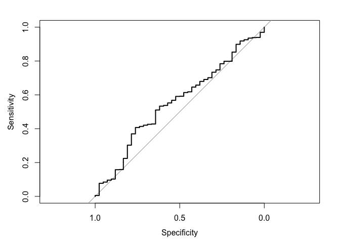<!-- -->

```r
auc(roc.curve)
```

```
## Area under the curve: 0.547
```

```r
#Functions by my own
roc.dat <- roc.func(target, pred)

roc.dat %>% ggplot(aes(x=FPR, y=TPR)) + geom_line() + geom_abline() + labs(title="ROC Curve")
```

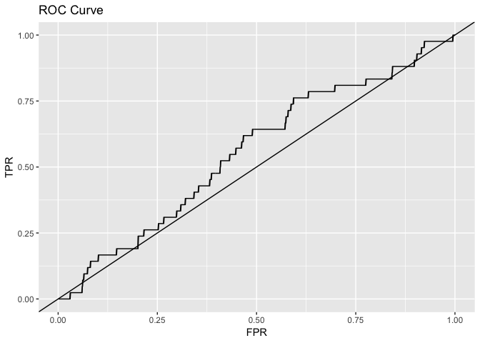<!-- -->

```r
auc.func(target, pred)
```

```
## [1] 0.5470226
```


```r
data(PimaIndiansDiabetes)
PimaIndiansDiabetes %>% head
```

```
##   pregnant glucose pressure triceps insulin mass pedigree age diabetes
## 1        6     148       72      35       0 33.6    0.627  50      pos
## 2        1      85       66      29       0 26.6    0.351  31      neg
## 3        8     183       64       0       0 23.3    0.672  32      pos
## 4        1      89       66      23      94 28.1    0.167  21      neg
## 5        0     137       40      35     168 43.1    2.288  33      pos
## 6        5     116       74       0       0 25.6    0.201  30      neg
```

```r
pima <- PimaIndiansDiabetes
pima %>% summary
```

```
##     pregnant         glucose         pressure         triceps     
##  Min.   : 0.000   Min.   :  0.0   Min.   :  0.00   Min.   : 0.00  
##  1st Qu.: 1.000   1st Qu.: 99.0   1st Qu.: 62.00   1st Qu.: 0.00  
##  Median : 3.000   Median :117.0   Median : 72.00   Median :23.00  
##  Mean   : 3.845   Mean   :120.9   Mean   : 69.11   Mean   :20.54  
##  3rd Qu.: 6.000   3rd Qu.:140.2   3rd Qu.: 80.00   3rd Qu.:32.00  
##  Max.   :17.000   Max.   :199.0   Max.   :122.00   Max.   :99.00  
##     insulin           mass          pedigree           age       
##  Min.   :  0.0   Min.   : 0.00   Min.   :0.0780   Min.   :21.00  
##  1st Qu.:  0.0   1st Qu.:27.30   1st Qu.:0.2437   1st Qu.:24.00  
##  Median : 30.5   Median :32.00   Median :0.3725   Median :29.00  
##  Mean   : 79.8   Mean   :31.99   Mean   :0.4719   Mean   :33.24  
##  3rd Qu.:127.2   3rd Qu.:36.60   3rd Qu.:0.6262   3rd Qu.:41.00  
##  Max.   :846.0   Max.   :67.10   Max.   :2.4200   Max.   :81.00  
##  diabetes 
##  neg:500  
##  pos:268  
##           
##           
##           
## 
```

```r
split.indx <- createDataPartition(pima$diabetes, p=0.7, list=FALSE)

train <- pima[split.indx,]
test <- pima[-split.indx,]
```


```r
#modeling functions and cv control 
model <- function(method, training, control,grid,...){

  if(is.null(grid)){
    model.fit <- train(diabetes~.,
                     data = training,
                     method = method,
                     trControl = control,
                     ...)
    return(model.fit)
  }

  else{
    model.fit <- train(diabetes~.,
                     data = training,
                     method = method,
                     trControl = control,
                     tuneGrid = grid,
                     ...)
    return(model.fit)
  }
}

control <- trainControl(method = "cv", number = 10, 
                        classProbs = TRUE,
                        summaryFunction = prSummary)
```


```r
#Decision Tree
dtree <- model("rpart",train, control, grid=NULL, metric="AUC", tuneLength=10)
dtree
```

```
## CART 
## 
## 538 samples
##   8 predictor
##   2 classes: 'neg', 'pos' 
## 
## No pre-processing
## Resampling: Cross-Validated (10 fold) 
## Summary of sample sizes: 485, 484, 484, 484, 484, 485, ... 
## Resampling results across tuning parameters:
## 
##   cp          AUC        Precision  Recall     F        
##   0.00000000  0.6982889  0.8111930  0.8228571  0.8131665
##   0.02895981  0.3392623  0.7745120  0.8400000  0.8032926
##   0.05791962  0.1353104  0.7536404  0.8685714  0.8047513
##   0.08687943  0.1340088  0.7564221  0.8485714  0.7967522
##   0.11583924  0.1326580  0.7672945  0.8142857  0.7868039
##   0.14479905  0.1326580  0.7672945  0.8142857  0.7868039
##   0.17375887  0.1326580  0.7672945  0.8142857  0.7868039
##   0.20271868  0.1326580  0.7672945  0.8142857  0.7868039
##   0.23167849  0.1326580  0.7672945  0.8142857  0.7868039
##   0.26063830  0.1326580  0.7672945  0.8142857  0.7868039
## 
## AUC was used to select the optimal model using the largest value.
## The final value used for the model was cp = 0.
```

```r
dtree.pred <- predict(dtree, test, type="prob")
dtree.pred %>% head
```

```
##          neg        pos
## 1  0.2553191 0.74468085
## 3  0.4285714 0.57142857
## 4  0.9779412 0.02205882
## 10 0.9696970 0.03030303
## 11 0.8461538 0.15384615
## 19 0.1000000 0.90000000
```

```r
#probability for 1 = neg
dtree.pred1 <- dtree.pred[,1] 
#if cutoff value is 0.5, and pred1 < 0.5, then it's 0 = pos for diabetes
dtree.pred1 %>% head
```

```
## [1] 0.2553191 0.4285714 0.9779412 0.9696970 0.8461538 0.1000000
```

```r
#roc built in R
roc.curve.dtree <- roc(test$diabetes, dtree.pred1, levels=c("neg","pos"), positive="neg")
```

```
## Setting direction: controls > cases
```

```r
plot(roc.curve.dtree)
```

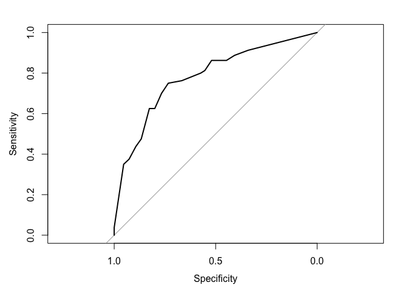<!-- -->

```r
auc(roc.curve.dtree)
```

```
## Area under the curve: 0.7801
```

```r
roc.curve.dtree %>% coords("best", transpose=FALSE)
```

```
##      threshold specificity sensitivity
## best 0.7394541   0.7333333        0.75
```

```r
#Optimal Cutoff probability
threshold.dtree <- data.frame(roc.curve.dtree %>% coords("best", transpose=FALSE))[,1]
threshold.dtree
```

```
## [1] 0.7394541
```

```r
#We would want higher probability of predicting "pos",
#since it's to predict if the patient has diabetes

#Typical cutoff value, 0.5
confusionMatrix(as.factor(ifelse(dtree.pred1 >= 0.5, "neg", "pos")), 
                as.factor(test$diabetes))
```

```
## Confusion Matrix and Statistics
## 
##           Reference
## Prediction neg pos
##        neg 115  24
##        pos  35  56
##                                           
##                Accuracy : 0.7435          
##                  95% CI : (0.6819, 0.7986)
##     No Information Rate : 0.6522          
##     P-Value [Acc > NIR] : 0.001872        
##                                           
##                   Kappa : 0.4522          
##                                           
##  Mcnemar's Test P-Value : 0.192954        
##                                           
##             Sensitivity : 0.7667          
##             Specificity : 0.7000          
##          Pos Pred Value : 0.8273          
##          Neg Pred Value : 0.6154          
##              Prevalence : 0.6522          
##          Detection Rate : 0.5000          
##    Detection Prevalence : 0.6043          
##       Balanced Accuracy : 0.7333          
##                                           
##        'Positive' Class : neg             
## 
```

```r
#Optimal cutoff value
confusionMatrix(as.factor(ifelse(dtree.pred1 >= threshold.dtree, "neg", "pos")),
                as.factor(test$diabetes))
```

```
## Confusion Matrix and Statistics
## 
##           Reference
## Prediction neg pos
##        neg 110  20
##        pos  40  60
##                                           
##                Accuracy : 0.7391          
##                  95% CI : (0.6773, 0.7946)
##     No Information Rate : 0.6522          
##     P-Value [Acc > NIR] : 0.002949        
##                                           
##                   Kappa : 0.4567          
##                                           
##  Mcnemar's Test P-Value : 0.014171        
##                                           
##             Sensitivity : 0.7333          
##             Specificity : 0.7500          
##          Pos Pred Value : 0.8462          
##          Neg Pred Value : 0.6000          
##              Prevalence : 0.6522          
##          Detection Rate : 0.4783          
##    Detection Prevalence : 0.5652          
##       Balanced Accuracy : 0.7417          
##                                           
##        'Positive' Class : neg             
## 
```

```r
#Functions created by my own
tp.dat.dtree <- tptnfpfn(test$diabetes,ifelse(dtree.pred1 >= threshold.dtree, "neg", "pos"))
tp.dat.dtree
```

```
##    TP FP TN FN
## 1 110 20 60 40
```

```r
precision(tp.dat.dtree)
```

```
## [1] 0.8461538
```

```r
recall(tp.dat.dtree)
```

```
## [1] 0.7333333
```

```r
spec(tp.dat.dtree)
```

```
## [1] 0.75
```

```r
f1.score(tp.dat.dtree)
```

```
## [1] 0.7857143
```

```r
roc.dat.dtree <- roc.func(test$diabetes, dtree.pred1)
roc.dat.dtree %>% ggplot(aes(x=FPR, y=TPR)) + geom_line() + geom_abline()
```

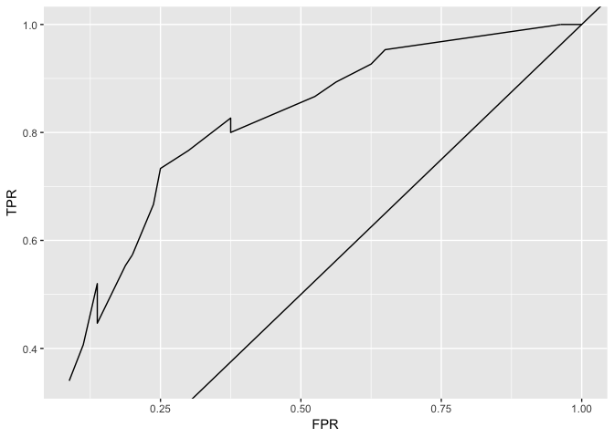<!-- -->

```r
auc.dtree <- auc.func(test$diabetes, dtree.pred1)
auc.dtree
```

```
## [1] 0.7800833
```


```r
#Decision Tree
rf <- model("rf",train, control, grid=NULL, metric="AUC", tuneLength=10)
```

```
## note: only 7 unique complexity parameters in default grid. Truncating the grid to 7 .
```

```r
rf
```

```
## Random Forest 
## 
## 538 samples
##   8 predictor
##   2 classes: 'neg', 'pos' 
## 
## No pre-processing
## Resampling: Cross-Validated (10 fold) 
## Summary of sample sizes: 484, 484, 484, 484, 485, 484, ... 
## Resampling results across tuning parameters:
## 
##   mtry  AUC        Precision  Recall     F        
##   2     0.8742793  0.8158779  0.8600000  0.8365976
##   3     0.8697110  0.8038189  0.8514286  0.8257740
##   4     0.8691558  0.8043725  0.8428571  0.8212594
##   5     0.8610310  0.7989233  0.8457143  0.8204384
##   6     0.8630166  0.7978640  0.8400000  0.8166073
##   7     0.8520739  0.7894683  0.8285714  0.8076855
##   8     0.8507368  0.7949931  0.8371429  0.8145063
## 
## AUC was used to select the optimal model using the largest value.
## The final value used for the model was mtry = 2.
```

```r
rf.pred <- predict(rf, test, type="prob")
rf.pred %>% head
```

```
##      neg   pos
## 1  0.334 0.666
## 3  0.432 0.568
## 4  0.996 0.004
## 10 0.778 0.222
## 11 0.858 0.142
## 19 0.620 0.380
```

```r
#probability for 1 = neg
rf.pred1 <- rf.pred[,1]
#if cutoff value is 0.5, and pred1 < 0.5, then it's 0 = pos for diabetes
rf.pred1 %>% head
```

```
## [1] 0.334 0.432 0.996 0.778 0.858 0.620
```

```r
#roc built in R
roc.curve.rf <- roc(test$diabetes, rf.pred1, levels=c("neg","pos"), positive="neg")
```

```
## Setting direction: controls > cases
```

```r
plot(roc.curve.rf)
```

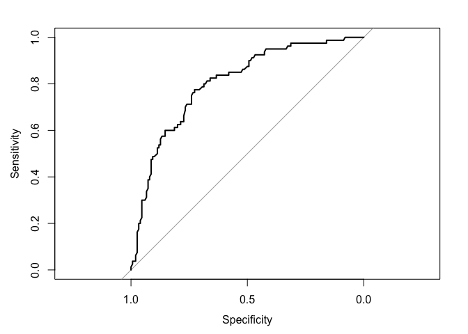<!-- -->

```r
auc(roc.curve.rf)
```

```
## Area under the curve: 0.804
```

```r
roc.curve.rf %>% coords("best", transpose=FALSE)
```

```
##      threshold specificity sensitivity
## best     0.613   0.7266667       0.775
```

```r
threshold.rf <- data.frame(roc.curve.rf %>% coords("best", transpose=FALSE))[,1]
threshold.rf
```

```
## [1] 0.613
```

```r
#Typical cutoff value, 0.5
confusionMatrix(as.factor(ifelse(rf.pred1 >= 0.5, "neg", "pos")), 
                as.factor(test$diabetes))
```

```
## Confusion Matrix and Statistics
## 
##           Reference
## Prediction neg pos
##        neg 122  32
##        pos  28  48
##                                           
##                Accuracy : 0.7391          
##                  95% CI : (0.6773, 0.7946)
##     No Information Rate : 0.6522          
##     P-Value [Acc > NIR] : 0.002949        
##                                           
##                   Kappa : 0.4182          
##                                           
##  Mcnemar's Test P-Value : 0.698535        
##                                           
##             Sensitivity : 0.8133          
##             Specificity : 0.6000          
##          Pos Pred Value : 0.7922          
##          Neg Pred Value : 0.6316          
##              Prevalence : 0.6522          
##          Detection Rate : 0.5304          
##    Detection Prevalence : 0.6696          
##       Balanced Accuracy : 0.7067          
##                                           
##        'Positive' Class : neg             
## 
```

```r
#Optimal cutoff value
confusionMatrix(as.factor(ifelse(rf.pred1 >= threshold.rf, "neg", "pos")),
                as.factor(test$diabetes))
```

```
## Confusion Matrix and Statistics
## 
##           Reference
## Prediction neg pos
##        neg 109  18
##        pos  41  62
##                                           
##                Accuracy : 0.7435          
##                  95% CI : (0.6819, 0.7986)
##     No Information Rate : 0.6522          
##     P-Value [Acc > NIR] : 0.001872        
##                                           
##                   Kappa : 0.4701          
##                                           
##  Mcnemar's Test P-Value : 0.004181        
##                                           
##             Sensitivity : 0.7267          
##             Specificity : 0.7750          
##          Pos Pred Value : 0.8583          
##          Neg Pred Value : 0.6019          
##              Prevalence : 0.6522          
##          Detection Rate : 0.4739          
##    Detection Prevalence : 0.5522          
##       Balanced Accuracy : 0.7508          
##                                           
##        'Positive' Class : neg             
## 
```

```r
#Functions created by my own
tp.dat.rf <- tptnfpfn(test$diabetes,ifelse(rf.pred1 >= threshold.rf, "neg", "pos"))
tp.dat.rf
```

```
##    TP FP TN FN
## 1 109 18 62 41
```

```r
precision(tp.dat.rf)
```

```
## [1] 0.8582677
```

```r
recall(tp.dat.rf)
```

```
## [1] 0.7266667
```

```r
spec(tp.dat.rf)
```

```
## [1] 0.775
```

```r
f1.score(tp.dat.rf)
```

```
## [1] 0.7870036
```

```r
roc.dat.rf <- roc.func(test$diabetes, rf.pred1)
roc.dat.rf %>% ggplot(aes(x=FPR, y=TPR)) + geom_line() + geom_abline()
```

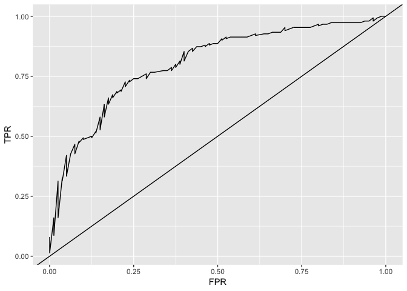<!-- -->

```r
auc.rf <- auc.func(test$diabetes, rf.pred1)
auc.rf
```

```
## [1] 0.8039583
```


```r
#Logistic Regression
glm.mod <- model("glm", train, control, grid=NULL, metric= "AUC")
glm.mod
```

```
## Generalized Linear Model 
## 
## 538 samples
##   8 predictor
##   2 classes: 'neg', 'pos' 
## 
## No pre-processing
## Resampling: Cross-Validated (10 fold) 
## Summary of sample sizes: 485, 484, 484, 484, 484, 484, ... 
## Resampling results:
## 
##   AUC        Precision  Recall     F        
##   0.8655553  0.7888771  0.8742857  0.8284002
```

```r
glm.pred <- predict(glm.mod, test, type="prob")
glm.pred %>% head
```

```
##          neg        pos
## 1  0.2925566 0.70744344
## 3  0.2315000 0.76849996
## 4  0.9594701 0.04052991
## 10 0.9705438 0.02945619
## 11 0.7494887 0.25051129
## 19 0.6516137 0.34838631
```

```r
glm.pred1 <- glm.pred[,1]
glm.pred1 %>% head
```

```
## [1] 0.2925566 0.2315000 0.9594701 0.9705438 0.7494887 0.6516137
```

```r
#roc built in R
roc.curve.glm <- roc(test$diabetes, glm.pred1, levels=c("neg","pos"), positive="neg")
```

```
## Setting direction: controls > cases
```

```r
plot(roc.curve.glm)
```

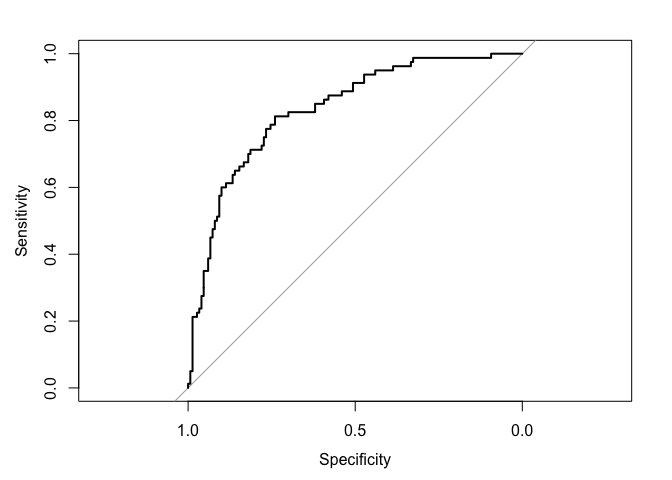<!-- -->

```r
auc(roc.curve.glm)
```

```
## Area under the curve: 0.8334
```

```r
roc.curve.glm %>% coords("best", transpose=FALSE)
```

```
##      threshold specificity sensitivity
## best 0.6597458        0.74      0.8125
```

```r
#Optmial cutoff
threshold.glm <- data.frame(roc.curve.glm %>% coords("best", transpose=FALSE))[,1]
threshold.glm
```

```
## [1] 0.6597458
```

```r
#Typical cutoff value, 0.5
confusionMatrix(as.factor(ifelse(glm.pred1 >= 0.5, "neg", "pos")), 
                as.factor(test$diabetes))
```

```
## Confusion Matrix and Statistics
## 
##           Reference
## Prediction neg pos
##        neg 130  30
##        pos  20  50
##                                           
##                Accuracy : 0.7826          
##                  95% CI : (0.7236, 0.8341)
##     No Information Rate : 0.6522          
##     P-Value [Acc > NIR] : 1.156e-05       
##                                           
##                   Kappa : 0.5064          
##                                           
##  Mcnemar's Test P-Value : 0.2031          
##                                           
##             Sensitivity : 0.8667          
##             Specificity : 0.6250          
##          Pos Pred Value : 0.8125          
##          Neg Pred Value : 0.7143          
##              Prevalence : 0.6522          
##          Detection Rate : 0.5652          
##    Detection Prevalence : 0.6957          
##       Balanced Accuracy : 0.7458          
##                                           
##        'Positive' Class : neg             
## 
```

```r
#Optimal cutoff value
confusionMatrix(as.factor(ifelse(glm.pred1 >= threshold.glm, "neg", "pos")),
                as.factor(test$diabetes))
```

```
## Confusion Matrix and Statistics
## 
##           Reference
## Prediction neg pos
##        neg 111  15
##        pos  39  65
##                                          
##                Accuracy : 0.7652         
##                  95% CI : (0.705, 0.8184)
##     No Information Rate : 0.6522         
##     P-Value [Acc > NIR] : 0.0001394      
##                                          
##                   Kappa : 0.5164         
##                                          
##  Mcnemar's Test P-Value : 0.0017486      
##                                          
##             Sensitivity : 0.7400         
##             Specificity : 0.8125         
##          Pos Pred Value : 0.8810         
##          Neg Pred Value : 0.6250         
##              Prevalence : 0.6522         
##          Detection Rate : 0.4826         
##    Detection Prevalence : 0.5478         
##       Balanced Accuracy : 0.7762         
##                                          
##        'Positive' Class : neg            
## 
```

```r
#Functions created by my own
tp.dat.glm <- tptnfpfn(test$diabetes,ifelse(glm.pred1 >= threshold.glm, "neg", "pos"))
tp.dat.glm
```

```
##    TP FP TN FN
## 1 111 15 65 39
```

```r
precision(tp.dat.glm)
```

```
## [1] 0.8809524
```

```r
recall(tp.dat.glm)
```

```
## [1] 0.74
```

```r
spec(tp.dat.glm)
```

```
## [1] 0.8125
```

```r
f1.score(tp.dat.glm)
```

```
## [1] 0.8043478
```

```r
roc.dat.glm <- roc.func(test$diabetes, glm.pred1)
roc.dat.glm %>% ggplot(aes(x=FPR, y=TPR)) + geom_line() + geom_abline()
```

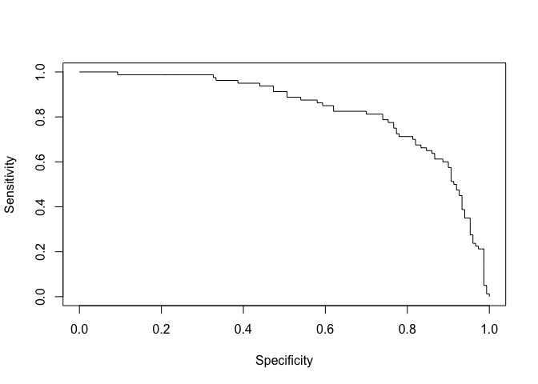<!-- -->

```r
auc.glm <- auc.func(test$diabetes, glm.pred1)
auc.glm
```

```
## [1] 0.8334167
```


```r
#Support Vector Machine with RBF Kernel
svm.mod <- model("svmRadial", train, control, grid=NULL, metric="AUC", tuneLength=10)
svm.mod
```

```
## Support Vector Machines with Radial Basis Function Kernel 
## 
## 538 samples
##   8 predictor
##   2 classes: 'neg', 'pos' 
## 
## No pre-processing
## Resampling: Cross-Validated (10 fold) 
## Summary of sample sizes: 484, 484, 484, 484, 484, 485, ... 
## Resampling results across tuning parameters:
## 
##   C       AUC        Precision  Recall     F        
##     0.25  0.8822715  0.7918448  0.8628571  0.8235539
##     0.50  0.8831475  0.7984747  0.8628571  0.8272969
##     1.00  0.8806990  0.7931319  0.8857143  0.8343236
##     2.00  0.8806294  0.7877682  0.8800000  0.8291722
##     4.00  0.8812615  0.7855265  0.8685714  0.8238536
##     8.00  0.8796329  0.7746852  0.8800000  0.8227737
##    16.00  0.8733471  0.7523668  0.8828571  0.8113856
##    32.00  0.8613002  0.7369571  0.8628571  0.7921029
##    64.00  0.8550158  0.7374736  0.8428571  0.7849034
##   128.00  0.8499809  0.7355124  0.8457143  0.7839207
## 
## Tuning parameter 'sigma' was held constant at a value of 0.1432638
## AUC was used to select the optimal model using the largest value.
## The final values used for the model were sigma = 0.1432638 and C = 0.5.
```

```r
svm.pred <- predict(svm.mod, test, type="prob")
svm.pred %>% head
```

```
##         neg        pos
## 1 0.2364146 0.76358536
## 2 0.1315212 0.86847875
## 3 0.9281084 0.07189164
## 4 0.6177035 0.38229651
## 5 0.8339350 0.16606503
## 6 0.5749195 0.42508052
```

```r
svm.pred1 <- svm.pred[,1]
svm.pred1 %>% head
```

```
## [1] 0.2364146 0.1315212 0.9281084 0.6177035 0.8339350 0.5749195
```

```r
#roc built in R
roc.curve.svm <- roc(test$diabetes, svm.pred1, levels=c("neg","pos"), positive="neg")
```

```
## Setting direction: controls > cases
```

```r
plot(roc.curve.svm)
```

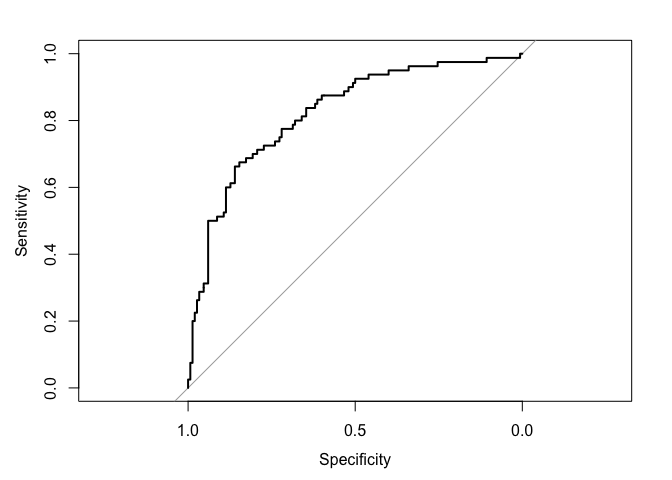<!-- -->

```r
auc(roc.curve.svm)
```

```
## Area under the curve: 0.8229
```

```r
roc.curve.svm %>% coords("best", transpose=FALSE)
```

```
##      threshold specificity sensitivity
## best 0.4599544        0.86      0.6625
```

```r
#Optmial cutoff
threshold.svm <- data.frame(roc.curve.svm %>% coords("best", transpose=FALSE))[,1]
threshold.svm
```

```
## [1] 0.4599544
```

```r
#Typical cutoff value, 0.5
confusionMatrix(as.factor(ifelse(glm.pred1 >= 0.5, "neg", "pos")), 
                as.factor(test$diabetes))
```

```
## Confusion Matrix and Statistics
## 
##           Reference
## Prediction neg pos
##        neg 130  30
##        pos  20  50
##                                           
##                Accuracy : 0.7826          
##                  95% CI : (0.7236, 0.8341)
##     No Information Rate : 0.6522          
##     P-Value [Acc > NIR] : 1.156e-05       
##                                           
##                   Kappa : 0.5064          
##                                           
##  Mcnemar's Test P-Value : 0.2031          
##                                           
##             Sensitivity : 0.8667          
##             Specificity : 0.6250          
##          Pos Pred Value : 0.8125          
##          Neg Pred Value : 0.7143          
##              Prevalence : 0.6522          
##          Detection Rate : 0.5652          
##    Detection Prevalence : 0.6957          
##       Balanced Accuracy : 0.7458          
##                                           
##        'Positive' Class : neg             
## 
```

```r
#Optimal cutoff value
confusionMatrix(as.factor(ifelse(glm.pred1 >= threshold.svm, "neg", "pos")),
                as.factor(test$diabetes))
```

```
## Confusion Matrix and Statistics
## 
##           Reference
## Prediction neg pos
##        neg 134  32
##        pos  16  48
##                                          
##                Accuracy : 0.7913         
##                  95% CI : (0.733, 0.8419)
##     No Information Rate : 0.6522         
##     P-Value [Acc > NIR] : 2.878e-06      
##                                          
##                   Kappa : 0.5175         
##                                          
##  Mcnemar's Test P-Value : 0.03038        
##                                          
##             Sensitivity : 0.8933         
##             Specificity : 0.6000         
##          Pos Pred Value : 0.8072         
##          Neg Pred Value : 0.7500         
##              Prevalence : 0.6522         
##          Detection Rate : 0.5826         
##    Detection Prevalence : 0.7217         
##       Balanced Accuracy : 0.7467         
##                                          
##        'Positive' Class : neg            
## 
```

```r
#Functions created by my own
tp.dat.svm <- tptnfpfn(test$diabetes,ifelse(svm.pred1 >= threshold.svm, "neg", "pos"))
tp.dat.svm
```

```
##    TP FP TN FN
## 1 129 27 53 21
```

```r
precision(tp.dat.svm)
```

```
## [1] 0.8269231
```

```r
recall(tp.dat.svm)
```

```
## [1] 0.86
```

```r
spec(tp.dat.svm)
```

```
## [1] 0.6625
```

```r
f1.score(tp.dat.svm)
```

```
## [1] 0.8431373
```

```r
roc.dat.svm <- roc.func(test$diabetes, svm.pred1)
roc.dat.svm %>% ggplot(aes(x=FPR, y=TPR)) + geom_line() + geom_abline()
```

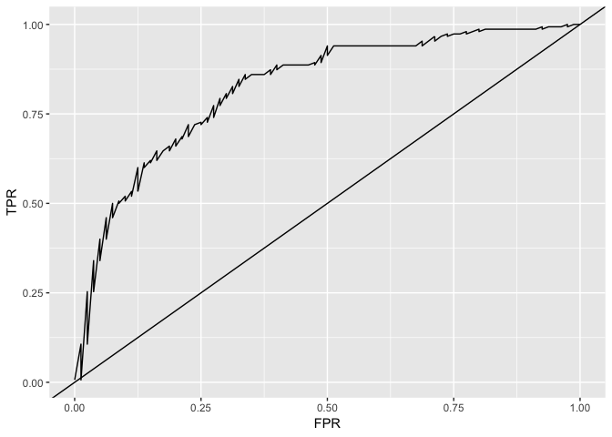<!-- -->

```r
auc.svm <- auc.func(test$diabetes, svm.pred1)
auc.svm
```

```
## [1] 0.8229167
```


```r
roc.dat.dtree$model <- "Decision Tree"
roc.dat.rf$model <- "Random Forest"
roc.dat.glm$model <- "Logistic Regression"
roc.dat.svm$model <- "SVM with RBF"

roc.dat <- rbind(roc.dat.dtree,
                 roc.dat.rf,
                 roc.dat.glm,
                 roc.dat.svm)

#ROC Curves
roc.dat %>% ggplot(aes(x=FPR, y=TPR, col=model)) + 
  geom_line() + 
  geom_abline() +
  labs(title= "ROC Curves for 4 models")
```

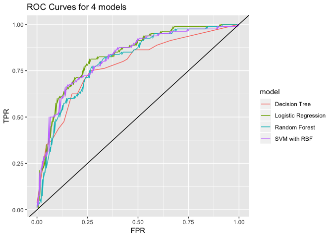<!-- -->

```r
#Optimal Cutoff Values

#Decision Tree
roc.curve.dtree %>% 
  coords("best",transpose=FALSE)
```

```
##      threshold specificity sensitivity
## best 0.7394541   0.7333333        0.75
```

```r
#Random Forest
roc.curve.rf %>% 
  coords("best",transpose=FALSE)
```

```
##      threshold specificity sensitivity
## best     0.613   0.7266667       0.775
```

```r
#Logistic Regression
roc.curve.glm %>% 
  coords("best",transpose=FALSE)
```

```
##      threshold specificity sensitivity
## best 0.6597458        0.74      0.8125
```

```r
#SVM
roc.curve.svm %>% 
  coords("best",transpose=FALSE)
```

```
##      threshold specificity sensitivity
## best 0.4599544        0.86      0.6625
```

```r
#AUC
auc.dtree
```

```
## [1] 0.7800833
```

```r
auc.rf
```

```
## [1] 0.8039583
```

```r
auc.glm
```

```
## [1] 0.8334167
```

```r
auc.svm
```

```
## [1] 0.8229167
```

```r
#I will choose model that has the greatest value of AUC, and pick the optimal cutoff value for the model, even if this model has less accuracy than others. 

auc.dat <- data.frame(dtree = auc.dtree,
                      rf = auc.rf,
                      glm = auc.glm,
                      svm = auc.svm)

which.max(auc.dat) %>% names
```

```
## [1] "glm"
```

```r
#With Optimal cutoff value for the best model
confusionMatrix(as.factor(ifelse(glm.pred1 >= threshold.glm, "neg", "pos")),
                as.factor(test$diabetes))
```

```
## Confusion Matrix and Statistics
## 
##           Reference
## Prediction neg pos
##        neg 111  15
##        pos  39  65
##                                          
##                Accuracy : 0.7652         
##                  95% CI : (0.705, 0.8184)
##     No Information Rate : 0.6522         
##     P-Value [Acc > NIR] : 0.0001394      
##                                          
##                   Kappa : 0.5164         
##                                          
##  Mcnemar's Test P-Value : 0.0017486      
##                                          
##             Sensitivity : 0.7400         
##             Specificity : 0.8125         
##          Pos Pred Value : 0.8810         
##          Neg Pred Value : 0.6250         
##              Prevalence : 0.6522         
##          Detection Rate : 0.4826         
##    Detection Prevalence : 0.5478         
##       Balanced Accuracy : 0.7762         
##                                          
##        'Positive' Class : neg            
## 
```
