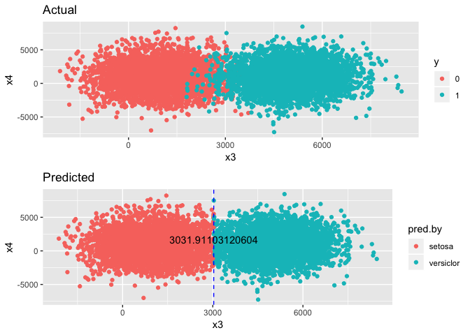

```r
library(caret)
```

```
## Loading required package: lattice
```

```
## Loading required package: ggplot2
```

```
## Registered S3 methods overwritten by 'ggplot2':
##   method         from 
##   [.quosures     rlang
##   c.quosures     rlang
##   print.quosures rlang
```

```r
library(dplyr)
```

```
## 
## Attaching package: 'dplyr'
```

```
## The following objects are masked from 'package:stats':
## 
##     filter, lag
```

```
## The following objects are masked from 'package:base':
## 
##     intersect, setdiff, setequal, union
```

```r
library(gridExtra)
```

```
## 
## Attaching package: 'gridExtra'
```

```
## The following object is masked from 'package:dplyr':
## 
##     combine
```

```r
library(rpart)
library(rpart.plot)

#I am going to use iris dataset first
iris %>% head
```

```
##   Sepal.Length Sepal.Width Petal.Length Petal.Width Species
## 1          5.1         3.5          1.4         0.2  setosa
## 2          4.9         3.0          1.4         0.2  setosa
## 3          4.7         3.2          1.3         0.2  setosa
## 4          4.6         3.1          1.5         0.2  setosa
## 5          5.0         3.6          1.4         0.2  setosa
## 6          5.4         3.9          1.7         0.4  setosa
```

```r
levels(iris$Species)
```

```
## [1] "setosa"     "versicolor" "virginica"
```

```r
#our target variable has 3 classes
table(iris$Species)
```

```
## 
##     setosa versicolor  virginica 
##         50         50         50
```

```r
#removing one of the classes of the target variable, virginica, 
#to make target as a binary variable
iris1 <- iris[which(iris$Species != "virginica"),]

#removing the factor level that we don't have any more
iris1$Species <- as.factor(as.character(iris1$Species))

set.seed(1234)
#splitting dataset
training.idx <- createDataPartition(iris1$Species, p=0.7, list=FALSE)

training <- iris1[training.idx,]
testing <- iris1[-training.idx,]

#quick decision tree built in r, rpart
tr <- rpart(Species~., training)
tr
```

```
## n= 70 
## 
## node), split, n, loss, yval, (yprob)
##       * denotes terminal node
## 
## 1) root 70 35 setosa (0.5000000 0.5000000)  
##   2) Petal.Length< 2.35 35  0 setosa (1.0000000 0.0000000) *
##   3) Petal.Length>=2.35 35  0 versicolor (0.0000000 1.0000000) *
```

```r
rpart.plot(tr)
```

<!-- -->

```r
dtree.pred <- predict(tr, type="class")

table(dtree.pred, training$Species)
```

```
##             
## dtree.pred   setosa versicolor
##   setosa         35          0
##   versicolor      0         35
```

```r
#with Petal.Length < 2.5, the model predict perfectly in training set

dtree.pred.test <- predict(tr, testing, type="class")

table(dtree.pred.test, testing$Species)
```

```
##                
## dtree.pred.test setosa versicolor
##      setosa         15          0
##      versicolor      0         15
```

```r
#with Petal.Length < 2.5, the model predict perfectly in testing set as well


t1 <- testing %>% 
  ggplot(aes(x=Petal.Length, y=Petal.Width, col=Species)) + 
  geom_jitter() + ggtitle("Actual")
t2 <- testing %>% 
  ggplot(aes(x=Petal.Length, y=Petal.Width, col=dtree.pred.test)) + 
  geom_jitter() + ggtitle("Predicted by Decision Tree built in R")
grid.arrange(t1, t2) 
```

<!-- -->


```r
#average function to create adjacent average between predictor indexes
avg <- function(x1,x2){sum(x1,x2)/2}

#gini function for a leaf
gini <- function(x){
  
  if(dim(x)[1]==1){
    return(1)
  }
  else{
    p11<-x[1,1]/sum(x[1,])
    p12<-x[1,2]/sum(x[1,])
    p21<-x[2,1]/sum(x[2,])
    p22<-x[2,2]/sum(x[2,])
    
    a.false.gini <- 1-p11^2-p12^2
    a.true.gini <- 1-p21^2-p22^2
    
    a.false.prob <- (x[1,1]+x[1,2]) / sum(x)
    a.true.prob <- (x[2,1]+x[2,2]) / sum(x)
    
    gini.imp <- a.false.prob * a.false.gini + a.true.prob * a.true.gini
    return(gini.imp)
  }
}


#log function with base 2 for entropy
log2 <- function(x){
  if(x!=0){
    return(log(x,base=2))
  }
  if(x==0){
    return(0)
  }
}


#entropy function for a leaf
entropy <- function(x){
  
  if(dim(x)[1]==1){
    return(0)
  }
  else{
    p11<-x[1,1]/sum(x[1,])
    p12<-x[1,2]/sum(x[1,])
    p21<-x[2,1]/sum(x[2,])
    p22<-x[2,2]/sum(x[2,])
    
    #Calculating weights, which is the bottom of the tree
    a.false.entropy <- -(p11*log2(p11)+p12*log2(p12))
    a.true.entropy <- -(p21*log2(p21)+p22*log2(p22))
    
    a.false.prob <- (x[1,1]+x[1,2]) / sum(x)
    a.true.prob <- (x[2,1]+x[2,2]) / sum(x)
    
    
    weighted.entropy <- a.true.prob*a.true.entropy + a.false.prob*a.false.entropy
    
    total.entropy <- -(a.false.prob*log2(a.false.prob) + a.true.prob*log2(a.true.prob))
    
    #Information Gain, which is the tree score to find best split
    #If the bigger this value is, we find the better split
    #maximum value is 1
    IG <- total.entropy - weighted.entropy
    
    return(IG) 
  }
}


#Calculating impurity to find which predictor is the best to split, which will be the top of the tree or first split in the tree
var.impurity <- function(x, dat, fun){
  imp.dat <- data.frame(matrix(0, nrow=nrow(dat)-1, ncol=3))
  colnames(imp.dat) <- c("index", "impurity", "adj.avg")

  for(i in 1:(nrow(dat)-1)){
    imp.dat[i,1] <- paste0("between ", i, " and ", i+1)
    #average value of the adjacent values
    a <- avg(x[i], x[i+1])
    mat <- as.matrix(table(x < a, dat[,target] ))
    
    imp.dat[i,2] <- fun(mat)
    imp.dat[i,3] <- a
    }
  return(imp.dat)
}

#this function will give you the best score of split for each predictors
impurity.fun <- function(dat, fun){
  predictors <- colnames(dat)[!colnames(dat) %in% target]
  var.impur.dat <- data.frame(matrix(0, nrow=length(predictors),ncol=2))
  colnames(var.impur.dat) <- c("var", "impurity")
  
  for(i in 1:(ncol(dat)-1)){
    var.impur.dat[i,1] <- predictors[i]
    if(fun == "gini"){
      #the least score of gini is the best split 
      var.impur.dat[i,2] <- min(var.impurity(dat[,i], dat, gini)$impurity)
    }
    if(fun == "entropy"){
      #the greates score of entropy is the best split
      var.impur.dat[i,2] <- max(var.impurity(dat[,i], dat, entropy)$impurity)
    }
  }
  return(var.impur.dat)
}


#give you the best predictor to split or the top of the tree
topTree.predictor <- function(x,fun){
  if(fun == "entropy"){
    return(which.max(impurity.fun(x, "entropy")[,2]))
  }
  if(fun == "gini"){
    return(which.min(impurity.fun(x, "gini")[,2]))
  }
}

#The best split point associated with the best predictor
impurityOfbest <- function(dat, best.pred, fun){
  if(fun == "entropy"){
    impurity.pred <- var.impurity(dat[,best.pred], dat, entropy)$adj.avg[which.max(var.impurity(dat[,best.pred], dat, entropy)$impurity)]
  }
  if(fun == "gini"){
    impurity.pred <- var.impurity(dat[,best.pred], dat, gini)$adj.avg[which.min(var.impurity(dat[,best.pred], dat, gini)$impurity)]
  }
  
  print(paste0("Best predictor, which is top tree node is ", colnames(dat)[best.pred], " with best split is  ", impurity.pred, " by the metric, ", fun))
  return(impurity.pred)
}
```


```r
#by Entropy metric, we want to find the maximum entropy score
fun <- "entropy"
target <- "Species"
imp.pred <- topTree.predictor(iris1, fun)
best.impur <- impurityOfbest(iris1, imp.pred, fun)
```

```
## [1] "Best predictor, which is top tree node is Petal.Width with best split is  0.8 by the metric, entropy"
```

```r
#Let's see how well this value calculated by the function predicts
table(iris1[,imp.pred] < best.impur, iris1$Species)
```

```
##        
##         setosa versicolor
##   FALSE      0         50
##   TRUE      50          0
```

```r
#perfectly predicted in training set


pred.by<- as.factor(ifelse(iris1[,imp.pred] < best.impur, "setosa","versiclor"))

t1 <- iris1 %>% 
  ggplot(aes(x=Petal.Width, y=Petal.Length ,col=Species)) + 
  geom_jitter() +
  ggtitle("Actual")
t2 <- iris1 %>% 
  ggplot(aes(x=Petal.Width, y=Petal.Length ,col=pred.by)) + 
  geom_jitter() +
  geom_vline(xintercept =  best.impur, colour="blue", linetype="dashed") + 
  annotate(geom="text", label=best.impur, x=best.impur, y=0, vjust=-1) +
  ggtitle("Predicted")

grid.arrange(t1,t2)
```

<!-- -->

```r
#perfect split


#by Gini index
fun <- "gini"
target <- "Species"
imp.pred <- topTree.predictor(iris1, fun)
best.impur <- impurityOfbest(iris1, imp.pred,fun)
```

```
## [1] "Best predictor, which is top tree node is Petal.Width with best split is  0.8 by the metric, gini"
```

```r
#Let's see how well this value predicts
table(iris1[,imp.pred] < impurityOfbest(iris1, imp.pred, fun), iris1$Species)
```

```
## [1] "Best predictor, which is top tree node is Petal.Width with best split is  0.8 by the metric, gini"
```

```
##        
##         setosa versicolor
##   FALSE      0         50
##   TRUE      50          0
```

```r
#perfectly predicted in training set as well


pred.by<- as.factor(ifelse(iris1[,imp.pred] < best.impur, "setosa","versiclor"))

t1 <- iris1 %>% 
  ggplot(aes(x=Petal.Width, y=Petal.Length ,col=Species)) + 
  geom_jitter() +
  ggtitle("Actual")
t2 <- iris1 %>% 
  ggplot(aes(x=Petal.Width, y=Petal.Length ,col=pred.by)) + 
  geom_jitter() +
  geom_vline(xintercept =  best.impur, colour="blue", linetype="dashed") + 
  annotate(geom="text", label=best.impur, x=best.impur, y=0, vjust=-1) +
  ggtitle("Predicted")

grid.arrange(t1,t2)
```

<!-- -->


```r
#dataset generated by couple of mixed normal distributions

#2 normal distributions
x1 <- rnorm(5000, 1000,1000)
x2 <- rnorm(5000, 5000,1000)

x<- data.frame(x1, x2, y=ifelse(x1, 0,1))

ggplot(x) +
  geom_density(aes(x1, fill="red", alpha=0.3))+
  geom_density(aes(x2, fill="blue", alpha=0.3))
```

<!-- -->

```r
#combine the 2 random variables generated by 2 normal distribution 
#that have different mean and the same variance
x3 <- c(x1,x2)

#different variable 
x4 <- rnorm(10000, 1000, 2000)


#The dataset will have 1 label and 2 predictors, which are x3 and x4

#Label dataset will be generated by x1 and x2


#Here is our dataset that will be examined
dat <- data.frame(x3 = x3, x4 = x4,
                  y = as.factor(ifelse(x3 %in% x1, 0, 1)))

dat %>% ggplot(aes(x=x3)) + geom_density(fill="green", alpha=0.3) + ggtitle("X3")
```

<!-- -->

```r
dat %>% ggplot(aes(x=x4)) + geom_density(fill="purple", alpha=0.3) + ggtitle("X4")
```

<!-- -->

```r
#Graph
dat %>% ggplot(aes(x=x3, y=x4, col=y)) + 
  geom_jitter() + ggtitle("Original Dataset")
```

<!-- -->

```r
cor(x3,x4)
```

```
## [1] 0.001760897
```

```r
#quick decision tree
tr <- rpart(y~., dat)
tr
```

```
## n= 10000 
## 
## node), split, n, loss, yval, (yprob)
##       * denotes terminal node
## 
## 1) root 10000 5000 0 (0.50000000 0.50000000)  
##   2) x3< 3024.085 5004  103 0 (0.97941647 0.02058353) *
##   3) x3>=3024.085 4996   99 1 (0.01981585 0.98018415) *
```

```r
rpart.plot(tr)
```

<!-- -->

```r
#splitting dataset
training.idx <- createDataPartition(dat$y, p=0.7,list=FALSE)

training <- dat[training.idx,]
testing <- dat[-training.idx,]

training %>% ggplot(aes(x=x3, y=x4, col=y)) + 
  geom_point() + ggtitle("Training")
```

<!-- -->

```r
testing %>% ggplot(aes(x=x3, y=x4, col=y)) + 
  geom_point() + ggtitle("Testing")
```

<!-- -->


```r
#by Entropy, the maximum entropy score is the best split
fun <- "entropy"
target <- "y"
imp.pred <- topTree.predictor(training, fun)
best.impur <- impurityOfbest(training, imp.pred, fun)
```

```
## [1] "Best predictor, which is top tree node is x3 with best split is  3016.77748153623 by the metric, entropy"
```

```r
#Let's see how well this value predicts
table(training[,imp.pred] < best.impur, training$y)
```

```
##        
##            0    1
##   FALSE   71 3428
##   TRUE  3429   72
```

```r
#quite well predicted in training set

pred.by<- as.factor(ifelse(training[,imp.pred] < best.impur, "setosa","versiclor"))

t1 <- training %>% 
  ggplot(aes(x=x3, y=x4 ,col=y)) + 
  geom_jitter() +
  ggtitle("Actual")
t2 <- training %>% 
  ggplot(aes(x=x3, y=x4 ,col=pred.by)) + 
  geom_jitter() +
  geom_vline(xintercept =  best.impur, colour="blue", linetype="dashed") + 
  annotate(geom="text", label=best.impur, x=best.impur, y=0, vjust=-1) +
  ggtitle("Predicted")

grid.arrange(t1,t2)
```

<!-- -->

```r
#in the Testset, which is we predict unkown dataset
pred.by<- as.factor(ifelse(testing[,imp.pred] < best.impur, "setosa","versiclor"))
t1 <- testing %>% 
  ggplot(aes(x=x3, y=x4 ,col=y)) + 
  geom_jitter() +
  ggtitle("Actual")
t2 <- testing %>% 
  ggplot(aes(x=x3, y=x4, col=pred.by)) + 
  geom_jitter() +
  geom_vline(xintercept =  best.impur, colour="blue", linetype="dashed") + 
  annotate(geom="text", label=best.impur, x=best.impur, y=0, vjust=-1) +
  ggtitle("Predicted")

grid.arrange(t1,t2)
```

<!-- -->


```r
#by Gini, the least gini index score is the best split
fun <- "gini"
target <- "y"
imp.pred <- topTree.predictor(training, fun)
best.impur <- impurityOfbest(training, imp.pred, fun)
```

```
## [1] "Best predictor, which is top tree node is x3 with best split is  3016.77748153623 by the metric, gini"
```

```r
#Let's see how well this value predicts
table(training[,imp.pred] < best.impur, training$y)
```

```
##        
##            0    1
##   FALSE   71 3428
##   TRUE  3429   72
```

```r
#quite well predicted in training set

pred.by<- as.factor(ifelse(training[,imp.pred] < best.impur, "setosa","versiclor"))

t1 <- training %>% 
  ggplot(aes(x=x3, y=x4 ,col=y)) + 
  geom_jitter() +
  ggtitle("Actual")
t2 <- training %>% 
  ggplot(aes(x=x3, y=x4 ,col=pred.by)) + 
  geom_jitter() +
  geom_vline(xintercept =  best.impur, colour="blue", linetype="dashed") + 
  annotate(geom="text", label=best.impur, x=best.impur, y=0, vjust=-1) +
  ggtitle("Predicted")

grid.arrange(t1,t2)
```

<!-- -->

```r
#in the Testset, which is we predict unkown dataset
pred.by<- as.factor(ifelse(testing[,imp.pred] < best.impur, "setosa","versiclor"))
t1 <- testing %>% 
  ggplot(aes(x=x3, y=x4 ,col=y)) + 
  geom_jitter() +
  ggtitle("Actual")
t2 <- testing %>% 
  ggplot(aes(x=x3, y=x4, col=pred.by)) + 
  geom_jitter() +
  geom_vline(xintercept =  best.impur, colour="blue", linetype="dashed") + 
  annotate(geom="text", label=best.impur, x=best.impur, y=0, vjust=-1) +
  ggtitle("Predicted")

grid.arrange(t1,t2)
```

<!-- -->
