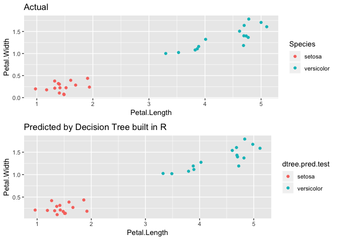

```r
library(caret)
```

```
## Loading required package: lattice
```

```
## Loading required package: ggplot2
```

```
## Registered S3 methods overwritten by 'ggplot2':
##   method         from 
##   [.quosures     rlang
##   c.quosures     rlang
##   print.quosures rlang
```

```r
library(dplyr)
```

```
## 
## Attaching package: 'dplyr'
```

```
## The following objects are masked from 'package:stats':
## 
##     filter, lag
```

```
## The following objects are masked from 'package:base':
## 
##     intersect, setdiff, setequal, union
```

```r
library(gridExtra)
```

```
## 
## Attaching package: 'gridExtra'
```

```
## The following object is masked from 'package:dplyr':
## 
##     combine
```

```r
library(rpart)
library(rpart.plot)


iris %>% head
```

```
##   Sepal.Length Sepal.Width Petal.Length Petal.Width Species
## 1          5.1         3.5          1.4         0.2  setosa
## 2          4.9         3.0          1.4         0.2  setosa
## 3          4.7         3.2          1.3         0.2  setosa
## 4          4.6         3.1          1.5         0.2  setosa
## 5          5.0         3.6          1.4         0.2  setosa
## 6          5.4         3.9          1.7         0.4  setosa
```

```r
levels(iris$Species)
```

```
## [1] "setosa"     "versicolor" "virginica"
```

```r
#our target variable has 3 classes
table(iris$Species)
```

```
## 
##     setosa versicolor  virginica 
##         50         50         50
```

```r
#removing one of the classes of the target variable, virginica, 
#to make target as a binary variable
iris1 <- iris[which(iris$Species != "virginica"),]

#removing the factor level that we don't have any more
iris1$Species <- as.factor(as.character(iris1$Species))

set.seed(1234)
#splitting dataset
training.idx <- createDataPartition(iris1$Species, p=0.7, list=FALSE)

training <- iris1[training.idx,]
testing <- iris1[-training.idx,]

#quick decision tree built in r, rpart
tr <- rpart(Species~., training)
tr
```

```
## n= 70 
## 
## node), split, n, loss, yval, (yprob)
##       * denotes terminal node
## 
## 1) root 70 35 setosa (0.5000000 0.5000000)  
##   2) Petal.Length< 2.35 35  0 setosa (1.0000000 0.0000000) *
##   3) Petal.Length>=2.35 35  0 versicolor (0.0000000 1.0000000) *
```

```r
rpart.plot(tr)
```

<!-- -->

```r
dtree.pred <- predict(tr, type="class")

table(dtree.pred, training$Species)
```

```
##             
## dtree.pred   setosa versicolor
##   setosa         35          0
##   versicolor      0         35
```

```r
#with Petal.Length < 2.5, the model predict perfectly in training set

dtree.pred.test <- predict(tr, testing, type="class")

table(dtree.pred.test, testing$Species)
```

```
##                
## dtree.pred.test setosa versicolor
##      setosa         15          0
##      versicolor      0         15
```

```r
#with Petal.Length < 2.5, the model predict perfectly in testing set as well


t1 <- testing %>% 
  ggplot(aes(x=Petal.Length, y=Petal.Width, col=Species)) + 
  geom_jitter() + ggtitle("Actual")
t2 <- testing %>% 
  ggplot(aes(x=Petal.Length, y=Petal.Width, col=dtree.pred.test)) + 
  geom_jitter() + ggtitle("Predicted by Decision Tree built in R")
grid.arrange(t1, t2) 
```

<!-- -->


```r
#This algorithm is for Decision Tree with continuous predictors


#dataset
iris1 <- iris[order(iris$Sepal.Length, decreasing = FALSE),]

#removing one of the class, virginica
iris1 <- iris[which(iris$Species != "virginica"),]

#removing the factor level that we don't have any more
iris1$Species <- as.factor(as.character(iris1$Species))

set.seed(13294)
#splitting dataset
training.idx <- createDataPartition(iris1$Species, p=0.7, list=FALSE)

iris2 <- iris1[training.idx,]
iris2.testing <- iris1[-training.idx,]

target <- "Species"

#average function
avg <- function(x1,x2){sum(x1,x2)/2}

#gini function for a leaf
gini <- function(x){
    p11<-x[1,1]/sum(x[1,])
    p12<-x[1,2]/sum(x[1,])
    p21<-x[2,1]/sum(x[2,])
    p22<-x[2,2]/sum(x[2,])
    
    a.false.gini <- 1-p11^2-p12^2
    a.true.gini <- 1-p21^2-p22^2
    
    a.false.prob <- (x[1,1]+x[1,2]) / sum(x)
    a.true.prob <- (x[2,1]+x[2,2]) / sum(x)
    
    gini.imp <- a.false.prob * a.false.gini + a.true.prob * a.true.gini
    return(gini.imp)
}


#gini function for a variable (node)
var.gini <- function(x, dat){
  gini.dat <- data.frame(matrix(0, nrow=nrow(dat)-1, ncol=3))
  colnames(gini.dat) <- c("index", "gini.imp", "adj.avg")

  for(i in 1:(nrow(dat)-1)){
    gini.dat[i,1] <- paste0("between ", i, " and ", i+1)
    #average value of the adjacent values
    a <- avg(x[i], x[i+1])
    mat <- as.matrix(table(x < a, dat[,target] ))
    
    gini.dat[i,2] <- gini(mat)
    gini.dat[i,3] <- a
    }
  return(gini.dat)
}

#gini function for a dataset to find which variable is the important to predict
#the most important variable will be the top of the tree
iris.gini <- function(dat){
  predictors <- colnames(dat)[!colnames(dat) %in% target]
  var.gini.dat <- data.frame(matrix(0, nrow=length(predictors),ncol=2))
  colnames(var.gini.dat) <- c("var", "gini imp")
  
  for(i in 1:(ncol(dat)-1)){
    var.gini.dat[i,1] <- predictors[i]
    var.gini.dat[i,2] <- min(var.gini(dat[,i], dat)$gini.imp)
  }
  
  return(var.gini.dat)
}


iris.gini(iris2) %>% head
```

```
##            var  gini imp
## 1 Sepal.Length 0.1797386
## 2  Sepal.Width 0.2647059
## 3 Petal.Length 0.0000000
## 4  Petal.Width 0.0000000
```

```r
#finding the important features by gini impurity of each variable, 
#which has the minimum gini impurity
imp.pred <- which.min(iris.gini(iris2)[,2])
colnames(iris2)[imp.pred]
```

```
## [1] "Petal.Length"
```

```r
var.gini(iris2[,imp.pred], iris2) %>% head(10)
```

```
##                index  gini.imp adj.avg
## 1    between 1 and 2 0.4531250    1.40
## 2    between 2 and 3 0.3269231    1.45
## 3    between 3 and 4 0.3269231    1.45
## 4    between 4 and 5 0.2045455    1.55
## 5    between 5 and 6 0.2045455    1.55
## 6    between 6 and 7 0.4531250    1.40
## 7    between 7 and 8 0.3269231    1.45
## 8    between 8 and 9 0.2045455    1.55
## 9   between 9 and 10 0.2045455    1.55
## 10 between 10 and 11 0.3269231    1.45
```

```r
#Since the predictors are continuous, 
#we need to find the average adjacent value of the most important variable, 
#which has the minimum of gini impurity

min.gini <- var.gini(iris2[,imp.pred], iris2)$adj.avg[which.min(var.gini(iris2[,imp.pred], iris2)$gini.imp)]

min.gini 
```

```
## [1] 2.95
```

```r
#Let's see how well this value predicts
table(iris2[,imp.pred] < min.gini, iris2$Species)
```

```
##        
##         setosa versicolor
##   FALSE      0         35
##   TRUE      35          0
```

```r
#perfectly predicted in training set

pred.by<- as.factor(ifelse(iris2[,imp.pred] < min.gini, "setosa","versiclor"))

iris2$pred.by <- pred.by
t1 <- iris2 %>% 
  ggplot(aes(x=Petal.Length, y=Petal.Width ,col=Species)) + 
  geom_jitter() +
  ggtitle("Actual")
t2 <- iris2 %>% 
  ggplot(aes(x=Petal.Length, y=Petal.Width ,col=pred.by)) + 
  geom_jitter() +
  geom_vline(xintercept =  min.gini, colour="blue", linetype="dashed") + 
  annotate(geom="text", label=min.gini, x=min.gini, y=0, vjust=-1) +
  ggtitle("Predicted")

grid.arrange(t1,t2)
```

<!-- -->

```r
#Let's see if it predicts well in testing set
table(iris2.testing[,imp.pred] < min.gini, iris2.testing$Species)
```

```
##        
##         setosa versicolor
##   FALSE      0         15
##   TRUE      15          0
```

```r
#Yes, it does. 
```


```r
#dataset generated by couple of mixed normal distributions

#2 normal distributions
x1 <- rnorm(5000, 1000,1000)
x2 <- rnorm(5000, 5000,1000)

x<- data.frame(x1, x2, y=ifelse(x1, 0,1))

ggplot(x) +
  geom_density(aes(x1, fill="red", alpha=0.3))+
  geom_density(aes(x2, fill="blue", alpha=0.3))
```

<!-- -->

```r
#combine the 2 random variables generated by 2 normal distribution 
#that have different mean and the same variance
x3 <- c(x1,x2)

#different variable 
x4 <- rnorm(10000, 1000, 2000)


#The dataset will have 1 label and 2 predictors, which are x3 and 4

#Label dataset will be generated by x1 and x2


#Here is our dataset that will be examined
dat <- data.frame(x3 = x3, x4 = x4,
                  y = as.factor(ifelse(x3 %in% x1, 0, 1)))

dat %>% ggplot(aes(x=x3)) + geom_density(fill="green", alpha=0.3) + ggtitle("X3")
```

<!-- -->

```r
dat %>% ggplot(aes(x=x4)) + geom_density(fill="purple", alpha=0.3) + ggtitle("X4")
```

<!-- -->

```r
#Graph
dat %>% ggplot(aes(x=x3, y=x4, col=y)) + 
  geom_jitter() + ggtitle("Original Dataset")
```

<!-- -->

```r
cor(x3,x4)
```

```
## [1] 0.002784496
```

```r
#quick decision tree
tr <- rpart(y~., dat)
tr
```

```
## n= 10000 
## 
## node), split, n, loss, yval, (yprob)
##       * denotes terminal node
## 
## 1) root 10000 5000 0 (0.50000000 0.50000000)  
##   2) x3< 3180.355 5070  143 0 (0.97179487 0.02820513) *
##   3) x3>=3180.355 4930   73 1 (0.01480730 0.98519270) *
```

```r
rpart.plot(tr)
```

<!-- -->

```r
#splitting dataset
training.idx <- createDataPartition(dat$y, p=0.7,list=FALSE)

training <- dat[training.idx,]
testing <- dat[-training.idx,]

training %>% ggplot(aes(x=x3, y=x4, col=y)) + 
  geom_point() + ggtitle("Training")
```

<!-- -->

```r
testing %>% ggplot(aes(x=x3, y=x4, col=y)) + 
  geom_point() + ggtitle("Testing")
```

<!-- -->

```r
target <- "y"

iris.gini(training)
```

```
##   var   gini imp
## 1  x3 0.04381527
## 2  x4 0.49984224
```

```r
imp.pred <- which.min(iris.gini(training)[,2])
colnames(training)[imp.pred]
```

```
## [1] "x3"
```

```r
min.gini <- var.gini(training[,imp.pred], training)$adj.avg[which.min(var.gini(training[,imp.pred], training)$gini.imp)]


min.gini
```

```
## [1] 3102.928
```

```r
rpart.plot(tr) #performed previously with whole dataset
```

<!-- -->

```r
#the value is significantly similar to the adjacent average that I calculated by gini impurity

#Let's see how well this value predicts
table(training[,imp.pred] < min.gini, training$y)
```

```
##        
##            0    1
##   FALSE   63 3406
##   TRUE  3437   94
```

```r
table(testing[,imp.pred] < min.gini, testing$y)
```

```
##        
##            0    1
##   FALSE   30 1469
##   TRUE  1470   31
```

```r
#performing well in both datasets

training$pred <- as.factor(ifelse(training$x3 < min.gini, 0,1))
testing$pred <- as.factor(ifelse(testing$x3 < min.gini, 0,1))

table(training$pred, training$y)
```

```
##    
##        0    1
##   0 3437   94
##   1   63 3406
```

```r
t1 <- training %>% 
  ggplot(aes(x=x3, y=x4, col=y)) + 
  geom_jitter() + 
  ggtitle("Actual in training")
t2 <- training %>% 
  ggplot(aes(x=x3, y=x4, col=pred)) + 
  geom_jitter() + 
  geom_vline(xintercept =  min.gini, colour="blue", linetype="dashed") + 
  annotate(geom="text", label=min.gini, x=min.gini, y=0, vjust=1) +
  ggtitle("Predicted in training")
grid.arrange(t1, t2)
```

<!-- -->

```r
t1 <- testing %>% 
  ggplot(aes(x=x3, y=x4, col=y)) + 
  geom_jitter() + 
  ggtitle("Actual in testing")
t2 <- testing %>% 
  ggplot(aes(x=x3, y=x4, col=pred)) + 
  geom_jitter() + 
  geom_vline(xintercept =  min.gini, colour="blue", linetype="dashed") + 
  annotate(geom="text", label=min.gini, x=min.gini, y=0, vjust=1) +
  ggtitle("Predicted in testing")
grid.arrange(t1, t2)
```

<!-- -->
