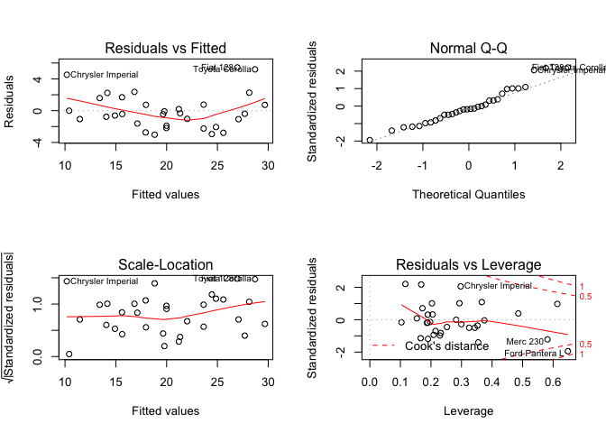
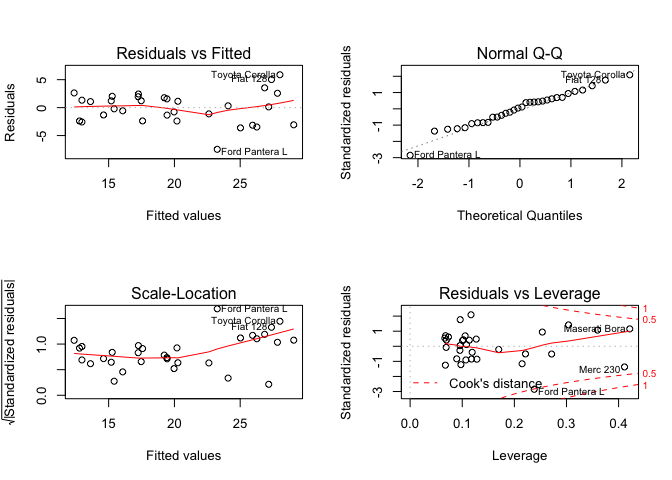
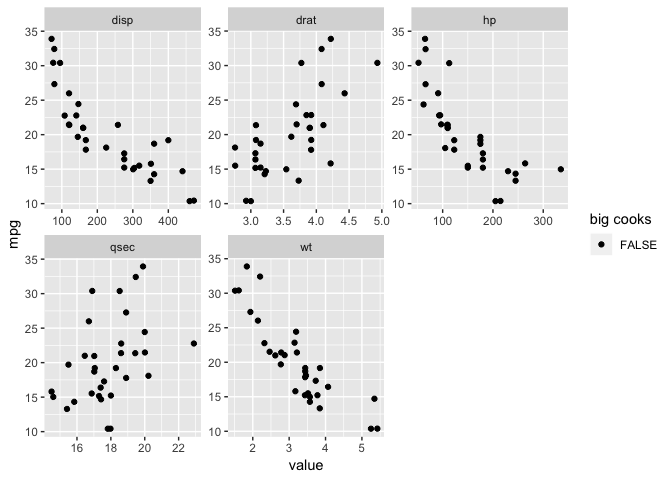
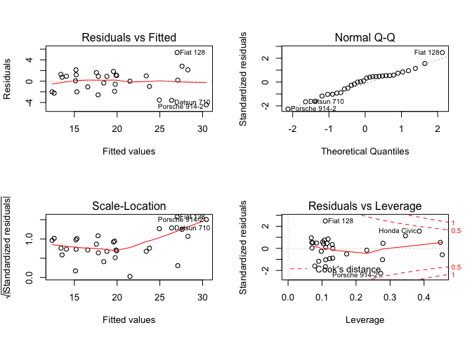
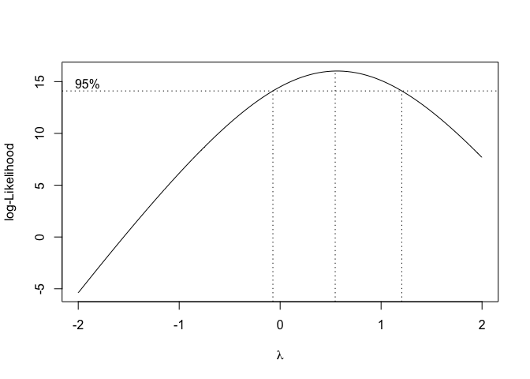
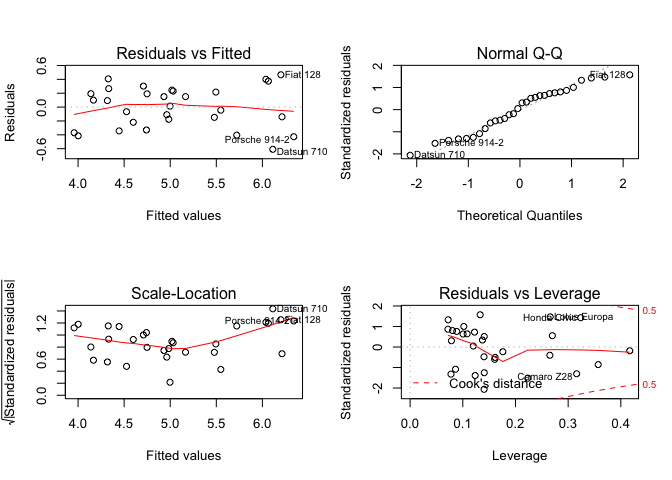

```r
library(dplyr)
```

```
## 
## Attaching package: 'dplyr'
```

```
## The following objects are masked from 'package:stats':
## 
##     filter, lag
```

```
## The following objects are masked from 'package:base':
## 
##     intersect, setdiff, setequal, union
```

```r
library(car)
```

```
## Loading required package: carData
```

```
## 
## Attaching package: 'car'
```

```
## The following object is masked from 'package:dplyr':
## 
##     recode
```

```r
mtcars %>% head
```

```
##                    mpg cyl disp  hp drat    wt  qsec vs am gear carb
## Mazda RX4         21.0   6  160 110 3.90 2.620 16.46  0  1    4    4
## Mazda RX4 Wag     21.0   6  160 110 3.90 2.875 17.02  0  1    4    4
## Datsun 710        22.8   4  108  93 3.85 2.320 18.61  1  1    4    1
## Hornet 4 Drive    21.4   6  258 110 3.08 3.215 19.44  1  0    3    1
## Hornet Sportabout 18.7   8  360 175 3.15 3.440 17.02  0  0    3    2
## Valiant           18.1   6  225 105 2.76 3.460 20.22  1  0    3    1
```

```r
#vs : V-shaped Engine = 0, straight = 1
#am : Transmission : automatic = 0, manual = 1

#Lets remove cateogrical since we are going to deal with only continuous variables
mtcars <- mtcars %>% subset(select = -c(vs, am))

base.lm <- lm(mpg~., mtcars)
summary(base.lm)
```

```
## 
## Call:
## lm(formula = mpg ~ ., data = mtcars)
## 
## Residuals:
##     Min      1Q  Median      3Q     Max 
## -3.0230 -1.6874 -0.4109  0.9640  5.4400 
## 
## Coefficients:
##             Estimate Std. Error t value Pr(>|t|)  
## (Intercept) 17.88964   17.81996   1.004   0.3259  
## cyl         -0.41460    0.95765  -0.433   0.6691  
## disp         0.01293    0.01758   0.736   0.4694  
## hp          -0.02085    0.02072  -1.006   0.3248  
## drat         1.10110    1.59806   0.689   0.4977  
## wt          -3.92065    1.86174  -2.106   0.0463 *
## qsec         0.54146    0.62122   0.872   0.3924  
## gear         1.23321    1.40238   0.879   0.3883  
## carb        -0.25510    0.81563  -0.313   0.7573  
## ---
## Signif. codes:  0 '***' 0.001 '**' 0.01 '*' 0.05 '.' 0.1 ' ' 1
## 
## Residual standard error: 2.622 on 23 degrees of freedom
## Multiple R-squared:  0.8596,	Adjusted R-squared:  0.8107 
## F-statistic:  17.6 on 8 and 23 DF,  p-value: 4.226e-08
```

```r
par(mfrow=c(2,2))
plot(base.lm)
```

<!-- -->

```r
par(mfrow=c(1,1))

vif(base.lm)
```

```
##       cyl      disp        hp      drat        wt      qsec      gear 
## 13.189675 21.402534  9.102122  3.292037 14.962903  5.556476  4.827297 
##      carb 
##  7.825779
```

```r
cor(mtcars)
```

```
##             mpg        cyl       disp         hp        drat         wt
## mpg   1.0000000 -0.8521620 -0.8475514 -0.7761684  0.68117191 -0.8676594
## cyl  -0.8521620  1.0000000  0.9020329  0.8324475 -0.69993811  0.7824958
## disp -0.8475514  0.9020329  1.0000000  0.7909486 -0.71021393  0.8879799
## hp   -0.7761684  0.8324475  0.7909486  1.0000000 -0.44875912  0.6587479
## drat  0.6811719 -0.6999381 -0.7102139 -0.4487591  1.00000000 -0.7124406
## wt   -0.8676594  0.7824958  0.8879799  0.6587479 -0.71244065  1.0000000
## qsec  0.4186840 -0.5912421 -0.4336979 -0.7082234  0.09120476 -0.1747159
## gear  0.4802848 -0.4926866 -0.5555692 -0.1257043  0.69961013 -0.5832870
## carb -0.5509251  0.5269883  0.3949769  0.7498125 -0.09078980  0.4276059
##             qsec       gear       carb
## mpg   0.41868403  0.4802848 -0.5509251
## cyl  -0.59124207 -0.4926866  0.5269883
## disp -0.43369788 -0.5555692  0.3949769
## hp   -0.70822339 -0.1257043  0.7498125
## drat  0.09120476  0.6996101 -0.0907898
## wt   -0.17471588 -0.5832870  0.4276059
## qsec  1.00000000 -0.2126822 -0.6562492
## gear -0.21268223  1.0000000  0.2740728
## carb -0.65624923  0.2740728  1.0000000
```

```r
#disp, cyl, wt, hp removed by multicollinearity, which will be discussed below. 

mtcars1 <- mtcars %>% subset(select = -c(disp, cyl, wt, hp))

lm1 <- lm(mpg~.,mtcars1)
vif(lm1)
```

```
##     drat     qsec     gear     carb 
## 2.389764 1.784365 2.563259 1.954820
```

```r
par(mfrow=c(2,2))
plot(lm1)
```

<!-- -->

```r
par(mfrow=c(1,1))

summary(lm1)
```

```
## 
## Call:
## lm(formula = mpg ~ ., data = mtcars1)
## 
## Residuals:
##     Min      1Q  Median      3Q     Max 
## -7.4559 -2.3798  0.2245  1.8186  5.8781 
## 
## Coefficients:
##             Estimate Std. Error t value Pr(>|t|)    
## (Intercept)  -6.3349     8.7057  -0.728  0.47308    
## drat          3.4649     1.5547   2.229  0.03436 *  
## qsec          0.3676     0.4020   0.914  0.36860    
## gear          3.6403     1.1669   3.120  0.00428 ** 
## carb         -2.1405     0.4655  -4.598 8.96e-05 ***
## ---
## Signif. codes:  0 '***' 0.001 '**' 0.01 '*' 0.05 '.' 0.1 ' ' 1
## 
## Residual standard error: 2.994 on 27 degrees of freedom
## Multiple R-squared:  0.7851,	Adjusted R-squared:  0.7532 
## F-statistic: 24.66 on 4 and 27 DF,  p-value: 1.123e-08
```

Investigating Linear Regression
===============

Coefficients - Beta Hat
--------------

```r
#Matrix of predictors
X<-model.matrix(mpg~., mtcars1)
#Coefficients
beta <- solve(t(X) %*% X) %*% (t(X) %*% mtcars1$mpg)
beta
```

```
##                   [,1]
## (Intercept) -6.3348714
## drat         3.4648543
## qsec         0.3675611
## gear         3.6402645
## carb        -2.1404624
```

```r
coef(lm1)
```

```
## (Intercept)        drat        qsec        gear        carb 
##  -6.3348714   3.4648543   0.3675611   3.6402645  -2.1404624
```

```r
#fitted values
X %*% beta #This is fitted values
```

```
##                         [,1]
## Mazda RX4           19.22732
## Mazda RX4 Wag       19.43316
## Datsun 710          26.26573
## Hornet 4 Drive      20.26260
## Hornet Sportabout   17.47518
## Valiant             19.44054
## Duster 360          12.96842
## Merc 240D           24.08180
## Merc 230            25.94464
## Merc 280            19.97293
## Merc 280C           20.19347
## Merc 450SE          15.19720
## Merc 450SL          15.27071
## Merc 450SLC         15.41774
## Cadillac Fleetwood  12.78484
## Lincoln Continental 12.96857
## Chrysler Imperial   13.61847
## Fiat 128            27.37874
## Honda Civic         27.83423
## Toyota Corolla      28.02188
## Toyota Corona       22.62032
## Dodge Challenger    16.06875
## AMC Javelin         17.57810
## Camaro Z28          14.61210
## Pontiac Firebird    17.24367
## Fiat X1-9           27.16923
## Porsche 914-2       29.07310
## Lotus Europa        26.85981
## Ford Pantera L      23.25592
## Ferrari Dino        17.26365
## Maserati Bora       12.37473
## Volvo 142E          25.02245
```

```r
predict(lm1)
```

```
##           Mazda RX4       Mazda RX4 Wag          Datsun 710 
##            19.22732            19.43316            26.26573 
##      Hornet 4 Drive   Hornet Sportabout             Valiant 
##            20.26260            17.47518            19.44054 
##          Duster 360           Merc 240D            Merc 230 
##            12.96842            24.08180            25.94464 
##            Merc 280           Merc 280C          Merc 450SE 
##            19.97293            20.19347            15.19720 
##          Merc 450SL         Merc 450SLC  Cadillac Fleetwood 
##            15.27071            15.41774            12.78484 
## Lincoln Continental   Chrysler Imperial            Fiat 128 
##            12.96857            13.61847            27.37874 
##         Honda Civic      Toyota Corolla       Toyota Corona 
##            27.83423            28.02188            22.62032 
##    Dodge Challenger         AMC Javelin          Camaro Z28 
##            16.06875            17.57810            14.61210 
##    Pontiac Firebird           Fiat X1-9       Porsche 914-2 
##            17.24367            27.16923            29.07310 
##        Lotus Europa      Ford Pantera L        Ferrari Dino 
##            26.85981            23.25592            17.26365 
##       Maserati Bora          Volvo 142E 
##            12.37473            25.02245
```


Standard Error for coefficients
---------------------


```r
#First approach from the results of our model
vcov(lm1) #variance-covariance matrix
```

```
##             (Intercept)       drat        qsec        gear       carb
## (Intercept)  75.7897831 -2.8484283 -3.12981986 -0.56764089 -2.5986016
## drat         -2.8484283  2.4171200 -0.07298240 -1.37840859  0.1922245
## qsec         -3.1298199 -0.0729824  0.16158134  0.05531822  0.1081937
## gear         -0.5676409 -1.3784086  0.05531822  1.36156866 -0.1717234
## carb         -2.5986016  0.1922245  0.10819366 -0.17172339  0.2166622
```

```r
sqrt(diag(vcov(lm1))) #Std.Error for Beta hat
```

```
## (Intercept)        drat        qsec        gear        carb 
##   8.7057328   1.5547090   0.4019718   1.1668627   0.4654699
```

```r
#Second approach
solve(t(X) %*% X) #inverse of X'X 
```

```
##             (Intercept)        drat         qsec         gear        carb
## (Intercept)  8.45512253 -0.31777120 -0.349163295 -0.063326125 -0.28990048
## drat        -0.31777120  0.26965437 -0.008141930 -0.153775523  0.02144460
## qsec        -0.34916329 -0.00814193  0.018026045  0.006171311  0.01207011
## gear        -0.06332613 -0.15377552  0.006171311  0.151896857 -0.01915749
## carb        -0.28990048  0.02144460  0.012070106 -0.019157494  0.02417088
```

```r
anova(lm1)[[3]][5] #RSS^2 = Mean of Sum of Squared of Residuals
```

```
## [1] 8.963771
```

```r
solve(t(X) %*% X)*anova(lm1)[[3]][5] #variance-covariance
```

```
##             (Intercept)       drat        qsec        gear       carb
## (Intercept)  75.7897831 -2.8484283 -3.12981986 -0.56764089 -2.5986016
## drat         -2.8484283  2.4171200 -0.07298240 -1.37840859  0.1922245
## qsec         -3.1298199 -0.0729824  0.16158134  0.05531822  0.1081937
## gear         -0.5676409 -1.3784086  0.05531822  1.36156866 -0.1717234
## carb         -2.5986016  0.1922245  0.10819366 -0.17172339  0.2166622
```

```r
inv.XX <- solve(t(X) %*% X) #inverse of X'X

se <- sqrt(diag(inv.XX)*anova(lm1)[[3]][5]) #Std.error for coefficients
se
```

```
## (Intercept)        drat        qsec        gear        carb 
##   8.7057328   1.5547090   0.4019718   1.1668627   0.4654699
```

```r
summary(lm1)[["coefficients"]][,"Std. Error"]
```

```
## (Intercept)        drat        qsec        gear        carb 
##   8.7057328   1.5547090   0.4019718   1.1668627   0.4654699
```


t-value
----------------

```r
#t-value = beta / se
beta / se
```

```
##                   [,1]
## (Intercept) -0.7276666
## drat         2.2286192
## qsec         0.9143953
## gear         3.1197024
## carb        -4.5984980
```

```r
summary(lm1)[["coefficients"]][,"t value"]
```

```
## (Intercept)        drat        qsec        gear        carb 
##  -0.7276666   2.2286192   0.9143953   3.1197024  -4.5984980
```

p-value
----------------

```r
#P-value from t distribution, degrees of freedom = n-p+1, where p is # of predictors, n = 32, p = 7

tvalue <- summary(lm1)[["coefficients"]][, "t value"]

#p value
pvalue <- sapply(tvalue, function(x){pt(-abs(x), df=(nrow(mtcars1)-dim(mtcars1)[2]), lower.tail=TRUE)*2})
pvalue
```

```
##  (Intercept)         drat         qsec         gear         carb 
## 4.730811e-01 3.435896e-02 3.686034e-01 4.275864e-03 8.958921e-05
```

```r
summary(lm1)[["coefficients"]][, "Pr(>|t|)"]
```

```
##  (Intercept)         drat         qsec         gear         carb 
## 4.730811e-01 3.435896e-02 3.686034e-01 4.275864e-03 8.958921e-05
```

confidence interval for coefficients
----------------

```r
#confidence interval for each coef
confint(lm1)
```

```
##                   2.5 %    97.5 %
## (Intercept) -24.1975596 11.527817
## drat          0.2748549  6.654854
## qsec         -0.4572169  1.192339
## gear          1.2460599  6.034469
## carb         -3.0955277 -1.185397
```

```r
#confidence interval
beta.conf <- data.frame("2.5%" = beta - se*(-qt(0.025,nrow(mtcars1)-dim(mtcars1)[2])),
               "97.5%" = beta + se*(-qt(0.025,nrow(mtcars1)-dim(mtcars1)[2])))
colnames(beta.conf) <- c("lower 2.5%", "upper 97.5%")
beta.conf
```

```
##              lower 2.5% upper 97.5%
## (Intercept) -24.1975596   11.527817
## drat          0.2748549    6.654854
## qsec         -0.4572169    1.192339
## gear          1.2460599    6.034469
## carb         -3.0955277   -1.185397
```

```r
confint(lm1)
```

```
##                   2.5 %    97.5 %
## (Intercept) -24.1975596 11.527817
## drat          0.2748549  6.654854
## qsec         -0.4572169  1.192339
## gear          1.2460599  6.034469
## carb         -3.0955277 -1.185397
```

Residual Standard Error
-------------

```r
#first appraoch from predicted values

p <- length(lm1$coefficients)-1 # number of predictors except for intercept
n <- length(lm1$residuals) # number of obs or resid

beta.pred <- X %*% beta 
predict(lm1)
```

```
##           Mazda RX4       Mazda RX4 Wag          Datsun 710 
##            19.22732            19.43316            26.26573 
##      Hornet 4 Drive   Hornet Sportabout             Valiant 
##            20.26260            17.47518            19.44054 
##          Duster 360           Merc 240D            Merc 230 
##            12.96842            24.08180            25.94464 
##            Merc 280           Merc 280C          Merc 450SE 
##            19.97293            20.19347            15.19720 
##          Merc 450SL         Merc 450SLC  Cadillac Fleetwood 
##            15.27071            15.41774            12.78484 
## Lincoln Continental   Chrysler Imperial            Fiat 128 
##            12.96857            13.61847            27.37874 
##         Honda Civic      Toyota Corolla       Toyota Corona 
##            27.83423            28.02188            22.62032 
##    Dodge Challenger         AMC Javelin          Camaro Z28 
##            16.06875            17.57810            14.61210 
##    Pontiac Firebird           Fiat X1-9       Porsche 914-2 
##            17.24367            27.16923            29.07310 
##        Lotus Europa      Ford Pantera L        Ferrari Dino 
##            26.85981            23.25592            17.26365 
##       Maserati Bora          Volvo 142E 
##            12.37473            25.02245
```

```r
error <- with(mtcars1, mpg-predict(lm1)) #y - yhat
RSS2 <- with(mtcars1, error^2) #squared (y - yhat)

sum(RSS2) #sum of squared (y - yhat)
```

```
## [1] 242.0218
```

```r
RSS <- sqrt(sum(RSS2)/(n-(p+1)))  #sqrt of sum of squared (y - yhat) = RSS
RSS
```

```
## [1] 2.993956
```

```r
#second approach from results of our model
RSS2 <- sum(lm1$residuals**2) #sum of square residuals
df <- n-(p+1) #degrees of freedom adding 1

RSS <- sqrt(RSS2 / df)
RSS
```

```
## [1] 2.993956
```


R squared - Explained variability of response variable
--------------

```r
#R^2 = 1 - RSS/SST, here SST = SYY
SYY <- sum((mtcars$mpg - mean(mtcars$mpg))^2)
RSS2
```

```
## [1] 242.0218
```

```r
#R^2
R2<-1-(RSS2/SYY)
R2
```

```
## [1] 0.7850696
```

```r
summary(lm1)$r.squared
```

```
## [1] 0.7850696
```

Adjusted R squared - for multiple variables
-----------------

```r
#Adjusted R Squared are normalized R Squared by taking into account how many samples and how many variables are used. 
adj.R2 <- 1-(RSS2/SYY)*(n-1)/(n-(p+1))
adj.R2
```

```
## [1] 0.753228
```

```r
summary(lm1)$adj.r.squared
```

```
## [1] 0.753228
```


F Statistics
---------------

```r
#It's investigating the hypothesis; at least one of coefficients is not zero
((SYY - RSS2)/p) / (RSS2/(n-(p+1)))
```

```
## [1] 24.65551
```

```r
summary(lm1)$fstatistic[1]
```

```
##    value 
## 24.65551
```

p value - F Statistics
---------------

```r
fvalue <- ((SYY - RSS2)/p) / (RSS2/(n-(p+1)))
fvalue
```

```
## [1] 24.65551
```

```r
#P-value for F statistics
pf(fvalue, p, n-(p+1), lower.tail=FALSE)
```

```
## [1] 1.123108e-08
```

```r
summary(lm1)
```

```
## 
## Call:
## lm(formula = mpg ~ ., data = mtcars1)
## 
## Residuals:
##     Min      1Q  Median      3Q     Max 
## -7.4559 -2.3798  0.2245  1.8186  5.8781 
## 
## Coefficients:
##             Estimate Std. Error t value Pr(>|t|)    
## (Intercept)  -6.3349     8.7057  -0.728  0.47308    
## drat          3.4649     1.5547   2.229  0.03436 *  
## qsec          0.3676     0.4020   0.914  0.36860    
## gear          3.6403     1.1669   3.120  0.00428 ** 
## carb         -2.1405     0.4655  -4.598 8.96e-05 ***
## ---
## Signif. codes:  0 '***' 0.001 '**' 0.01 '*' 0.05 '.' 0.1 ' ' 1
## 
## Residual standard error: 2.994 on 27 degrees of freedom
## Multiple R-squared:  0.7851,	Adjusted R-squared:  0.7532 
## F-statistic: 24.66 on 4 and 27 DF,  p-value: 1.123e-08
```


Assumptions of Linear Regression
=================

1. Outliers
2. Normality of Residuals
3. Multicollinearity
4. Homoscedasticity (Non-Constant Variance of Residuals)


1. Outliers
-----------------

```r
#Sqrt(standardized residuals) > 2 or < -2 by influence
o1<-which(rstandard(lm1, infl = lm.influence(lm1, do.coef = FALSE),
          sd = sqrt(deviance(lm1)/df.residual(lm1)),
          type=c("sd.1", "predictive"))>2)

o2<-which(rstandard(lm1, infl = lm.influence(lm1, do.coef = FALSE),
          sd = sqrt(deviance(lm1)/df.residual(lm1)),
          type=c("sd.1", "predictive"))<(-2))

outliers <- c(o1, o2)
length(outliers)
```

```
## [1] 2
```

```r
out.mtcars1 <- mtcars1[-outliers,]

lm2 <- lm(mpg~., out.mtcars1)
summary(lm2)
```

```
## 
## Call:
## lm(formula = mpg ~ ., data = out.mtcars1)
## 
## Residuals:
##     Min      1Q  Median      3Q     Max 
## -4.4346 -1.6936  0.4705  1.1748  5.3767 
## 
## Coefficients:
##             Estimate Std. Error t value Pr(>|t|)    
## (Intercept)   1.6578     6.9091   0.240   0.8123    
## drat          3.2305     1.2048   2.681   0.0128 *  
## qsec         -0.1248     0.3297  -0.378   0.7083    
## gear          4.2265     0.9094   4.647 9.29e-05 ***
## carb         -2.2915     0.3638  -6.299 1.36e-06 ***
## ---
## Signif. codes:  0 '***' 0.001 '**' 0.01 '*' 0.05 '.' 0.1 ' ' 1
## 
## Residual standard error: 2.298 on 25 degrees of freedom
## Multiple R-squared:  0.8556,	Adjusted R-squared:  0.8324 
## F-statistic: 37.02 on 4 and 25 DF,  p-value: 3.666e-10
```

```r
#much improved by removing only 2 outliers

par(mfrow=c(2,2))
plot(lm2)
```

<!-- -->

```r
par(mfrow=c(1,1))
```


2. Normality of Residuals
--------------------

```r
library(e1071) #skewness / kurtosis
densityPlot(lm2$residuals)
```

<!-- -->

```r
skewness(lm2$residuals) #we would say this is not normal
```

```
## [1] -0.04867746
```

```r
kurtosis(lm2$residuals) #well?
```

```
## [1] -0.1176351
```

```r
shapiro.test(lm2$residuals) #P-value > 0.05, then it's normal distribution
```

```
## 
## 	Shapiro-Wilk normality test
## 
## data:  lm2$residuals
## W = 0.9661, p-value = 0.4387
```


3. Multicollinearity 
-------------------

```r
#I actually remove those predictors that have correlation each other predictors,
#which have collinearity. 

library(Matrix)
out.mtcars1 %>% dim
```

```
## [1] 30  5
```

```r
mat <- model.matrix(mpg~., out.mtcars1)
rankMatrix(mat)[1] #full rank of our predictors matrix
```

```
## [1] 5
```

```r
vif(lm2)
```

```
##     drat     qsec     gear     carb 
## 2.208303 1.719611 2.344295 1.908959
```

```r
#common cutoff is 5, so it's safe


#Calculation of VIf for drat
drat.r2 <- lm(drat~.-mpg, out.mtcars1)
summary(drat.r2)$r.squared
```

```
## [1] 0.5471636
```

```r
#VIF = 1/(1-R^2), here the R^2 is the R squared value when the predictor fitted by the other predictors
1/(1-summary(drat.r2)$r.squared)
```

```
## [1] 2.208303
```


4. Heteroscedasticity
-------------------

```r
par(mfrow=c(2,2))
plot(lm2)
```

<!-- -->

```r
par(mfrow=c(1,1))
#For the first and third graphs, 
#fitted values vs Residual or fitted values vs sqrt(std residuals)
#If we see some patterns, there's heteroscedasticity

#Since it's too small dataset, it's not likely seemed to exist. 

resid.lm <- lm(lm2$residuals~lm2$fitted.values)
summary(resid.lm)
```

```
## 
## Call:
## lm(formula = lm2$residuals ~ lm2$fitted.values)
## 
## Residuals:
##     Min      1Q  Median      3Q     Max 
## -4.4346 -1.6936  0.4705  1.1748  5.3767 
## 
## Coefficients:
##                     Estimate Std. Error t value Pr(>|t|)
## (Intercept)        7.594e-17  1.586e+00       0        1
## lm2$fitted.values -7.941e-18  7.765e-02       0        1
## 
## Residual standard error: 2.171 on 28 degrees of freedom
## Multiple R-squared:  6.844e-33,	Adjusted R-squared:  -0.03571 
## F-statistic: 1.916e-31 on 1 and 28 DF,  p-value: 1
```

```r
#Is residuals explained by fitted values?
#no, p value for t value is 1
#no, p value for F statistic(Chi-square) is 1 -> at least one beta is 0, which is fitted values
#no, R^2 is very low


library(lmtest)
```

```
## Loading required package: zoo
```

```
## 
## Attaching package: 'zoo'
```

```
## The following objects are masked from 'package:base':
## 
##     as.Date, as.Date.numeric
```

```r
bptest(lm2) #Heteroscedasticity test, P-value < 0.05 -> homoscedasticity
```

```
## 
## 	studentized Breusch-Pagan test
## 
## data:  lm2
## BP = 9.8036, df = 4, p-value = 0.04387
```

```r
library(gvlma)#Gloval Validation of Linear Models Assumptions
summary(gvlma(lm2))
```

```
## 
## Call:
## lm(formula = mpg ~ ., data = out.mtcars1)
## 
## Residuals:
##     Min      1Q  Median      3Q     Max 
## -4.4346 -1.6936  0.4705  1.1748  5.3767 
## 
## Coefficients:
##             Estimate Std. Error t value Pr(>|t|)    
## (Intercept)   1.6578     6.9091   0.240   0.8123    
## drat          3.2305     1.2048   2.681   0.0128 *  
## qsec         -0.1248     0.3297  -0.378   0.7083    
## gear          4.2265     0.9094   4.647 9.29e-05 ***
## carb         -2.2915     0.3638  -6.299 1.36e-06 ***
## ---
## Signif. codes:  0 '***' 0.001 '**' 0.01 '*' 0.05 '.' 0.1 ' ' 1
## 
## Residual standard error: 2.298 on 25 degrees of freedom
## Multiple R-squared:  0.8556,	Adjusted R-squared:  0.8324 
## F-statistic: 37.02 on 4 and 25 DF,  p-value: 3.666e-10
## 
## 
## ASSESSMENT OF THE LINEAR MODEL ASSUMPTIONS
## USING THE GLOBAL TEST ON 4 DEGREES-OF-FREEDOM:
## Level of Significance =  0.05 
## 
## Call:
##  gvlma(x = lm2) 
## 
##                       Value p-value                Decision
## Global Stat        2.362358  0.6694 Assumptions acceptable.
## Skewness           0.013116  0.9088 Assumptions acceptable.
## Kurtosis           0.008941  0.9247 Assumptions acceptable.
## Link Function      0.756606  0.3844 Assumptions acceptable.
## Heteroscedasticity 1.583695  0.2082 Assumptions acceptable.
```

```r
#seems ok! 
```


Transformation
--------------


Boxcox transformation

y(lambda) = 

(y^(lambda)-1)/lambda if lambda != 0
log(y)                if lambda == 0

This searches the lambda that gives the maximum likelihood of y(lambda)

```r
#I will use boxcox transformation for response 
#and log transformation for predictors if it would improve our model
library(MASS)
```

```
## 
## Attaching package: 'MASS'
```

```
## The following object is masked from 'package:dplyr':
## 
##     select
```

```r
#Boxcox

bc<-boxcox(lm2)
```

<!-- -->

```r
lambda <- bc$x[which.max(bc$y)]
lambda
```

```
## [1] 0.5454545
```

```r
#log transformation on predictors
predictors <- colnames(out.mtcars1)[-1]
mt.predictors <- out.mtcars1[,predictors]
mt.predictors.trans <- apply(mt.predictors, 2, function(x){log(x+1)})

#boxcox transformation on response
trans.mpg <- (out.mtcars1$mpg)^(lambda)

trans.mtcars <- data.frame(cbind("mpg" = trans.mpg, mt.predictors.trans))

#boxcox + log transformation
lm3 <- lm(mpg~., trans.mtcars)
summary(lm3)
```

```
## 
## Call:
## lm(formula = mpg ~ ., data = trans.mtcars)
## 
## Residuals:
##      Min       1Q   Median       3Q      Max 
## -0.60889 -0.20813  0.05378  0.22729  0.46630 
## 
## Coefficients:
##             Estimate Std. Error t value Pr(>|t|)    
## (Intercept)   0.8171     2.8448   0.287 0.776301    
## drat          2.2946     0.7951   2.886 0.007931 ** 
## qsec         -0.4338     0.8990  -0.483 0.633576    
## gear          2.3846     0.6099   3.910 0.000625 ***
## carb         -1.2607     0.1985  -6.350  1.2e-06 ***
## ---
## Signif. codes:  0 '***' 0.001 '**' 0.01 '*' 0.05 '.' 0.1 ' ' 1
## 
## Residual standard error: 0.3185 on 25 degrees of freedom
## Multiple R-squared:  0.8572,	Adjusted R-squared:  0.8343 
## F-statistic:  37.5 on 4 and 25 DF,  p-value: 3.195e-10
```

```r
#slightly improved; adj.R^2 : 0.8324 -> 0.8343

par(mfrow=c(2,2))
plot(lm3)
```

<!-- -->

```r
par(mfrow=c(1,1))
```
