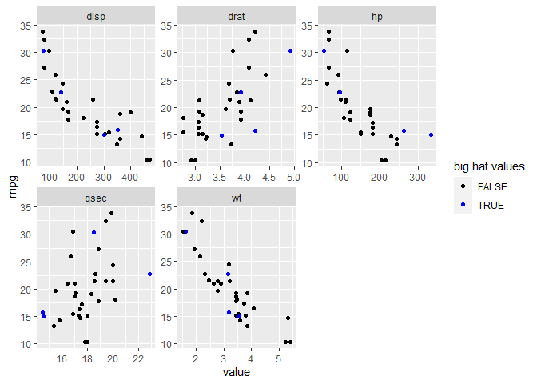
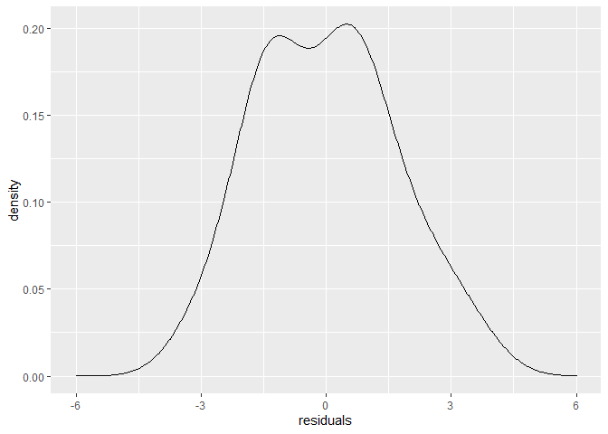
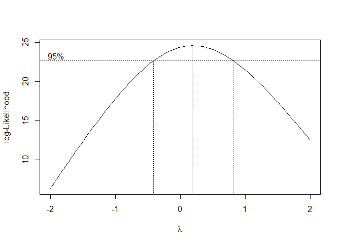

Linear Regression
================
Yongbock (David) Kwon

``` r
library(dplyr)
library(tidyr)
library(ggplot2)
library(car)
```

``` r
data(mtcars)
mtcars %>% head
```

    ##                    mpg cyl disp  hp drat    wt  qsec vs am gear carb
    ## Mazda RX4         21.0   6  160 110 3.90 2.620 16.46  0  1    4    4
    ## Mazda RX4 Wag     21.0   6  160 110 3.90 2.875 17.02  0  1    4    4
    ## Datsun 710        22.8   4  108  93 3.85 2.320 18.61  1  1    4    1
    ## Hornet 4 Drive    21.4   6  258 110 3.08 3.215 19.44  1  0    3    1
    ## Hornet Sportabout 18.7   8  360 175 3.15 3.440 17.02  0  0    3    2
    ## Valiant           18.1   6  225 105 2.76 3.460 20.22  1  0    3    1

``` r
#vs : V-shaped Engine = 0, straight = 1
#am : Transmission : automatic = 0, manual = 1

#Lets remove cateogrical variables since we are going to deal with only continuous variables
mtcars1 <- mtcars %>% subset(select = -c(cyl, vs, am, gear, carb))
lm1 <- lm(mpg~., mtcars1)
summary(lm1)
```

    ## 
    ## Call:
    ## lm(formula = mpg ~ ., data = mtcars1)
    ## 
    ## Residuals:
    ##     Min      1Q  Median      3Q     Max 
    ## -3.5404 -1.6701 -0.4264  1.1320  5.4996 
    ## 
    ## Coefficients:
    ##             Estimate Std. Error t value Pr(>|t|)   
    ## (Intercept) 16.53357   10.96423   1.508  0.14362   
    ## disp         0.00872    0.01119   0.779  0.44281   
    ## hp          -0.02060    0.01528  -1.348  0.18936   
    ## drat         2.01578    1.30946   1.539  0.13579   
    ## wt          -4.38546    1.24343  -3.527  0.00158 **
    ## qsec         0.64015    0.45934   1.394  0.17523   
    ## ---
    ## Signif. codes:  0 '***' 0.001 '**' 0.01 '*' 0.05 '.' 0.1 ' ' 1
    ## 
    ## Residual standard error: 2.558 on 26 degrees of freedom
    ## Multiple R-squared:  0.8489, Adjusted R-squared:  0.8199 
    ## F-statistic: 29.22 on 5 and 26 DF,  p-value: 6.892e-10

``` r
par(mfrow=c(2,2))
plot(lm1)
```

<!-- -->

``` r
par(mfrow=c(1,1))
```

# Investigating Linear Regression

Simple linear regression is defined as below,

  
 + e_i = \\beta_0 + \\beta_1*x + \\hat e_i")  
where   
  
is the random error term.

We want to minimize the difference between the actual value of
 and the
predicted value of .

The difference is called the residual and defined as below,   
  
where   
  

 and
 are chosen
through the method of least squares, which is to minimize the sum of
squared residuals (RSS).

  
^{2} = \\sum_{i=1}^{n} \\left(y_i - b_0 - b_1 x_i \\right)^{2}")  

To minimize RSS with respect to
 and
,

  
 = 0 ")  
  
 = 0 ")  

Rearranging the terms in these last two equations gives

  
  
  
 \\left(y_i - \\bar y \\right)}{\\sum_{i=1}^{n} \\left(x_i - \\bar x \\right)^{2}}")  

Here, since the  = 0"), we see that

  
(y_i - \\bar y) = \\sum_{i=1}^{n}(x_i-\\bar x)y_i - \\bar y\\sum_{i=1}^{n}(x_i-\\bar x) \\\\= \\sum_{i=1}^{n}(x_i-\\bar x)y_i")  
Therefore,

  
y_i}{\\sum_{i=1}^{n}(x_i-\\bar x)^2} =  (X^{T}X)^{-1}X^{T}Y ")  

## Coefficients - Beta Hat

 is defined as..

  
^{-1}X^{T}Y")  

``` r
#Matrix of predictors
X<-model.matrix(mpg~., mtcars1)
#Coefficients 
beta <- solve(t(X) %*% X) %*% (t(X) %*% mtcars1$mpg)
beta
```

    ##                     [,1]
    ## (Intercept) 16.533569595
    ## disp         0.008720176
    ## hp          -0.020598081
    ## drat         2.015774558
    ## wt          -4.385463888
    ## qsec         0.640149901

``` r
coef(lm1) %>% t %>% t
```

    ##                     [,1]
    ## (Intercept) 16.533569595
    ## disp         0.008720176
    ## hp          -0.020598081
    ## drat         2.015774558
    ## wt          -4.385463888
    ## qsec         0.640149901

``` r
#fitted values
X %*% beta #This is fitted values
```

    ##                          [,1]
    ## Mazda RX4           22.571482
    ## Mazda RX4 Wag       21.811672
    ## Datsun 710          25.059373
    ## Hornet 4 Drive      21.071419
    ## Hornet Sportabout   18.227214
    ## Valiant             19.666474
    ## Duster 360          15.580808
    ## Merc 240D           22.787315
    ## Merc 230            24.551610
    ## Merc 280            19.992091
    ## Merc 280C           20.376181
    ## Merc 450SE          14.709138
    ## Merc 450SL          16.328225
    ## Merc 450SLC         16.365012
    ## Cadillac Fleetwood  10.819315
    ## Lincoln Continental  9.784302
    ## Chrysler Imperial    9.854947
    ## Fiat 128            26.900432
    ## Honda Civic         30.833407
    ## Toyota Corolla      29.012924
    ## Toyota Corona       25.040446
    ## Dodge Challenger    17.142907
    ## AMC Javelin         18.455006
    ## Camaro Z28          15.082469
    ## Pontiac Firebird    16.678009
    ## Fiat X1-9           27.700311
    ## Porsche 914-2       25.943673
    ## Lotus Europa        26.818072
    ## Ford Pantera L      18.043280
    ## Ferrari Dino        19.265023
    ## Maserati Bora       13.083910
    ## Volvo 142E          23.343552

``` r
as.matrix(predict(lm1))
```

    ##                          [,1]
    ## Mazda RX4           22.571482
    ## Mazda RX4 Wag       21.811672
    ## Datsun 710          25.059373
    ## Hornet 4 Drive      21.071419
    ## Hornet Sportabout   18.227214
    ## Valiant             19.666474
    ## Duster 360          15.580808
    ## Merc 240D           22.787315
    ## Merc 230            24.551610
    ## Merc 280            19.992091
    ## Merc 280C           20.376181
    ## Merc 450SE          14.709138
    ## Merc 450SL          16.328225
    ## Merc 450SLC         16.365012
    ## Cadillac Fleetwood  10.819315
    ## Lincoln Continental  9.784302
    ## Chrysler Imperial    9.854947
    ## Fiat 128            26.900432
    ## Honda Civic         30.833407
    ## Toyota Corolla      29.012924
    ## Toyota Corona       25.040446
    ## Dodge Challenger    17.142907
    ## AMC Javelin         18.455006
    ## Camaro Z28          15.082469
    ## Pontiac Firebird    16.678009
    ## Fiat X1-9           27.700311
    ## Porsche 914-2       25.943673
    ## Lotus Europa        26.818072
    ## Ford Pantera L      18.043280
    ## Ferrari Dino        19.265023
    ## Maserati Bora       13.083910
    ## Volvo 142E          23.343552

## Residual Standard Error

  
  
  
^2 ")  

``` r
#first appraoch from predicted values

p <- length(lm1$coefficients)-1 # number of predictors except for intercept
n <- length(lm1$residuals) # number of obs or resid

beta.pred <- X %*% beta 
beta.pred
```

    ##                          [,1]
    ## Mazda RX4           22.571482
    ## Mazda RX4 Wag       21.811672
    ## Datsun 710          25.059373
    ## Hornet 4 Drive      21.071419
    ## Hornet Sportabout   18.227214
    ## Valiant             19.666474
    ## Duster 360          15.580808
    ## Merc 240D           22.787315
    ## Merc 230            24.551610
    ## Merc 280            19.992091
    ## Merc 280C           20.376181
    ## Merc 450SE          14.709138
    ## Merc 450SL          16.328225
    ## Merc 450SLC         16.365012
    ## Cadillac Fleetwood  10.819315
    ## Lincoln Continental  9.784302
    ## Chrysler Imperial    9.854947
    ## Fiat 128            26.900432
    ## Honda Civic         30.833407
    ## Toyota Corolla      29.012924
    ## Toyota Corona       25.040446
    ## Dodge Challenger    17.142907
    ## AMC Javelin         18.455006
    ## Camaro Z28          15.082469
    ## Pontiac Firebird    16.678009
    ## Fiat X1-9           27.700311
    ## Porsche 914-2       25.943673
    ## Lotus Europa        26.818072
    ## Ford Pantera L      18.043280
    ## Ferrari Dino        19.265023
    ## Maserati Bora       13.083910
    ## Volvo 142E          23.343552

``` r
as.matrix(predict(lm1))
```

    ##                          [,1]
    ## Mazda RX4           22.571482
    ## Mazda RX4 Wag       21.811672
    ## Datsun 710          25.059373
    ## Hornet 4 Drive      21.071419
    ## Hornet Sportabout   18.227214
    ## Valiant             19.666474
    ## Duster 360          15.580808
    ## Merc 240D           22.787315
    ## Merc 230            24.551610
    ## Merc 280            19.992091
    ## Merc 280C           20.376181
    ## Merc 450SE          14.709138
    ## Merc 450SL          16.328225
    ## Merc 450SLC         16.365012
    ## Cadillac Fleetwood  10.819315
    ## Lincoln Continental  9.784302
    ## Chrysler Imperial    9.854947
    ## Fiat 128            26.900432
    ## Honda Civic         30.833407
    ## Toyota Corolla      29.012924
    ## Toyota Corona       25.040446
    ## Dodge Challenger    17.142907
    ## AMC Javelin         18.455006
    ## Camaro Z28          15.082469
    ## Pontiac Firebird    16.678009
    ## Fiat X1-9           27.700311
    ## Porsche 914-2       25.943673
    ## Lotus Europa        26.818072
    ## Ford Pantera L      18.043280
    ## Ferrari Dino        19.265023
    ## Maserati Bora       13.083910
    ## Volvo 142E          23.343552

``` r
mtcars1$mpg - predict(lm1)
```

    ##           Mazda RX4       Mazda RX4 Wag          Datsun 710 
    ##         -1.57148162         -0.81167228         -2.25937258 
    ##      Hornet 4 Drive   Hornet Sportabout             Valiant 
    ##          0.32858059          0.47278581         -1.56647443 
    ##          Duster 360           Merc 240D            Merc 230 
    ##         -1.28080782          1.61268526         -1.75161045 
    ##            Merc 280           Merc 280C          Merc 450SE 
    ##         -0.79209083         -2.57618077          1.69086228 
    ##          Merc 450SL         Merc 450SLC  Cadillac Fleetwood 
    ##          0.97177457         -1.16501219         -0.41931533 
    ## Lincoln Continental   Chrysler Imperial            Fiat 128 
    ##          0.61569807          4.84505296          5.49956767 
    ##         Honda Civic      Toyota Corolla       Toyota Corona 
    ##         -0.43340728          4.88707571         -3.54044580 
    ##    Dodge Challenger         AMC Javelin          Camaro Z28 
    ##         -1.64290715         -3.25500565         -1.78246913 
    ##    Pontiac Firebird           Fiat X1-9       Porsche 914-2 
    ##          2.52199137         -0.40031087          0.05632667 
    ##        Lotus Europa      Ford Pantera L        Ferrari Dino 
    ##          3.58192825         -2.24327970          0.43497663 
    ##       Maserati Bora          Volvo 142E 
    ##          1.91609010         -1.94355207

``` r
error <- with(mtcars1, mpg-predict(lm1)) #y - yhat
RSS2.hands <- error^2 #squared (y - yhat)

error
```

    ##           Mazda RX4       Mazda RX4 Wag          Datsun 710 
    ##         -1.57148162         -0.81167228         -2.25937258 
    ##      Hornet 4 Drive   Hornet Sportabout             Valiant 
    ##          0.32858059          0.47278581         -1.56647443 
    ##          Duster 360           Merc 240D            Merc 230 
    ##         -1.28080782          1.61268526         -1.75161045 
    ##            Merc 280           Merc 280C          Merc 450SE 
    ##         -0.79209083         -2.57618077          1.69086228 
    ##          Merc 450SL         Merc 450SLC  Cadillac Fleetwood 
    ##          0.97177457         -1.16501219         -0.41931533 
    ## Lincoln Continental   Chrysler Imperial            Fiat 128 
    ##          0.61569807          4.84505296          5.49956767 
    ##         Honda Civic      Toyota Corolla       Toyota Corona 
    ##         -0.43340728          4.88707571         -3.54044580 
    ##    Dodge Challenger         AMC Javelin          Camaro Z28 
    ##         -1.64290715         -3.25500565         -1.78246913 
    ##    Pontiac Firebird           Fiat X1-9       Porsche 914-2 
    ##          2.52199137         -0.40031087          0.05632667 
    ##        Lotus Europa      Ford Pantera L        Ferrari Dino 
    ##          3.58192825         -2.24327970          0.43497663 
    ##       Maserati Bora          Volvo 142E 
    ##          1.91609010         -1.94355207

``` r
RSS2.hands
```

    ##           Mazda RX4       Mazda RX4 Wag          Datsun 710 
    ##         2.469554490         0.658811884         5.104764436 
    ##      Hornet 4 Drive   Hornet Sportabout             Valiant 
    ##         0.107965201         0.223526423         2.453842125 
    ##          Duster 360           Merc 240D            Merc 230 
    ##         1.640468675         2.600753759         3.068139176 
    ##            Merc 280           Merc 280C          Merc 450SE 
    ##         0.627407885         6.636707370         2.859015236 
    ##          Merc 450SL         Merc 450SLC  Cadillac Fleetwood 
    ##         0.944345822         1.357253409         0.175825347 
    ## Lincoln Continental   Chrysler Imperial            Fiat 128 
    ##         0.379084112        23.474538211        30.245244529 
    ##         Honda Civic      Toyota Corolla       Toyota Corona 
    ##         0.187841869        23.883508982        12.534756429 
    ##    Dodge Challenger         AMC Javelin          Camaro Z28 
    ##         2.699143891        10.595061780         3.177196183 
    ##    Pontiac Firebird           Fiat X1-9       Porsche 914-2 
    ##         6.360440483         0.160248794         0.003172693 
    ##        Lotus Europa      Ford Pantera L        Ferrari Dino 
    ##        12.830209964         5.032303792         0.189204668 
    ##       Maserati Bora          Volvo 142E 
    ##         3.671401257         3.777394641

``` r
sum(RSS2.hands) #sum of squared (y - yhat)
```

    ## [1] 170.1291

``` r
RSS.hands <- sum(RSS2.hands)

#second approach from results of our model
RSS.def <- sum(lm1$residuals**2) #sum of square residuals

RSS.def
```

    ## [1] 170.1291

## Standard Error for coefficients

  
^{-1}X^{T}Y")  

  
 = (X^{T}X)^{-1}X^{T}\\sigma^2IX(X^{T}X)^{-1} = \\sigma^2(X^{T}X)^{-1}X^{T}X(X^{T}X)^{-1} \\\\= \\sigma^2(X^{T}X)^{-1} ")  

where  in anova table, where MSE is
Mean of Sum of Squared of Residuals

``` r
#First approach from the results of our model
vcov(lm1) #variance-covariance matrix
```

    ##              (Intercept)          disp            hp         drat
    ## (Intercept) 120.21434693 -3.913906e-02 -8.506173e-02 -9.183490623
    ## disp         -0.03913906  1.251958e-04 -3.966522e-05  0.005149514
    ## hp           -0.08506173 -3.966522e-05  2.335727e-04 -0.001643319
    ## drat         -9.18349062  5.149514e-03 -1.643319e-03  1.714684098
    ## wt            2.71740943 -9.730204e-03 -5.468125e-03  0.190251467
    ## qsec         -4.15803471  1.616696e-03  4.675610e-03  0.081651900
    ##                       wt         qsec
    ## (Intercept)  2.717409426 -4.158034714
    ## disp        -0.009730204  0.001616696
    ## hp          -0.005468125  0.004675610
    ## drat         0.190251467  0.081651900
    ## wt           1.546123355 -0.298555891
    ## qsec        -0.298555891  0.210997231

``` r
sqrt(diag(vcov(lm1))) #Std.Error for Beta hat
```

    ## (Intercept)        disp          hp        drat          wt        qsec 
    ## 10.96423034  0.01118909  0.01528309  1.30945947  1.24343209  0.45934435

``` r
#Second approach
solve(t(X) %*% X) #inverse of X'X 
```

    ##             (Intercept)          disp            hp          drat
    ## (Intercept) 18.37176829 -5.981430e-03 -1.299957e-02 -1.4034677733
    ## disp        -0.00598143  1.913305e-05 -6.061841e-06  0.0007869750
    ## hp          -0.01299957 -6.061841e-06  3.569577e-05 -0.0002511404
    ## drat        -1.40346777  7.869750e-04 -2.511404e-04  0.2620467501
    ## wt           0.41528834 -1.487019e-03 -8.356667e-04  0.0290751974
    ## qsec        -0.63545203  2.470717e-04  7.145505e-04  0.0124784589
    ##                        wt          qsec
    ## (Intercept)  0.4152883379 -0.6354520259
    ## disp        -0.0014870194  0.0002470717
    ## hp          -0.0008356667  0.0007145505
    ## drat         0.0290751974  0.0124784589
    ## wt           0.2362864396 -0.0456268306
    ## qsec        -0.0456268306  0.0322456707

``` r
anova(lm1)
```

    ## Analysis of Variance Table
    ## 
    ## Response: mpg
    ##           Df Sum Sq Mean Sq  F value   Pr(>F)    
    ## disp       1 808.89  808.89 123.6185 2.23e-11 ***
    ## hp         1  33.67   33.67   5.1449 0.031854 *  
    ## drat       1  30.15   30.15   4.6073 0.041340 *  
    ## wt         1  70.51   70.51  10.7754 0.002933 ** 
    ## qsec       1  12.71   12.71   1.9422 0.175233    
    ## Residuals 26 170.13    6.54                      
    ## ---
    ## Signif. codes:  0 '***' 0.001 '**' 0.01 '*' 0.05 '.' 0.1 ' ' 1

``` r
anova(lm1)[['Mean Sq']][length(anova(lm1)[['Mean Sq']])]#Mean of Sum of Squared of Residuals
```

    ## [1] 6.543428

``` r
MSE <- RSS.hands/(n-p-1)
MSE
```

    ## [1] 6.543428

``` r
#This is vcov(lm1)
solve(t(X) %*% X)*MSE #variance-covariance
```

    ##              (Intercept)          disp            hp         drat
    ## (Intercept) 120.21434693 -3.913906e-02 -8.506173e-02 -9.183490623
    ## disp         -0.03913906  1.251958e-04 -3.966522e-05  0.005149514
    ## hp           -0.08506173 -3.966522e-05  2.335727e-04 -0.001643319
    ## drat         -9.18349062  5.149514e-03 -1.643319e-03  1.714684098
    ## wt            2.71740943 -9.730204e-03 -5.468125e-03  0.190251467
    ## qsec         -4.15803471  1.616696e-03  4.675610e-03  0.081651900
    ##                       wt         qsec
    ## (Intercept)  2.717409426 -4.158034714
    ## disp        -0.009730204  0.001616696
    ## hp          -0.005468125  0.004675610
    ## drat         0.190251467  0.081651900
    ## wt           1.546123355 -0.298555891
    ## qsec        -0.298555891  0.210997231

``` r
inv.XX <- solve(t(X) %*% X) #inverse of X'X

se <- sqrt(diag(inv.XX)*MSE) #Std.error for coefficients
se
```

    ## (Intercept)        disp          hp        drat          wt        qsec 
    ## 10.96423034  0.01118909  0.01528309  1.30945947  1.24343209  0.45934435

``` r
summary(lm1)[["coefficients"]][,"Std. Error"]
```

    ## (Intercept)        disp          hp        drat          wt        qsec 
    ## 10.96423034  0.01118909  0.01528309  1.30945947  1.24343209  0.45934435

## T-value

Test:

Null  :
 against, Alternative
: 

T statistic = }")

We set the  in the formula to test the hypothesis
 : .

``` r
#t-value = beta / se
(beta - 0)/ se
```

    ##                   [,1]
    ## (Intercept)  1.5079553
    ## disp         0.7793462
    ## hp          -1.3477698
    ## drat         1.5393944
    ## wt          -3.5269026
    ## qsec         1.3936166

``` r
as.matrix(summary(lm1)[["coefficients"]][,"t value"])
```

    ##                   [,1]
    ## (Intercept)  1.5079553
    ## disp         0.7793462
    ## hp          -1.3477698
    ## drat         1.5393944
    ## wt          -3.5269026
    ## qsec         1.3936166

## p-value

``` r
#P-value from t distribution, degrees of freedom = n-p-1, where p is # of predictors, n = 32, p = 6
tvalue <- summary(lm1)[["coefficients"]][,"t value"]

#p value by t student distribution
pvalue <- 
  sapply(tvalue, function(x){pt(-abs(x), df=(nrow(mtcars1)-dim(mtcars1)[2]), lower.tail=TRUE)*2})
pvalue
```

    ## (Intercept)        disp          hp        drat          wt        qsec 
    ## 0.143622106 0.442812305 0.189359670 0.135791211 0.001584059 0.175232676

``` r
summary(lm1)[["coefficients"]][, "Pr(>|t|)"]
```

    ## (Intercept)        disp          hp        drat          wt        qsec 
    ## 0.143622106 0.442812305 0.189359670 0.135791211 0.001584059 0.175232676

## Confidence Interval for Coefficients

Confidence Interval for Coefficients..

  
*t(\\frac{\\alpha}{2}, n-p-1)")  

where ") is the
")th quantile of the t-distribution with
 degrees of
freedom.

For 95% confidence interval,

``` r
#confidence interval for each coef
confint(lm1)
```

    ##                   2.5 %      97.5 %
    ## (Intercept) -6.00372864 39.07086783
    ## disp        -0.01427933  0.03171968
    ## hp          -0.05201291  0.01081675
    ## drat        -0.67585793  4.70740704
    ## wt          -6.94137515 -1.82955263
    ## qsec        -0.30404593  1.58434573

``` r
#confidence interval
beta.conf <- data.frame("2.5%" = beta - se*(-qt(0.025,nrow(mtcars1)-dim(mtcars1)[2])),
               "97.5%" = beta + se*(-qt(0.025,nrow(mtcars1)-dim(mtcars1)[2])))
colnames(beta.conf) <- c("2.5%", "97.5%")
beta.conf
```

    ##                    2.5%       97.5%
    ## (Intercept) -6.00372864 39.07086783
    ## disp        -0.01427933  0.03171968
    ## hp          -0.05201291  0.01081675
    ## drat        -0.67585793  4.70740704
    ## wt          -6.94137515 -1.82955263
    ## qsec        -0.30404593  1.58434573

``` r
confint(lm1)
```

    ##                   2.5 %      97.5 %
    ## (Intercept) -6.00372864 39.07086783
    ## disp        -0.01427933  0.03171968
    ## hp          -0.05201291  0.01081675
    ## drat        -0.67585793  4.70740704
    ## wt          -6.94137515 -1.82955263
    ## qsec        -0.30404593  1.58434573

## R squared - Explained variability of response variable

From the below,

  
  
where ") is sum of sqaured of
, ^2") is regression sum of
squares (sum of squares explained by the regression model)

  
  
  
  
where  is the
coefficient of determination of the regression line, which is the
proportion of the total sample variability in the Y’s explained by the
regressionl model.

If we have one predictor, then ^2")

``` r
#R^2 = 1 - RSS/SST, here SST = SYY
SYY <- sum((mtcars1$mpg - mean(mtcars1$mpg))^2)
SYY
```

    ## [1] 1126.047

``` r
RSS.hands #sum of squared of residuals
```

    ## [1] 170.1291

``` r
#R^2 = 1 - RSS/SST = 1 - RSS/SYY
R2<-1-(RSS.hands/SYY)
R2
```

    ## [1] 0.8489147

``` r
summary(lm1)$r.squared
```

    ## [1] 0.8489147

## Adjusted R squared - for multiple variables

For the model adding more predictors, we often use the
 defined by,

  
  

``` r
#Adjusted R Squared are normalized R Squared by taking into account how many samples and how many variables are used. 
adj.R2 <- 1-(RSS.hands/SYY)*(n-1)/(n-(p+1))
adj.R2
```

    ## [1] 0.8198599

``` r
summary(lm1)$adj.r.squared
```

    ## [1] 0.8198599

## F Statistics

F test statistic is defined as , which here
is } = \\frac{(SST-RSS)/p}{RSS/(n-p-1)}")

``` r
#It's investigating the hypothesis; at least one of coefficients is not zero
((SYY - RSS.hands)/p) / (RSS.hands/(n-(p+1)))
```

    ## [1] 29.21765

``` r
summary(lm1)$fstatistic[1]
```

    ##    value 
    ## 29.21765

## p value for F Statistics

``` r
fvalue <- ((SYY - RSS.hands)/p) / (RSS.hands/(n-(p+1)))
fvalue
```

    ## [1] 29.21765

``` r
#P-value for F statistics
pf(fvalue, p, n-(p+1), lower.tail=FALSE)
```

    ## [1] 6.892136e-10

``` r
sum.lm1 <- summary(lm1)

pf(sum.lm1$fstatistic[1],sum.lm1$fstatistic[2],sum.lm1$fstatistic[3],lower.tail=FALSE)
```

    ##        value 
    ## 6.892136e-10

# Assumptions of Linear Regression

1.  Outliers

2.  Normality of Residuals

3.  Multicollinearity

4.  Homoscedasticity (Non-Constant Variance of Residuals)

5.  ## Outliers

<!-- end list -->

``` r
cooks <- cooks.distance(lm1)
hat <- lm.influence(lm1)$hat


infl <- rstandard(lm1, infl = lm.influence(lm1, do.coef = FALSE),
          sd = sqrt(deviance(lm1)/df.residual(lm1)),
          type=c("sd.1", "predictive"))

mtcars1$cooks <- cooks
mtcars1$hat <- hat
mtcars1$inf <- infl

mtcars1 %>% gather(-mpg,-cooks, -hat, -inf, key = "var", value = "value") %>%
  ggplot(aes(x=value, y=mpg, color = cooks > qf(.1, p, n-p))) +
  geom_jitter()+
  facet_wrap(~var, scales="free") +
  scale_color_manual(name = "big cooks", values = setNames(c('red', 'black'), c(T,F)))
```

<!-- -->

``` r
mtcars1 %>% gather(-mpg,-cooks, -hat, -inf, key = "var", value = "value") %>%
  ggplot(aes(x=value, y=mpg, color = hat > 2*(p/n))) +
  geom_jitter()+
  facet_wrap(~var, scales="free") +
  scale_color_manual(name = "big hat values", values = setNames(c('blue', 'black'), c(T,F)))
```

<!-- -->

``` r
mtcars1 %>% gather(-mpg,-cooks, -hat,-inf, key = "var", value = "value") %>%
  ggplot(aes(x=value, y=mpg, color = abs(inf) > 2)) +
  geom_jitter()+
  facet_wrap(~var, scales="free") +
  scale_color_manual(name = "big std error", values = setNames(c('green', 'black'), c(T,F)))
```

<!-- -->

``` r
mtcars1 <- mtcars1 %>% subset(select = -c(cooks, hat, inf))

#Sqrt(standardized residuals) > 2 or < -2 by influence
outliers <- which(abs(infl) > 2)

length(outliers)
```

    ## [1] 3

``` r
out.mtcars1 <- mtcars1[-outliers,]

lm2 <- lm(mpg~., out.mtcars1)
summary(lm2)
```

    ## 
    ## Call:
    ## lm(formula = mpg ~ ., data = out.mtcars1)
    ## 
    ## Residuals:
    ##     Min      1Q  Median      3Q     Max 
    ## -3.1076 -1.3244  0.2009  1.0608  3.5902 
    ## 
    ## Coefficients:
    ##              Estimate Std. Error t value Pr(>|t|)    
    ## (Intercept) 25.328066   8.076535   3.136  0.00463 ** 
    ## disp         0.006860   0.008074   0.850  0.40430    
    ## hp          -0.021661   0.011011  -1.967  0.06134 .  
    ## drat         1.044083   0.965908   1.081  0.29093    
    ## wt          -4.491025   0.956688  -4.694 9.97e-05 ***
    ## qsec         0.363061   0.339420   1.070  0.29587    
    ## ---
    ## Signif. codes:  0 '***' 0.001 '**' 0.01 '*' 0.05 '.' 0.1 ' ' 1
    ## 
    ## Residual standard error: 1.831 on 23 degrees of freedom
    ## Multiple R-squared:  0.8957, Adjusted R-squared:  0.8731 
    ## F-statistic: 39.52 on 5 and 23 DF,  p-value: 1.503e-10

``` r
#much improved by removing only 3 outliers
#R.squared: 0.8489 -> 0.8957
#adj R.squared: 0.8199 -> 0.8731

par(mfrow=c(2,2))
plot(lm2)
```

<!-- -->

``` r
par(mfrow=c(1,1))
```

## 2\. Normality of Residuals

``` r
library(e1071) #skewness / kurtosis

resid <- data.frame(residuals = lm2$residuals)
resid
```

    ##                       residuals
    ## Mazda RX4           -1.32443898
    ## Mazda RX4 Wag       -0.38254161
    ## Datsun 710          -1.61162857
    ## Hornet 4 Drive       0.84966291
    ## Hornet Sportabout    0.67387188
    ## Valiant             -1.18103731
    ## Duster 360          -1.26029275
    ## Merc 240D            2.62100226
    ## Merc 230             0.30361701
    ## Merc 280             0.09873828
    ## Merc 280C           -1.51909815
    ## Merc 450SE           1.83470047
    ## Merc 450SL           1.13513983
    ## Merc 450SLC         -0.88553321
    ## Cadillac Fleetwood   0.26527615
    ## Lincoln Continental  1.33064411
    ## Honda Civic          1.06076315
    ## Toyota Corona       -2.60846709
    ## Dodge Challenger    -1.95858478
    ## AMC Javelin         -3.10758978
    ## Camaro Z28          -1.36592273
    ## Pontiac Firebird     2.78052880
    ## Fiat X1-9            0.42800793
    ## Porsche 914-2        0.74016480
    ## Lotus Europa         3.59017962
    ## Ford Pantera L      -1.65143555
    ## Ferrari Dino         0.20093021
    ## Maserati Bora        1.89954390
    ## Volvo 142E          -0.95620079

``` r
resid %>%
  ggplot(aes(x=residuals)) +
  geom_density() +
  xlim(c(-6,6))
```

<!-- -->

``` r
skewness(lm2$residuals) #we would say this is not normal
```

    ## [1] 0.2086016

``` r
kurtosis(lm2$residuals) #well?
```

    ## [1] -0.7702626

``` r
shapiro.test(lm2$residuals) #P-value > 0.05, then it's normal distribution
```

    ## 
    ##  Shapiro-Wilk normality test
    ## 
    ## data:  lm2$residuals
    ## W = 0.97855, p-value = 0.8003

## 3\. Multicollinearity

``` r
library(Matrix)
```

    ## 
    ## Attaching package: 'Matrix'

    ## The following object is masked from 'package:tidyr':
    ## 
    ##     expand

``` r
out.mtcars1 %>% dim
```

    ## [1] 29  6

``` r
mat <- model.matrix(mpg~., out.mtcars1)
rankMatrix(mat)[1] 
```

    ## [1] 6

``` r
#full rank of our predictors matrix
identical(dim(out.mtcars1)[2], rankMatrix(mat)[1])
```

    ## [1] TRUE

``` r
summary(lm2)
```

    ## 
    ## Call:
    ## lm(formula = mpg ~ ., data = out.mtcars1)
    ## 
    ## Residuals:
    ##     Min      1Q  Median      3Q     Max 
    ## -3.1076 -1.3244  0.2009  1.0608  3.5902 
    ## 
    ## Coefficients:
    ##              Estimate Std. Error t value Pr(>|t|)    
    ## (Intercept) 25.328066   8.076535   3.136  0.00463 ** 
    ## disp         0.006860   0.008074   0.850  0.40430    
    ## hp          -0.021661   0.011011  -1.967  0.06134 .  
    ## drat         1.044083   0.965908   1.081  0.29093    
    ## wt          -4.491025   0.956688  -4.694 9.97e-05 ***
    ## qsec         0.363061   0.339420   1.070  0.29587    
    ## ---
    ## Signif. codes:  0 '***' 0.001 '**' 0.01 '*' 0.05 '.' 0.1 ' ' 1
    ## 
    ## Residual standard error: 1.831 on 23 degrees of freedom
    ## Multiple R-squared:  0.8957, Adjusted R-squared:  0.8731 
    ## F-statistic: 39.52 on 5 and 23 DF,  p-value: 1.503e-10

``` r
#cyl, disp, hp, wt seems important variables

vif(lm2)
```

    ##     disp       hp     drat       wt     qsec 
    ## 7.452856 4.532439 2.249335 6.058621 3.146367

``` r
#common cutoff is 5, let's see correlation between each variables

out.mtcars1 %>% 
  subset(select = -mpg) %>%
  cor
```

    ##            disp         hp        drat          wt        qsec
    ## disp  1.0000000  0.7540401 -0.68525159  0.86252284 -0.38850705
    ## hp    0.7540401  1.0000000 -0.38481506  0.59751118 -0.69249038
    ## drat -0.6852516 -0.3848151  1.00000000 -0.70254744  0.01465218
    ## wt    0.8625228  0.5975112 -0.70254744  1.00000000 -0.08963982
    ## qsec -0.3885070 -0.6924904  0.01465218 -0.08963982  1.00000000

``` r
#Calculation of VIf for drat
drat.r2 <- lm(drat~.-mpg, out.mtcars1)
summary(drat.r2)$r.squared
```

    ## [1] 0.5554241

``` r
#VIF = 1/(1-R^2), here the R^2 is the R squared value when the predictor fitted by the other predictors
1/(1-summary(drat.r2)$r.squared)
```

    ## [1] 2.249335

``` r
#Calculation of VIf for cyl
disp.r2 <- lm(disp~.-mpg, out.mtcars1)
summary(disp.r2)$r.squared
```

    ## [1] 0.8658232

``` r
#VIF = 1/(1-R^2), here the R^2 is the R squared value when the predictor fitted by the other predictors
1/(1-summary(disp.r2)$r.squared)
```

    ## [1] 7.452856

``` r
out.mtcars2 <- out.mtcars1 %>% subset(select = -c( disp))

lm3 <- lm(mpg~., data=out.mtcars2)

vif(lm3)
```

    ##       hp     drat       wt     qsec 
    ## 4.321273 1.984090 3.283749 2.803516

``` r
summary(lm3)
```

    ## 
    ## Call:
    ## lm(formula = mpg ~ ., data = out.mtcars2)
    ## 
    ## Residuals:
    ##     Min      1Q  Median      3Q     Max 
    ## -2.9052 -1.2754 -0.2706  1.1806  3.6281 
    ## 
    ## Coefficients:
    ##             Estimate Std. Error t value Pr(>|t|)    
    ## (Intercept) 27.55321    7.59570   3.627  0.00134 ** 
    ## hp          -0.01964    0.01069  -1.837  0.07855 .  
    ## drat         0.76228    0.90190   0.845  0.40635    
    ## wt          -3.94095    0.70022  -5.628 8.56e-06 ***
    ## qsec         0.26787    0.31853   0.841  0.40868    
    ## ---
    ## Signif. codes:  0 '***' 0.001 '**' 0.01 '*' 0.05 '.' 0.1 ' ' 1
    ## 
    ## Residual standard error: 1.821 on 24 degrees of freedom
    ## Multiple R-squared:  0.8925, Adjusted R-squared:  0.8745 
    ## F-statistic:  49.8 on 4 and 24 DF,  p-value: 2.798e-11

``` r
#common cutoff value for VIF is 5, so it's safe now

#Even though the R.squared value is decreased, this model is more likely to be a valid model
```

## 4\. Heteroscedasticity

``` r
par(mfrow=c(2,2))
plot(lm2)
```

<!-- -->

``` r
par(mfrow=c(1,1))
#For the first and third graphs, 
#fitted values vs Residual or fitted values vs sqrt(std residuals)
#If we see some patterns, there's heteroscedasticity

#Since it's too small dataset, it's not likely seemed to exist. 

resid.lm <- lm(lm2$residuals~lm2$fitted.values)
summary(resid.lm)
```

    ## 
    ## Call:
    ## lm(formula = lm2$residuals ~ lm2$fitted.values)
    ## 
    ## Residuals:
    ##     Min      1Q  Median      3Q     Max 
    ## -3.1076 -1.3244  0.2009  1.0608  3.5902 
    ## 
    ## Coefficients:
    ##                     Estimate Std. Error t value Pr(>|t|)
    ## (Intercept)       -1.588e-15  1.310e+00       0        1
    ## lm2$fitted.values  8.409e-17  6.566e-02       0        1
    ## 
    ## Residual standard error: 1.69 on 27 degrees of freedom
    ## Multiple R-squared:  8.506e-32,  Adjusted R-squared:  -0.03704 
    ## F-statistic: 2.297e-30 on 1 and 27 DF,  p-value: 1

``` r
#Is residuals explained by fitted values?
#no, p value for t value is 1
#no, p value for F statistic(Chi-square) is 1 -> at least one beta is 0, which is fitted values
#no, R^2 is very low


library(lmtest)
```

    ## Loading required package: zoo

    ## 
    ## Attaching package: 'zoo'

    ## The following objects are masked from 'package:base':
    ## 
    ##     as.Date, as.Date.numeric

``` r
bptest(lm2) #Heteroscedasticity test, P-value < 0.05 -> homoscedasticity
```

    ## 
    ##  studentized Breusch-Pagan test
    ## 
    ## data:  lm2
    ## BP = 5.7376, df = 5, p-value = 0.3326

``` r
library(gvlma)#Gloval Validation of Linear Models Assumptions
summary(gvlma(lm2))
```

    ## 
    ## Call:
    ## lm(formula = mpg ~ ., data = out.mtcars1)
    ## 
    ## Residuals:
    ##     Min      1Q  Median      3Q     Max 
    ## -3.1076 -1.3244  0.2009  1.0608  3.5902 
    ## 
    ## Coefficients:
    ##              Estimate Std. Error t value Pr(>|t|)    
    ## (Intercept) 25.328066   8.076535   3.136  0.00463 ** 
    ## disp         0.006860   0.008074   0.850  0.40430    
    ## hp          -0.021661   0.011011  -1.967  0.06134 .  
    ## drat         1.044083   0.965908   1.081  0.29093    
    ## wt          -4.491025   0.956688  -4.694 9.97e-05 ***
    ## qsec         0.363061   0.339420   1.070  0.29587    
    ## ---
    ## Signif. codes:  0 '***' 0.001 '**' 0.01 '*' 0.05 '.' 0.1 ' ' 1
    ## 
    ## Residual standard error: 1.831 on 23 degrees of freedom
    ## Multiple R-squared:  0.8957, Adjusted R-squared:  0.8731 
    ## F-statistic: 39.52 on 5 and 23 DF,  p-value: 1.503e-10
    ## 
    ## 
    ## ASSESSMENT OF THE LINEAR MODEL ASSUMPTIONS
    ## USING THE GLOBAL TEST ON 4 DEGREES-OF-FREEDOM:
    ## Level of Significance =  0.05 
    ## 
    ## Call:
    ##  gvlma(x = lm2) 
    ## 
    ##                     Value p-value                   Decision
    ## Global Stat        6.6386 0.15627    Assumptions acceptable.
    ## Skewness           0.2337 0.62882    Assumptions acceptable.
    ## Kurtosis           0.4469 0.50381    Assumptions acceptable.
    ## Link Function      4.3921 0.03611 Assumptions NOT satisfied!
    ## Heteroscedasticity 1.5659 0.21081    Assumptions acceptable.

``` r
#seems ok except for link function assumption.
```

## Transformation

Boxcox transformation

``` r
#I will use boxcox transformation for response 
#and log transformation for predictors if it would improve our model
library(MASS)
```

    ## 
    ## Attaching package: 'MASS'

    ## The following object is masked from 'package:dplyr':
    ## 
    ##     select

``` r
#Boxcox

bc<-boxcox(lm3)
```

<!-- -->

``` r
lambda <- bc$x[which.max(bc$y)]
lambda
```

    ## [1] 0.1818182

``` r
#log transformation on predictors
predictors <- colnames(out.mtcars2)[-1]
mt.predictors <- out.mtcars2[,predictors]
mt.predictors.trans <- apply(mt.predictors, 2, function(x){log(x+1)})

#boxcox transformation on response
trans.mpg <- (out.mtcars2$mpg)^(lambda)

trans.mtcars <- data.frame(cbind("mpg" = trans.mpg, mt.predictors.trans))

#boxcox + log transformation
lm4 <- lm(mpg~., trans.mtcars)
summary(lm4)
```

    ## 
    ## Call:
    ## lm(formula = mpg ~ ., data = trans.mtcars)
    ## 
    ## Residuals:
    ##       Min        1Q    Median        3Q       Max 
    ## -0.041126 -0.020942 -0.002838  0.018116  0.065112 
    ## 
    ## Coefficients:
    ##              Estimate Std. Error t value Pr(>|t|)    
    ## (Intercept)  2.097730   0.450118   4.660 9.85e-05 ***
    ## hp          -0.049382   0.030610  -1.613    0.120    
    ## drat        -0.001137   0.066752  -0.017    0.987    
    ## wt          -0.277994   0.048859  -5.690 7.34e-06 ***
    ## qsec         0.084356   0.106737   0.790    0.437    
    ## ---
    ## Signif. codes:  0 '***' 0.001 '**' 0.01 '*' 0.05 '.' 0.1 ' ' 1
    ## 
    ## Residual standard error: 0.02831 on 24 degrees of freedom
    ## Multiple R-squared:  0.9018, Adjusted R-squared:  0.8854 
    ## F-statistic:  55.1 on 4 and 24 DF,  p-value: 9.503e-12

``` r
#slightly improved; adj.R^2 : 0.8745 -> 0.8854

par(mfrow=c(2,2))
plot(lm3)
```

<!-- -->

``` r
par(mfrow=c(1,1))


summary(gvlma(lm4))
```

    ## 
    ## Call:
    ## lm(formula = mpg ~ ., data = trans.mtcars)
    ## 
    ## Residuals:
    ##       Min        1Q    Median        3Q       Max 
    ## -0.041126 -0.020942 -0.002838  0.018116  0.065112 
    ## 
    ## Coefficients:
    ##              Estimate Std. Error t value Pr(>|t|)    
    ## (Intercept)  2.097730   0.450118   4.660 9.85e-05 ***
    ## hp          -0.049382   0.030610  -1.613    0.120    
    ## drat        -0.001137   0.066752  -0.017    0.987    
    ## wt          -0.277994   0.048859  -5.690 7.34e-06 ***
    ## qsec         0.084356   0.106737   0.790    0.437    
    ## ---
    ## Signif. codes:  0 '***' 0.001 '**' 0.01 '*' 0.05 '.' 0.1 ' ' 1
    ## 
    ## Residual standard error: 0.02831 on 24 degrees of freedom
    ## Multiple R-squared:  0.9018, Adjusted R-squared:  0.8854 
    ## F-statistic:  55.1 on 4 and 24 DF,  p-value: 9.503e-12
    ## 
    ## 
    ## ASSESSMENT OF THE LINEAR MODEL ASSUMPTIONS
    ## USING THE GLOBAL TEST ON 4 DEGREES-OF-FREEDOM:
    ## Level of Significance =  0.05 
    ## 
    ## Call:
    ##  gvlma(x = lm4) 
    ## 
    ##                      Value p-value                Decision
    ## Global Stat        4.80789 0.30758 Assumptions acceptable.
    ## Skewness           0.69255 0.40530 Assumptions acceptable.
    ## Kurtosis           0.26233 0.60853 Assumptions acceptable.
    ## Link Function      3.81749 0.05072 Assumptions acceptable.
    ## Heteroscedasticity 0.03553 0.85049 Assumptions acceptable.
