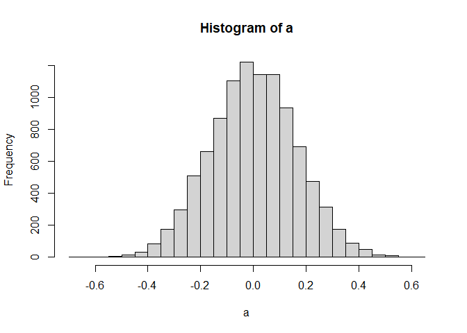

Log Odds
================
David (Yongbock) Kwon

  - [Log Odds (Logit)](#log-odds-logit)
      - [About Log odds..](#about-log-odds..)
      - [With Titanic Dataset](#with-titanic-dataset)

# Log Odds (Logit)

## About Log odds..

``` r
library(dplyr)
```

    ## 
    ## Attaching package: 'dplyr'

    ## The following objects are masked from 'package:stats':
    ## 
    ##     filter, lag

    ## The following objects are masked from 'package:base':
    ## 
    ##     intersect, setdiff, setequal, union

``` r
#creating function to make Logodds table
#and re-convert them to probability with sigmoid function

#lo = log odds
#This function gets log odds input and gives probability converted from the logodds
sigmoid <- function(lo){
  sig <- 1/(1+exp(-lo))
  return(sig)
}

log.odds <- function(p){
  logodds <- log(p/(1-p))
  return(logodds)
}

prob.tab <- function(x,y){
  return(prop.table(table(x,y),2))
}


#about log.odds..
library(e1071)
```

    ## 
    ## Attaching package: 'e1071'

    ## The following object is masked _by_ '.GlobalEnv':
    ## 
    ##     sigmoid

``` r
a<-0

#generating 10000 log odds of uniform random variables
#with binary values classified by randomply picked number between 0 and 1
#We will investigate one of the properties of logodds
for(i in 1:10000){
  
  yn <- ifelse(runif(1000,0,1)<0.4, "yes","no")
  ab <- ifelse(runif(1000,0,1)<0.2, "a","b")
  
  mat <- as.matrix(table(yn,ab))
  
  a[i] <- log((mat[1,1]/mat[1,2])/(mat[2,1]/mat[2,2]))
  
}


hist(a, breaks = 20)
```

<!-- -->

``` r
#The histogram shows that it's really similar to the normal distribution with mean 0. 
mean(a)
```

    ## [1] 0.002606809

``` r
sd(a)
```

    ## [1] 0.1625608

``` r
skewness(a)
```

    ## [1] 0.03474915

``` r
kurtosis(a)
```

    ## [1] -0.07854539

``` r
#Let's generate 2 binary random variable by uniform distribution
yn <- ifelse(runif(1000,0,1)<0.4, "yes","no")
ab <- ifelse(runif(1000,0,1)<0.2, "a","b")

mat <- as.matrix(table(yn,ab))
mat
```

    ##      ab
    ## yn      a   b
    ##   no  131 443
    ##   yes  91 335

``` r
#The standard deviation of the matrix of the 2 r.v
#is quite similar to the standard deviation of 10000 log odds
sqrt(1/mat[1,1] + 1/mat[1,2] + 1/mat[2,1] + 1/mat[2,2])
```

    ## [1] 0.154483

``` r
sd(a)
```

    ## [1] 0.1625608

``` r
#It will show that this log odds is how far from mean 0 by dividing standard deviation
log((mat[1,1]/mat[1,2])/(mat[2,1]/mat[2,2])) / sd(a)
```

    ## [1] 0.5222574

``` r
#If it's far away from mean 0 usually about 2 standard deviation 
#from the mean of the normal distribution,
#then we could say that it's statistically significant. 

#This value is not far away from mean, 
#since the value is just randomly generated with uniform distribution 
#and randomply picked a number to make it binary variable 
```

## With Titanic Dataset

``` r
#Let's see how this works for our predictors
##Survived ~ Sex logodds

getwd()
```

    ## [1] "C:/Users/husie/Desktop/Kaggle/Github/MathematicsBehindAlgorithms/Log Odds"

``` r
train <- read.csv("Datasets/train.csv", stringsAsFactors = TRUE, na.strings = "")
test <- read.csv("Datasets/train.csv", stringsAsFactors = TRUE, na.strings = "")

test$Survived <- NA
dat <- rbind(train,test)

#remove PassengerId
dat <- dat %>% subset(select= -c(PassengerId))

#convert survived and pclass to factor variable
dat$Survived <- as.factor(dat$Survived)
dat$Pclass <- as.factor(dat$Pclass)


#Sex
tab <- table(dat$Survived, dat$Sex)

sqrt(1/tab[1,1] + 1/tab[1,2] + 1/tab[2,1] + 1/tab[2,2])
```

    ## [1] 0.1671783

``` r
#This will show that the log odds is how far from the mean 0 
log((tab[2,1]/tab[1,1]) / (tab[2,2]/tab[1,2])) / sqrt(1/tab[1,1] + 1/tab[1,2] + 1/tab[2,1] + 1/tab[2,2])
```

    ## [1] 15.0361

``` r
#The logodds of the probability of survival given Sex is quite far away from the mean of the normal distribution
#which means that Sex have significant relationship with Survival


#Let's see for the log odds of 3 levels factor variables

#Pclass (1,2, and 3)
tab <- table(dat$Survived, dat$Pclass)


#Given Pclass 1, the log odds of not survival 
lo <- log((tab[1,1]/tab[2,1]) / ((tab[1,2] + tab[1,3]) / (tab[2,2] + tab[2,3])))
sdt <- sqrt(1/tab[1,1] + 1/(tab[1,2] + tab[1,3]) + 1/tab[2,1] + 1/(tab[2,2] + tab[2,3]))

lo/sdt
```

    ## [1] -8.260844

``` r
#Pclass 1 seems important since it's about 8 sd away from mean


#Given Pclass 2, the log odds of not survival
lo <- log((tab[1,2]/tab[2,2]) / ((tab[1,3] + tab[1,1]) / (tab[2,3] + tab[2,1])))
sdt <- sqrt(1/tab[1,2] + 1/(tab[1,3] + tab[1,1]) + 1/tab[2,2] + 1/(tab[2,3] + tab[2,1]))

lo/sdt
```

    ## [1] -2.773732

``` r
#The value is much less than Pclass 1, we might say it's significant factor, but less powerful than Pclass1


#Given Pclass3, the log odds of not survival
lo <- log((tab[1,3]/tab[2,3]) / ((tab[1,2] + tab[1,1]) / (tab[2,2] + tab[2,1])))
sdt <- sqrt(1/tab[1,3] + 1/(tab[1,2] + tab[1,1]) + 1/tab[2,3] + 1/(tab[2,2] + tab[2,1]))

lo/sdt
```

    ## [1] 9.408971

``` r
#Pclass3 is bigger than other Pclass, so we could say this is the most important factor among Pclass factors. 


#Embarked
tab <- table(dat$Survived, dat$Embarked)
tab
```

    ##    
    ##       C   Q   S
    ##   0  75  47 427
    ##   1  93  30 217

``` r
#Given Embarked C, the log odds of not survival 
lo <- log((tab[1,1]/tab[2,1]) / ((tab[1,2] + tab[1,3]) / (tab[2,2] + tab[2,3])))
sdt <- sqrt(1/tab[1,1] + 1/(tab[1,2] + tab[1,3]) + 1/tab[2,1] + 1/(tab[2,2] + tab[2,3]))

lo/sdt
```

    ## [1] -4.984968

``` r
#Embarked C seems meaningful. 

#Given Embarked Q, the log odds of not survival
lo <- log((tab[1,2]/tab[2,2]) / ((tab[1,3] + tab[1,1]) / (tab[2,3] + tab[2,1])))
sdt <- sqrt(1/tab[1,2] + 1/(tab[1,3] + tab[1,1]) + 1/tab[2,2] + 1/(tab[2,3] + tab[2,1]))

lo/sdt
```

    ## [1] -0.135233

``` r
#Given Embarked Q, this factor seems not important to make for the binary prediction of survival


lo <- log((tab[1,3]/tab[2,3]) / ((tab[1,2] + tab[1,1]) / (tab[2,2] + tab[2,1])))
sdt <- sqrt(1/tab[1,3] + 1/(tab[1,2] + tab[1,1]) + 1/tab[2,3] + 1/(tab[2,2] + tab[2,1]))

lo/sdt
```

    ## [1] 4.490127

``` r
#Embarked S seems meaningful. 


#This function gives us the log odds of the probability given each factor level,
#and how far each log odds are from the mean of the normal distribution of the log odds
#as we shows above

#With this function, we can see which factor level of which variable is important to make prediction
log.odds.given <- function(x,y){
  tab <- table(x,y)
  output <- matrix(nrow = 2, ncol=dim(tab)[2])
  
  col <- dim(tab)[2]
  
  for(j in 1:col){
    output[1,j] <- log((tab[2,j] / tab[1,j]) / ((sum(tab[2,]) - tab[2,j]) / (sum(tab[1,]) - tab[1,j]))) 
    output[2,j] <- output[1,j] / sqrt(1/tab[1,j] + 1/(sum(tab[1,]) - tab[1,j]) + 1/tab[2,j] + 1/(sum(tab[2,]) - tab[2,j]))

    }
  
  return(output)
}

#First row of the table is log odds of Survival for each given Pclass level
#Second row of the table is the value that logodds divided by standard deviation,
#which implies that if the bigger value is, especially bigger than 2, 
#the more important the factor level is 

log.odds.given(dat$Survived, dat$Pclass)
```

    ##          [,1]      [,2]      [,3]
    ## [1,] 1.353355 0.4636158 -1.370792
    ## [2,] 8.260844 2.7737321 -9.408971

``` r
#Pclass 1 and 3 important, and 2 not
log.odds.given(dat$Survived, dat$Embarked)
```

    ##           [,1]      [,2]      [,3]
    ## [1,] 0.8669304 0.0330776 -0.685050
    ## [2,] 4.9849681 0.1352330 -4.490127

``` r
#we could say that Embarked Q is rarely important for Survival
log.odds.given(dat$Survived, dat$Sex)
```

    ##          [,1]      [,2]
    ## [1,]  2.51371  -2.51371
    ## [2,] 15.03610 -15.03610
