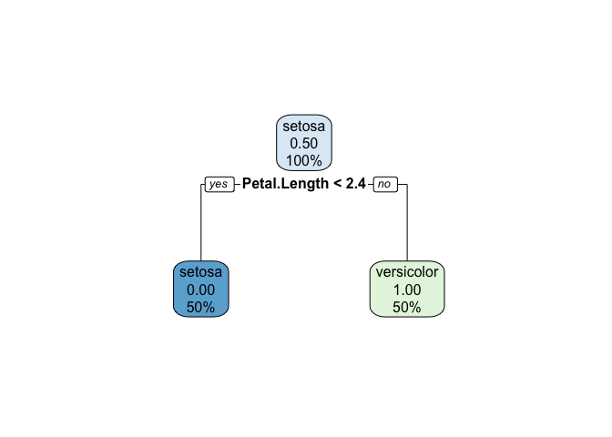
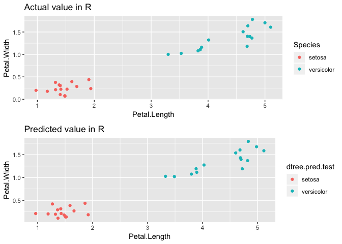
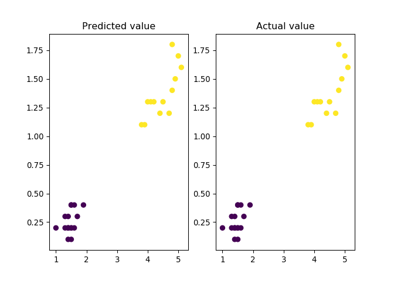
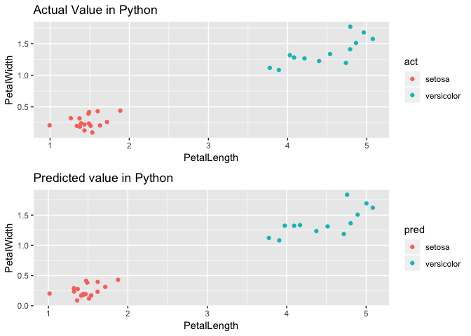
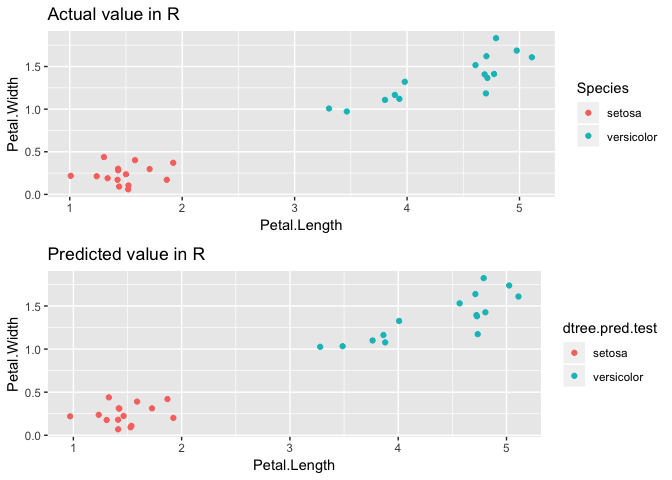
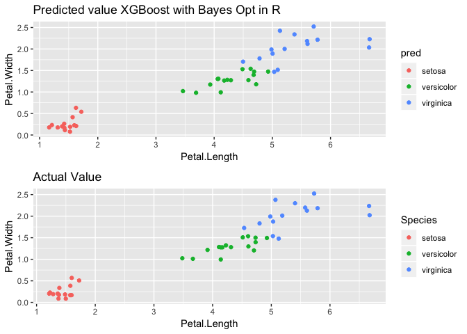
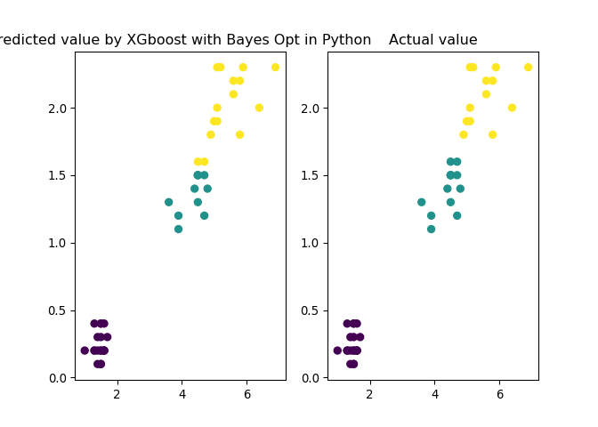
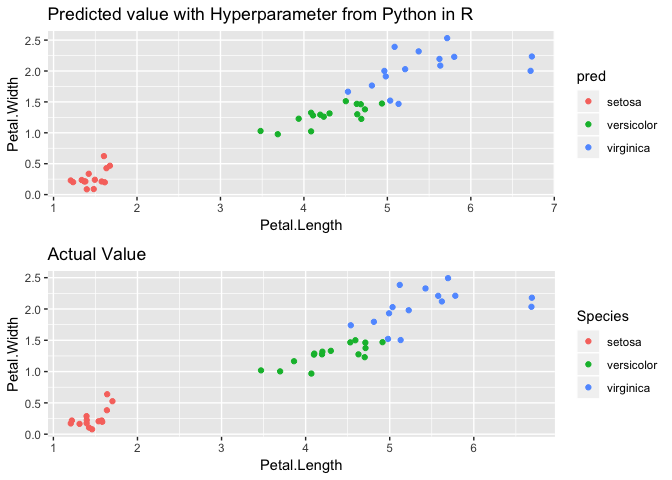
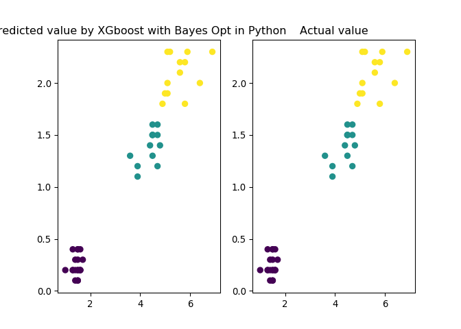

Simple Decision Tree in R
========================


```r
library(caret)
```

```
## Loading required package: lattice
```

```
## Loading required package: ggplot2
```

```
## Registered S3 methods overwritten by 'ggplot2':
##   method         from 
##   [.quosures     rlang
##   c.quosures     rlang
##   print.quosures rlang
```

```r
library(rpart)
library(rpart.plot)
library(ggplot2)
library(dplyr)
```

```
## 
## Attaching package: 'dplyr'
```

```
## The following objects are masked from 'package:stats':
## 
##     filter, lag
```

```
## The following objects are masked from 'package:base':
## 
##     intersect, setdiff, setequal, union
```

```r
library(gridExtra)
```

```
## 
## Attaching package: 'gridExtra'
```

```
## The following object is masked from 'package:dplyr':
## 
##     combine
```

```r
#Quick Decision Tree in R
iris1 <- iris[which(iris$Species != "virginica"),]

#removing the factor level that we don't have any more
iris1$Species <- as.factor(as.character(iris1$Species))

set.seed(1234)
#splitting dataset
training.idx <- createDataPartition(iris1$Species, p=0.7, list=FALSE)

training <- iris1[training.idx,]
testing <- iris1[-training.idx,]

#quick decision tree built in r, rpart
tr <- rpart(Species~., training)
tr
```

```
## n= 70 
## 
## node), split, n, loss, yval, (yprob)
##       * denotes terminal node
## 
## 1) root 70 35 setosa (0.5000000 0.5000000)  
##   2) Petal.Length< 2.35 35  0 setosa (1.0000000 0.0000000) *
##   3) Petal.Length>=2.35 35  0 versicolor (0.0000000 1.0000000) *
```

```r
rpart.plot(tr)
```

<!-- -->

```r
dtree.pred <- predict(tr, type="class")

table(dtree.pred, training$Species)
```

```
##             
## dtree.pred   setosa versicolor
##   setosa         35          0
##   versicolor      0         35
```

```r
#with Petal.Length < 2.5, the model predict perfectly in training set

dtree.pred.test <- predict(tr, testing, type="class")

table(dtree.pred.test, testing$Species)
```

```
##                
## dtree.pred.test setosa versicolor
##      setosa         15          0
##      versicolor      0         15
```

```r
#with Petal.Length < 2.5, the model predict perfectly in testing set as well


t1 <- testing %>% 
  ggplot(aes(x=Petal.Length, y=Petal.Width, col=Species)) + 
  geom_jitter() + ggtitle("Actual value in R")
t2 <- testing %>% 
  ggplot(aes(x=Petal.Length, y=Petal.Width, col=dtree.pred.test)) + 
  geom_jitter() + ggtitle("Predicted value in R")
grid.arrange(t1, t2) 
```

<!-- -->

Python Engine and Virtual Environment Setup
==========================================

```r
library(reticulate)
#Let's use conda environment
Sys.which("python")
```

```
##            python 
## "/usr/bin/python"
```

```r
use_python("/anaconda3/bin/python")

virtualenv_list()
```

```
## [1] "r-reticulate"
```

```r
#you have to reopen Rstudio after installing those packages into virtual environment
#also make sure you have installed the packages in conda environment

#virtualenv_install("r-reticulate", "bayesian-optimization")
#virtualenv_install("r-reticulate", "pandas")
#virtualenv_install("r-reticulate", "seaborn")
#virtualenv_install("r-reticulate", "sklearn")
#virtualenv_install("r-reticulate", "xgboost")
use_virtualenv("r-reticulate")


py_module_available("seaborn")
```

```
## [1] TRUE
```

```r
py_module_available("sklearn")
```

```
## [1] TRUE
```

```r
py_module_available("pandas")
```

```
## [1] TRUE
```

```r
py_module_available("bayes_opt")
```

```
## [1] TRUE
```

```r
py_module_available("xgboost")
```

```
## [1] TRUE
```

Simple Decision Tree as Python Code in R
=======================================

```python
import matplotlib as mlt
import matplotlib.pyplot as plt
import numpy as np
import seaborn as sns
import pandas as pd
from sklearn.datasets import load_iris
from sklearn import tree
from sklearn.model_selection import cross_val_score
from sklearn.model_selection import train_test_split
#iris dataset that I have removed the row for virginica in R environment
r.iris1.head(5)
```

```
##    Sepal.Length  Sepal.Width  Petal.Length  Petal.Width Species
## 0           5.1          3.5           1.4          0.2  setosa
## 1           4.9          3.0           1.4          0.2  setosa
## 2           4.7          3.2           1.3          0.2  setosa
## 3           4.6          3.1           1.5          0.2  setosa
## 4           5.0          3.6           1.4          0.2  setosa
```

```python
r.iris1.describe()

#Let's create same datset from iris in Python module, it's in "new" virtual environment
#import iris dataset from sklearn
```

```
##        Sepal.Length  Sepal.Width  Petal.Length  Petal.Width
## count    100.000000   100.000000    100.000000   100.000000
## mean       5.471000     3.099000      2.861000     0.786000
## std        0.641698     0.478739      1.449549     0.565153
## min        4.300000     2.000000      1.000000     0.100000
## 25%        5.000000     2.800000      1.500000     0.200000
## 50%        5.400000     3.050000      2.450000     0.800000
## 75%        5.900000     3.400000      4.325000     1.300000
## max        7.000000     4.400000      5.100000     1.800000
```

```python
iris2 = load_iris()

r.iris1.columns

#convert sklearn dataset to pandas dataframe
```

```
## Index(['Sepal.Length', 'Sepal.Width', 'Petal.Length', 'Petal.Width',
##        'Species'],
##       dtype='object')
```

```python
df_iris2 = pd.DataFrame(data= np.c_[iris2['data'], iris2['target']], columns= ['SepalLength','SepalWidth','PetalLength','PetalWidth','Species'])

df_iris2.head(5)

#remove "virginica" 
```

```
##    SepalLength  SepalWidth  PetalLength  PetalWidth  Species
## 0          5.1         3.5          1.4         0.2      0.0
## 1          4.9         3.0          1.4         0.2      0.0
## 2          4.7         3.2          1.3         0.2      0.0
## 3          4.6         3.1          1.5         0.2      0.0
## 4          5.0         3.6          1.4         0.2      0.0
```

```python
new_iris2 = df_iris2[df_iris2.Species !=2]

Y = new_iris2.Species
X = new_iris2.iloc[:,0:4]

X_train, X_test, y_train, y_test = train_test_split(X, Y, test_size=0.3, random_state=42)

tree_clf = tree.DecisionTreeClassifier(max_depth=2, random_state=42)
cross_val_score(tree_clf, X_train, y_train, cv=10)
```

```
## array([1., 1., 1., 1., 1., 1., 1., 1., 1., 1.])
```

```python
tree_fit = tree_clf.fit(X_train, y_train)
tree_fit

```

```
## DecisionTreeClassifier(class_weight=None, criterion='gini', max_depth=2,
##             max_features=None, max_leaf_nodes=None,
##             min_impurity_decrease=0.0, min_impurity_split=None,
##             min_samples_leaf=1, min_samples_split=2,
##             min_weight_fraction_leaf=0.0, presort=False, random_state=42,
##             splitter='best')
```

```python
pred = tree_clf.predict(X_test)

pd.crosstab(pred, y_test, rownames = ['pred'], colnames=['actual'])
```

```
## actual  0.0  1.0
## pred            
## 0.0      17    0
## 1.0       0   13
```

```python
plt.subplot(1, 2, 1)
plt.scatter(X_test.PetalLength, X_test.PetalWidth, c=pred)
plt.title('Predicted value')
plt.subplot(1, 2, 2)
plt.scatter(X_test.PetalLength, X_test.PetalWidth, c=y_test)
plt.title('Actual value')
plt.show()
```



Python variables in R
====================


```r
#see the created Dataset from Python
library(plyr)
```

```
## -------------------------------------------------------------------------
```

```
## You have loaded plyr after dplyr - this is likely to cause problems.
## If you need functions from both plyr and dplyr, please load plyr first, then dplyr:
## library(plyr); library(dplyr)
```

```
## -------------------------------------------------------------------------
```

```
## 
## Attaching package: 'plyr'
```

```
## The following objects are masked from 'package:dplyr':
## 
##     arrange, count, desc, failwith, id, mutate, rename, summarise,
##     summarize
```

```r
iris.convert <- function(Y){
  y <- as.character(Y)
  y <- as.factor(revalue(y,c('0' = "setosa", '1' = "versicolor")))
  return(y)
}

py.act <- py$X_test %>% 
  mutate(act = iris.convert(py$y_test)) %>% 
  ggplot(aes(x=PetalLength, y=PetalWidth, col=act)) + 
  geom_jitter()+
  labs(title="Actual Value in Python")

py.pred <- py$X_test %>% 
  mutate(pred = iris.convert(py$pred)) %>% 
  ggplot(aes(x=PetalLength, y=PetalWidth, col=pred)) +
  geom_jitter()+
  labs(title="Predicted value in Python")

grid.arrange(py.act, py.pred) 
```

<!-- -->

```r
grid.arrange(t1,t2)
```

<!-- -->

```r
detach(package:plyr)
```

XGboost with Bayesian Optimization in R
======================================


```r
library(xgboost)
```

```
## 
## Attaching package: 'xgboost'
```

```
## The following object is masked from 'package:dplyr':
## 
##     slice
```

```r
library(rBayesianOptimization)
library(MLmetrics)
```

```
## 
## Attaching package: 'MLmetrics'
```

```
## The following objects are masked from 'package:caret':
## 
##     MAE, RMSE
```

```
## The following object is masked from 'package:base':
## 
##     Recall
```

```r
#Let's remove all environment created above
rm(list=ls())

#labeling species
iris1 <- iris %>% mutate(Species = as.integer(Species)-1)

set.seed(1234)
#splitting dataset
training.idx <- createDataPartition(iris1$Species, p=0.7, list=FALSE)

#splitting
train <- as.matrix(iris1[training.idx,])
valid <- as.matrix(iris1[-training.idx,])

train.label <- iris1$Species[training.idx]
valid.label <- iris1$Species[-training.idx]

#XGB dataform
dtrain <- xgb.DMatrix(data = as.matrix(train),
                      label = train.label)
dvalid <- xgb.DMatrix(data = as.matrix(valid),
                      label = valid.label)

set.seed(1234)
#cv
cv_folds <- createFolds(train.label, k=5, list=TRUE)

#function for bayesian optimization
xgb_cv_bayes <- function(max_depth, min_child_weight, subsample, 
                         colsample_bytree, lambda, gamma, alpha) {
  cv <- xgb.cv(params = list(booster = "gbtree", eta = 0.008,
                             max_depth = max_depth,
                             min_child_weight = min_child_weight,
                             subsample = subsample, 
                             colsample_bytree = colsample_bytree,
                             lambda = lambda, 
                             gamma = gamma,
                             alpha = alpha,
                             objective = "multi:softprob",
                             eval_metric = "mlogloss",
                             num_class=3),
               data = dtrain, nround = 1000,
               folds = cv_folds, prediction = TRUE, showsd = TRUE,
               early_stopping_rounds = 100, maximize = TRUE, verbose = 0)
  list(Score = cv$evaluation_log$test_mlogloss_mean[cv$best_iteration],
       Pred = cv$pred)
}

#BayesianOptimization
Bayes_opt <- BayesianOptimization(xgb_cv_bayes,
                                bounds = list(
                                  #tree depth
                                  max_depth = c(1L,5L), 
                                  #sum of Hessian for each node
                                  min_child_weight = c(1L, 10L),
                                  #randomly sapmle row index(data points)
                                  subsample = c(0.6, 1),
                                  #randomly sample column index(like random forest)
                                  colsample_bytree = c(0.6,1),
                                  #adding L2 regularization term (ridge)
                                  lambda = c(0.001,1),
                                  #adding L1 regularization term (lasso)
                                  alpha = c(0.001,1),
                                  #minimum loss reduction for further partition
                                  gamma = c(0.1,2)),
                                init_grid_dt = NULL, init_points = 10, n_iter = 20,
                                acq = "ucb", kappa = 2.576, eps = 0.0,
                                verbose = TRUE)
```

```
## elapsed = 0.19	Round = 1	max_depth = 3.0000	min_child_weight = 6.0000	subsample = 0.7301	colsample_bytree = 0.7212	lambda = 0.7428	alpha = 0.6396	gamma = 1.9727	Value = 1.0887 
## elapsed = 0.18	Round = 2	max_depth = 3.0000	min_child_weight = 5.0000	subsample = 0.9029	colsample_bytree = 0.7915	lambda = 0.6393	alpha = 0.6611	gamma = 1.1760	Value = 1.0887 
## elapsed = 0.17	Round = 3	max_depth = 2.0000	min_child_weight = 6.0000	subsample = 0.8337	colsample_bytree = 0.7379	lambda = 0.9925	alpha = 0.5288	gamma = 0.6327	Value = 1.0891 
## elapsed = 0.13	Round = 4	max_depth = 1.0000	min_child_weight = 5.0000	subsample = 0.8835	colsample_bytree = 0.8403	lambda = 0.1291	alpha = 0.3182	gamma = 0.4516	Value = 1.0902 
## elapsed = 0.16	Round = 5	max_depth = 4.0000	min_child_weight = 3.0000	subsample = 0.7708	colsample_bytree = 0.6304	lambda = 0.8834	alpha = 0.7681	gamma = 1.5403	Value = 1.0889 
## elapsed = 0.17	Round = 6	max_depth = 2.0000	min_child_weight = 2.0000	subsample = 0.7374	colsample_bytree = 0.9824	lambda = 0.8103	alpha = 0.5268	gamma = 1.1769	Value = 1.0886 
## elapsed = 0.17	Round = 7	max_depth = 5.0000	min_child_weight = 7.0000	subsample = 0.9036	colsample_bytree = 0.6089	lambda = 0.8220	alpha = 0.7326	gamma = 1.8711	Value = 1.0884 
## elapsed = 0.17	Round = 8	max_depth = 3.0000	min_child_weight = 5.0000	subsample = 0.7696	colsample_bytree = 0.9367	lambda = 0.8349	alpha = 0.3084	gamma = 1.3135	Value = 1.0886 
## elapsed = 0.17	Round = 9	max_depth = 5.0000	min_child_weight = 2.0000	subsample = 0.8244	colsample_bytree = 0.8530	lambda = 0.7330	alpha = 0.4048	gamma = 1.4314	Value = 1.0879 
## elapsed = 0.15	Round = 10	max_depth = 3.0000	min_child_weight = 8.0000	subsample = 0.6465	colsample_bytree = 0.7240	lambda = 0.9831	alpha = 0.2052	gamma = 1.0105	Value = 1.0914 
## elapsed = 0.17	Round = 11	max_depth = 4.0000	min_child_weight = 1.0000	subsample = 0.6335	colsample_bytree = 0.7780	lambda = 0.0149	alpha = 0.4809	gamma = 1.5991	Value = 1.0881 
## elapsed = 0.12	Round = 12	max_depth = 1.0000	min_child_weight = 9.0000	subsample = 1.0000	colsample_bytree = 0.6073	lambda = 0.1317	alpha = 0.6680	gamma = 1.7862	Value = 1.0903 
## elapsed = 0.13	Round = 13	max_depth = 1.0000	min_child_weight = 3.0000	subsample = 0.9544	colsample_bytree = 0.6000	lambda = 0.0384	alpha = 0.0010	gamma = 2.0000	Value = 1.0900 
## elapsed = 0.17	Round = 14	max_depth = 4.0000	min_child_weight = 1.0000	subsample = 0.6000	colsample_bytree = 0.6000	lambda = 1.0000	alpha = 0.1587	gamma = 1.5805	Value = 1.0889 
## elapsed = 0.16	Round = 15	max_depth = 3.0000	min_child_weight = 10.0000	subsample = 0.9610	colsample_bytree = 0.9427	lambda = 0.3569	alpha = 0.0108	gamma = 1.9725	Value = 1.0882 
## elapsed = 0.16	Round = 16	max_depth = 3.0000	min_child_weight = 4.0000	subsample = 0.6311	colsample_bytree = 0.6835	lambda = 1.0000	alpha = 0.7848	gamma = 1.8970	Value = 1.0894 
## elapsed = 0.15	Round = 17	max_depth = 2.0000	min_child_weight = 10.0000	subsample = 0.6577	colsample_bytree = 0.7620	lambda = 0.8120	alpha = 0.4082	gamma = 0.1845	Value = 1.0938 
## elapsed = 0.21	Round = 18	max_depth = 3.0000	min_child_weight = 10.0000	subsample = 0.6550	colsample_bytree = 0.9178	lambda = 0.1577	alpha = 0.2252	gamma = 0.4923	Value = 1.0938 
## elapsed = 0.15	Round = 19	max_depth = 4.0000	min_child_weight = 8.0000	subsample = 0.6063	colsample_bytree = 0.6852	lambda = 0.7397	alpha = 0.8295	gamma = 0.3595	Value = 1.0916 
## elapsed = 0.14	Round = 20	max_depth = 1.0000	min_child_weight = 10.0000	subsample = 0.9592	colsample_bytree = 0.6722	lambda = 0.0010	alpha = 0.4506	gamma = 0.5343	Value = 1.0899 
## elapsed = 0.13	Round = 21	max_depth = 1.0000	min_child_weight = 10.0000	subsample = 0.6000	colsample_bytree = 1.0000	lambda = 0.4351	alpha = 0.7591	gamma = 1.5983	Value = 1.0955 
## elapsed = 0.14	Round = 22	max_depth = 2.0000	min_child_weight = 10.0000	subsample = 0.6000	colsample_bytree = 0.9818	lambda = 0.5416	alpha = 0.7228	gamma = 1.4284	Value = 1.0936 
## elapsed = 0.12	Round = 23	max_depth = 1.0000	min_child_weight = 10.0000	subsample = 0.6000	colsample_bytree = 0.6000	lambda = 0.0010	alpha = 0.8176	gamma = 0.1000	Value = 1.0940 
## elapsed = 0.12	Round = 24	max_depth = 1.0000	min_child_weight = 10.0000	subsample = 0.6000	colsample_bytree = 1.0000	lambda = 0.0010	alpha = 0.0071	gamma = 0.1000	Value = 1.0950 
## elapsed = 0.12	Round = 25	max_depth = 1.0000	min_child_weight = 10.0000	subsample = 0.6000	colsample_bytree = 0.6000	lambda = 0.0010	alpha = 0.1805	gamma = 2.0000	Value = 1.0957 
## elapsed = 0.13	Round = 26	max_depth = 1.0000	min_child_weight = 10.0000	subsample = 0.6000	colsample_bytree = 1.0000	lambda = 0.0010	alpha = 0.3433	gamma = 2.0000	Value = 1.0951 
## elapsed = 0.16	Round = 27	max_depth = 4.0000	min_child_weight = 10.0000	subsample = 1.0000	colsample_bytree = 1.0000	lambda = 0.5094	alpha = 0.3589	gamma = 0.1000	Value = 1.0873 
## elapsed = 0.12	Round = 28	max_depth = 1.0000	min_child_weight = 10.0000	subsample = 0.6000	colsample_bytree = 0.6000	lambda = 1.0000	alpha = 0.5949	gamma = 2.0000	Value = 1.0950 
## elapsed = 0.14	Round = 29	max_depth = 1.0000	min_child_weight = 8.0000	subsample = 0.6000	colsample_bytree = 0.7663	lambda = 0.0010	alpha = 0.4888	gamma = 1.2583	Value = 1.0925 
## elapsed = 0.16	Round = 30	max_depth = 1.0000	min_child_weight = 10.0000	subsample = 0.6713	colsample_bytree = 0.6251	lambda = 0.4681	alpha = 0.0010	gamma = 0.3751	Value = 1.0936 
## 
##  Best Parameters Found: 
## Round = 25	max_depth = 1.0000	min_child_weight = 10.0000	subsample = 0.6000	colsample_bytree = 0.6000	lambda = 0.0010	alpha = 0.1805	gamma = 2.0000	Value = 1.0957
```

```r
#It takes times

Bayes_opt
```

```
## $Best_Par
##        max_depth min_child_weight        subsample colsample_bytree 
##        1.0000000       10.0000000        0.6000000        0.6000000 
##           lambda            alpha            gamma 
##        0.0010000        0.1804569        2.0000000 
## 
## $Best_Value
## [1] 1.09568
## 
## $History
##     Round max_depth min_child_weight subsample colsample_bytree     lambda
##  1:     1         3                6 0.7301113        0.7212087 0.74282680
##  2:     2         3                5 0.9029156        0.7915211 0.63927240
##  3:     3         2                6 0.8337086        0.7379322 0.99252347
##  4:     4         1                5 0.8835358        0.8402857 0.12914152
##  5:     5         4                3 0.7707903        0.6304333 0.88335634
##  6:     6         2                2 0.7374291        0.9823970 0.81027330
##  7:     7         5                7 0.9036480        0.6088827 0.82202933
##  8:     8         3                5 0.7696121        0.9366843 0.83486796
##  9:     9         5                2 0.8243549        0.8529770 0.73299949
## 10:    10         3                8 0.6464543        0.7240377 0.98306098
## 11:    11         4                1 0.6334857        0.7780135 0.01489691
## 12:    12         1                9 1.0000000        0.6073161 0.13168511
## 13:    13         1                3 0.9543973        0.6000000 0.03841083
## 14:    14         4                1 0.6000000        0.6000000 1.00000000
## 15:    15         3               10 0.9609974        0.9426905 0.35691905
## 16:    16         3                4 0.6310997        0.6835314 1.00000000
## 17:    17         2               10 0.6577361        0.7619739 0.81201779
## 18:    18         3               10 0.6549849        0.9178138 0.15774553
## 19:    19         4                8 0.6063049        0.6852057 0.73973307
## 20:    20         1               10 0.9592418        0.6722355 0.00100000
## 21:    21         1               10 0.6000000        1.0000000 0.43513359
## 22:    22         2               10 0.6000000        0.9817837 0.54161380
## 23:    23         1               10 0.6000000        0.6000000 0.00100000
## 24:    24         1               10 0.6000000        1.0000000 0.00100000
## 25:    25         1               10 0.6000000        0.6000000 0.00100000
## 26:    26         1               10 0.6000000        1.0000000 0.00100000
## 27:    27         4               10 1.0000000        1.0000000 0.50941363
## 28:    28         1               10 0.6000000        0.6000000 1.00000000
## 29:    29         1                8 0.6000000        0.7663009 0.00100000
## 30:    30         1               10 0.6712777        0.6251123 0.46806584
##     Round max_depth min_child_weight subsample colsample_bytree     lambda
##           alpha     gamma    Value
##  1: 0.639565378 1.9727029 1.088689
##  2: 0.661093880 1.1759904 1.088663
##  3: 0.528831019 0.6327128 1.089076
##  4: 0.318176328 0.4516059 1.090216
##  5: 0.768087614 1.5403167 1.088867
##  6: 0.526782184 1.1768844 1.088596
##  7: 0.732569582 1.8711298 1.088398
##  8: 0.308358075 1.3135173 1.088620
##  9: 0.404769078 1.4314215 1.087895
## 10: 0.205198043 1.0105227 1.091356
## 11: 0.480877191 1.5990562 1.088082
## 12: 0.668036159 1.7862193 1.090254
## 13: 0.001000000 2.0000000 1.090019
## 14: 0.158707682 1.5805265 1.088906
## 15: 0.010809881 1.9724678 1.088177
## 16: 0.784781075 1.8969944 1.089356
## 17: 0.408165978 0.1844722 1.093797
## 18: 0.225212944 0.4923132 1.093771
## 19: 0.829484085 0.3594509 1.091638
## 20: 0.450634874 0.5342727 1.089903
## 21: 0.759078151 1.5982778 1.095457
## 22: 0.722800471 1.4283987 1.093565
## 23: 0.817630841 0.1000000 1.094032
## 24: 0.007138048 0.1000000 1.094970
## 25: 0.180456913 2.0000000 1.095680
## 26: 0.343288323 2.0000000 1.095070
## 27: 0.358900999 0.1000000 1.087314
## 28: 0.594893774 2.0000000 1.094972
## 29: 0.488789768 1.2583407 1.092537
## 30: 0.001000000 0.3751066 1.093636
##           alpha     gamma    Value
## 
## $Pred
##             V1        V2        V3      V1.1      V2.1      V3.1      V1.2
##   1: 0.3368698 0.3316649 0.3314654 0.3369973 0.3315617 0.3314410 0.3369053
##   2: 0.3368698 0.3316649 0.3314654 0.3369973 0.3315617 0.3314410 0.3369053
##   3: 0.3368717 0.3316340 0.3314943 0.3369601 0.3315679 0.3314720 0.3368979
##   4: 0.3368698 0.3316649 0.3314654 0.3369973 0.3315617 0.3314410 0.3369053
##   5: 0.3368076 0.3315942 0.3315982 0.3370071 0.3315469 0.3314460 0.3367374
##  ---                                                                      
## 101: 0.3315939 0.3317008 0.3367052 0.3314413 0.3318113 0.3367474 0.3314808
## 102: 0.3315363 0.3316745 0.3367893 0.3314545 0.3315951 0.3369504 0.3311863
## 103: 0.3315378 0.3317077 0.3367544 0.3314620 0.3317493 0.3367887 0.3312304
## 104: 0.3315092 0.3316395 0.3368514 0.3315991 0.3317394 0.3366615 0.3316250
## 105: 0.3315092 0.3316395 0.3368514 0.3315991 0.3317394 0.3366615 0.3316250
##           V2.2      V3.2      V1.3      V2.3      V3.3      V1.4      V2.4
##   1: 0.3316222 0.3314724 0.3368098 0.3322237 0.3309665 0.3368703 0.3316393
##   2: 0.3316222 0.3314724 0.3368098 0.3322237 0.3309665 0.3368703 0.3316393
##   3: 0.3316084 0.3314938 0.3372246 0.3314082 0.3313672 0.3367985 0.3316746
##   4: 0.3316222 0.3314724 0.3368098 0.3322237 0.3309665 0.3368703 0.3316393
##   5: 0.3319106 0.3313521 0.3368458 0.3321364 0.3310179 0.3368063 0.3316314
##  ---                                                                      
## 101: 0.3320409 0.3364782 0.3313749 0.3314255 0.3371995 0.3313895 0.3322009
## 102: 0.3322447 0.3365690 0.3299107 0.3343618 0.3357275 0.3315119 0.3316751
## 103: 0.3321497 0.3366199 0.3304037 0.3333584 0.3362379 0.3316022 0.3317356
## 104: 0.3317429 0.3366320 0.3304062 0.3333575 0.3362363 0.3315142 0.3317169
## 105: 0.3317429 0.3366320 0.3304062 0.3333575 0.3362363 0.3315142 0.3317169
##           V3.4      V1.5      V2.5      V3.5      V1.6      V2.6      V3.6
##   1: 0.3314904 0.3369140 0.3315920 0.3314941 0.3368903 0.3316407 0.3314690
##   2: 0.3314904 0.3369140 0.3315920 0.3314941 0.3368903 0.3316407 0.3314690
##   3: 0.3315270 0.3369212 0.3316019 0.3314769 0.3369135 0.3316130 0.3314734
##   4: 0.3314904 0.3369140 0.3315920 0.3314941 0.3368903 0.3316407 0.3314690
##   5: 0.3315623 0.3368875 0.3316054 0.3315071 0.3368494 0.3315325 0.3316181
##  ---                                                                      
## 101: 0.3364096 0.3314600 0.3316538 0.3368862 0.3315482 0.3317013 0.3367505
## 102: 0.3368130 0.3312477 0.3320702 0.3366821 0.3315098 0.3316306 0.3368596
## 103: 0.3366621 0.3314683 0.3316339 0.3368978 0.3315575 0.3316913 0.3367513
## 104: 0.3367690 0.3316889 0.3318202 0.3364909 0.3314821 0.3316116 0.3369063
## 105: 0.3367690 0.3316889 0.3318202 0.3364909 0.3314821 0.3316116 0.3369063
##           V1.7      V2.7      V3.7      V1.8      V2.8      V3.8      V1.9
##   1: 0.3369313 0.3315897 0.3314791 0.3369978 0.3315494 0.3314528 0.3359587
##   2: 0.3369313 0.3315897 0.3314791 0.3369978 0.3315494 0.3314528 0.3359587
##   3: 0.3369530 0.3315754 0.3314715 0.3369701 0.3315517 0.3314781 0.3369012
##   4: 0.3369313 0.3315897 0.3314791 0.3369978 0.3315494 0.3314528 0.3359587
##   5: 0.3368928 0.3317316 0.3313757 0.3370095 0.3315439 0.3314466 0.3365189
##  ---                                                                      
## 101: 0.3314650 0.3315787 0.3369564 0.3314455 0.3315572 0.3369973 0.3314266
## 102: 0.3312661 0.3319738 0.3367600 0.3308688 0.3327348 0.3363963 0.3305477
## 103: 0.3314760 0.3315874 0.3369366 0.3314679 0.3315614 0.3369707 0.3305859
## 104: 0.3314838 0.3315975 0.3369186 0.3314621 0.3315684 0.3369695 0.3307435
## 105: 0.3314838 0.3315975 0.3369186 0.3314621 0.3315684 0.3369695 0.3307435
##           V2.9      V3.9     V1.10     V2.10     V3.10     V1.11     V2.11
##   1: 0.3334996 0.3305417 0.3371674 0.3314580 0.3313746 0.3371463 0.3314643
##   2: 0.3334996 0.3305417 0.3371674 0.3314580 0.3313746 0.3371463 0.3314643
##   3: 0.3316055 0.3314933 0.3371689 0.3314674 0.3313636 0.3371463 0.3314643
##   4: 0.3334996 0.3305417 0.3371674 0.3314580 0.3313746 0.3371463 0.3314643
##   5: 0.3317918 0.3316893 0.3371120 0.3314067 0.3314814 0.3368288 0.3320997
##  ---                                                                      
## 101: 0.3321364 0.3364370 0.3314005 0.3314455 0.3371540 0.3313887 0.3314705
## 102: 0.3335334 0.3359189 0.3307712 0.3326863 0.3365424 0.3301029 0.3340689
## 103: 0.3337373 0.3356767 0.3313843 0.3314922 0.3371235 0.3304979 0.3332705
## 104: 0.3334160 0.3358405 0.3314059 0.3314477 0.3371464 0.3304979 0.3332705
## 105: 0.3334160 0.3358405 0.3314059 0.3314477 0.3371464 0.3304979 0.3332705
##          V3.11     V1.12     V2.12     V3.12     V1.13     V2.13     V3.13
##   1: 0.3313894 0.3373329 0.3313350 0.3313321 0.3369176 0.3316003 0.3314821
##   2: 0.3313894 0.3373329 0.3313350 0.3313321 0.3369176 0.3316003 0.3314821
##   3: 0.3313894 0.3373333 0.3313348 0.3313319 0.3368956 0.3316187 0.3314857
##   4: 0.3313894 0.3373329 0.3313350 0.3313321 0.3369176 0.3316003 0.3314821
##   5: 0.3310715 0.3368531 0.3320499 0.3310970 0.3368522 0.3317379 0.3314099
##  ---                                                                      
## 101: 0.3371407 0.3304629 0.3335527 0.3359843 0.3314937 0.3316498 0.3368565
## 102: 0.3358282 0.3297551 0.3345180 0.3357269 0.3301811 0.3343269 0.3354920
## 103: 0.3362316 0.3303450 0.3333265 0.3363286 0.3315153 0.3316655 0.3368193
## 104: 0.3362316 0.3304210 0.3331727 0.3364064 0.3315090 0.3316605 0.3368305
## 105: 0.3362316 0.3304210 0.3331727 0.3364064 0.3315090 0.3316605 0.3368305
##          V1.14     V2.14     V3.14     V1.15     V2.15     V3.15     V1.16
##   1: 0.3372399 0.3313927 0.3313673 0.3366369 0.3317244 0.3316388 0.3348503
##   2: 0.3372399 0.3313927 0.3313673 0.3366369 0.3317244 0.3316388 0.3357392
##   3: 0.3372425 0.3313915 0.3313661 0.3367019 0.3317332 0.3315649 0.3354375
##   4: 0.3372399 0.3313927 0.3313673 0.3366369 0.3317244 0.3316388 0.3357392
##   5: 0.3372425 0.3313915 0.3313661 0.3367462 0.3317538 0.3315000 0.3362755
##  ---                                                                      
## 101: 0.3312947 0.3315484 0.3371569 0.3315811 0.3317313 0.3366875 0.3313096
## 102: 0.3300909 0.3339773 0.3359318 0.3315815 0.3318425 0.3365760 0.3313248
## 103: 0.3314362 0.3314662 0.3370976 0.3312639 0.3324249 0.3363113 0.3319639
## 104: 0.3312966 0.3315607 0.3371426 0.3315786 0.3316889 0.3367326 0.3315014
## 105: 0.3312966 0.3315607 0.3371426 0.3315786 0.3316889 0.3367326 0.3315014
##          V2.16     V3.16     V1.17     V2.17     V3.17     V1.18     V2.18
##   1: 0.3341106 0.3310391 0.3345999 0.3328405 0.3325596 0.3367566 0.3316897
##   2: 0.3323429 0.3319179 0.3345999 0.3328405 0.3325596 0.3367566 0.3316897
##   3: 0.3335931 0.3309694 0.3360041 0.3320014 0.3319944 0.3368101 0.3316545
##   4: 0.3323429 0.3319179 0.3345999 0.3328405 0.3325596 0.3367566 0.3316897
##   5: 0.3321120 0.3316125 0.3365082 0.3320818 0.3314099 0.3367797 0.3316543
##  ---                                                                      
## 101: 0.3336950 0.3349954 0.3316278 0.3316502 0.3367220 0.3313089 0.3320431
## 102: 0.3333024 0.3353728 0.3307204 0.3332550 0.3360247 0.3312714 0.3337819
## 103: 0.3323007 0.3357355 0.3319903 0.3320082 0.3360015 0.3323021 0.3323985
## 104: 0.3322884 0.3362102 0.3312409 0.3324765 0.3362826 0.3312504 0.3338169
## 105: 0.3322884 0.3362102 0.3312409 0.3324765 0.3362826 0.3312504 0.3338169
##          V3.18     V1.19     V2.19     V3.19     V1.20     V2.20     V3.20
##   1: 0.3315537 0.3372301 0.3314069 0.3313630 0.3350585 0.3340235 0.3309179
##   2: 0.3315537 0.3372301 0.3314069 0.3313630 0.3359477 0.3322562 0.3317961
##   3: 0.3315354 0.3372288 0.3314056 0.3313656 0.3343987 0.3332093 0.3323920
##   4: 0.3315537 0.3372301 0.3314069 0.3313630 0.3359477 0.3322562 0.3317961
##   5: 0.3315660 0.3372344 0.3314045 0.3313611 0.3357558 0.3322702 0.3319740
##  ---                                                                      
## 101: 0.3366480 0.3303681 0.3334172 0.3362147 0.3317926 0.3330095 0.3351979
## 102: 0.3349467 0.3304444 0.3332652 0.3362904 0.3312910 0.3341849 0.3345241
## 103: 0.3352994 0.3304402 0.3332698 0.3362900 0.3333329 0.3321473 0.3345198
## 104: 0.3349327 0.3305191 0.3333483 0.3361326 0.3323647 0.3335427 0.3340926
## 105: 0.3349327 0.3305191 0.3333483 0.3361326 0.3323647 0.3335427 0.3340926
##          V1.21     V2.21     V3.21     V1.22     V2.22     V3.22     V1.23
##   1: 0.3362426 0.3321309 0.3316265 0.3342290 0.3334188 0.3323522 0.3354009
##   2: 0.3362426 0.3321309 0.3316265 0.3342290 0.3334188 0.3323522 0.3354009
##   3: 0.3363895 0.3326686 0.3309418 0.3350863 0.3330854 0.3318282 0.3353330
##   4: 0.3362426 0.3321309 0.3316265 0.3342290 0.3334188 0.3323522 0.3354009
##   5: 0.3353520 0.3330082 0.3316398 0.3358243 0.3329956 0.3311802 0.3351861
##  ---                                                                      
## 101: 0.3318707 0.3327883 0.3353409 0.3313757 0.3331273 0.3354969 0.3324293
## 102: 0.3315675 0.3331264 0.3353061 0.3308356 0.3326698 0.3364947 0.3312780
## 103: 0.3314329 0.3331773 0.3353898 0.3314679 0.3327419 0.3357902 0.3309871
## 104: 0.3315535 0.3333722 0.3350744 0.3312417 0.3331025 0.3356558 0.3321553
## 105: 0.3315535 0.3333722 0.3350744 0.3312417 0.3331025 0.3356558 0.3321553
##          V2.23     V3.23     V1.24     V2.24     V3.24     V1.25     V2.25
##   1: 0.3336270 0.3309721 0.3352394 0.3333942 0.3313663 0.3350800 0.3336929
##   2: 0.3336270 0.3309721 0.3352394 0.3333942 0.3313663 0.3356360 0.3325872
##   3: 0.3337623 0.3309047 0.3353995 0.3316462 0.3329543 0.3337052 0.3344191
##   4: 0.3336270 0.3309721 0.3352394 0.3333942 0.3313663 0.3356360 0.3325872
##   5: 0.3335357 0.3312783 0.3354518 0.3316074 0.3329408 0.3360264 0.3322133
##  ---                                                                      
## 101: 0.3321819 0.3353888 0.3327066 0.3330054 0.3342880 0.3326133 0.3329113
## 102: 0.3335358 0.3351862 0.3318830 0.3343880 0.3337290 0.3307264 0.3340226
## 103: 0.3325452 0.3364678 0.3318864 0.3349183 0.3331954 0.3327748 0.3317443
## 104: 0.3331542 0.3346905 0.3319079 0.3344376 0.3336546 0.3311300 0.3334164
## 105: 0.3331542 0.3346905 0.3319079 0.3344376 0.3336546 0.3311300 0.3334164
##          V3.25     V1.26     V2.26     V3.26     V1.27     V2.27     V3.27
##   1: 0.3312271 0.3371199 0.3314747 0.3314054 0.3353320 0.3332195 0.3314484
##   2: 0.3317767 0.3371199 0.3314747 0.3314054 0.3353320 0.3332195 0.3314484
##   3: 0.3318757 0.3371199 0.3314747 0.3314054 0.3355410 0.3329675 0.3314915
##   4: 0.3317767 0.3371199 0.3314747 0.3314054 0.3353320 0.3332195 0.3314484
##   5: 0.3317603 0.3371263 0.3314692 0.3314046 0.3348503 0.3320430 0.3331067
##  ---                                                                      
## 101: 0.3344755 0.3314054 0.3314811 0.3371135 0.3312123 0.3329948 0.3357929
## 102: 0.3352510 0.3314082 0.3314797 0.3371121 0.3340013 0.3337366 0.3322621
## 103: 0.3354809 0.3314072 0.3314802 0.3371126 0.3316249 0.3331393 0.3352359
## 104: 0.3354536 0.3314072 0.3314802 0.3371126 0.3313546 0.3327476 0.3358978
## 105: 0.3354536 0.3314072 0.3314802 0.3371126 0.3313546 0.3327476 0.3358978
##          V1.28     V2.28     V3.28     V1.29     V2.29     V3.29
##   1: 0.3362413 0.3332535 0.3305053 0.3355118 0.3333031 0.3311851
##   2: 0.3370711 0.3316080 0.3313209 0.3355118 0.3333031 0.3311851
##   3: 0.3370157 0.3317494 0.3312349 0.3351810 0.3336182 0.3312008
##   4: 0.3370711 0.3316080 0.3313209 0.3355118 0.3333031 0.3311851
##   5: 0.3367350 0.3316552 0.3316098 0.3367808 0.3319627 0.3312565
##  ---                                                            
## 101: 0.3315002 0.3324418 0.3360580 0.3317137 0.3329697 0.3353165
## 102: 0.3308733 0.3334614 0.3356653 0.3323039 0.3353942 0.3323020
## 103: 0.3315487 0.3320822 0.3363692 0.3322493 0.3322643 0.3354865
## 104: 0.3319421 0.3325819 0.3354760 0.3309183 0.3340055 0.3350762
## 105: 0.3319421 0.3325819 0.3354760 0.3309183 0.3340055 0.3350762
```

```r
#Best Parameter
Bayes_opt$Best_Par
```

```
##        max_depth min_child_weight        subsample colsample_bytree 
##        1.0000000       10.0000000        0.6000000        0.6000000 
##           lambda            alpha            gamma 
##        0.0010000        0.1804569        2.0000000
```

```r
Bayes_opt$Best_Value
```

```
## [1] 1.09568
```

```r
#training
xgb <- xgb.train(params=as.list(Bayes_opt$Best_Par),
          data = dtrain,
          nrounds = 1000,
          booster="gbtree",
          objective = "multi:softprob",
          eval_metric = "mlogloss",
          num_class=3,
          early_stopping_rounds=100,
          watchlist=list(val1=dtrain,val2=dvalid))
```

```
## [1]	val1-mlogloss:0.862164	val2-mlogloss:0.875891 
## Multiple eval metrics are present. Will use val2_mlogloss for early stopping.
## Will train until val2_mlogloss hasn't improved in 100 rounds.
## 
## [2]	val1-mlogloss:0.668333	val2-mlogloss:0.684222 
## [3]	val1-mlogloss:0.541935	val2-mlogloss:0.557043 
## [4]	val1-mlogloss:0.495548	val2-mlogloss:0.510808 
## [5]	val1-mlogloss:0.495292	val2-mlogloss:0.510669 
## [6]	val1-mlogloss:0.409923	val2-mlogloss:0.423613 
## [7]	val1-mlogloss:0.409420	val2-mlogloss:0.422930 
## [8]	val1-mlogloss:0.409066	val2-mlogloss:0.422048 
## [9]	val1-mlogloss:0.378483	val2-mlogloss:0.391237 
## [10]	val1-mlogloss:0.370296	val2-mlogloss:0.383402 
## [11]	val1-mlogloss:0.370198	val2-mlogloss:0.383759 
## [12]	val1-mlogloss:0.370446	val2-mlogloss:0.383181 
## [13]	val1-mlogloss:0.370451	val2-mlogloss:0.383356 
## [14]	val1-mlogloss:0.370815	val2-mlogloss:0.383680 
## [15]	val1-mlogloss:0.370942	val2-mlogloss:0.384266 
## [16]	val1-mlogloss:0.370756	val2-mlogloss:0.383950 
## [17]	val1-mlogloss:0.370583	val2-mlogloss:0.384378 
## [18]	val1-mlogloss:0.370212	val2-mlogloss:0.383834 
## [19]	val1-mlogloss:0.370302	val2-mlogloss:0.384070 
## [20]	val1-mlogloss:0.370358	val2-mlogloss:0.384250 
## [21]	val1-mlogloss:0.370221	val2-mlogloss:0.384117 
## [22]	val1-mlogloss:0.370206	val2-mlogloss:0.384123 
## [23]	val1-mlogloss:0.342464	val2-mlogloss:0.358241 
## [24]	val1-mlogloss:0.342502	val2-mlogloss:0.358508 
## [25]	val1-mlogloss:0.342550	val2-mlogloss:0.358888 
## [26]	val1-mlogloss:0.342815	val2-mlogloss:0.359201 
## [27]	val1-mlogloss:0.342783	val2-mlogloss:0.359789 
## [28]	val1-mlogloss:0.342717	val2-mlogloss:0.359589 
## [29]	val1-mlogloss:0.342600	val2-mlogloss:0.359077 
## [30]	val1-mlogloss:0.342554	val2-mlogloss:0.358714 
## [31]	val1-mlogloss:0.342554	val2-mlogloss:0.358699 
## [32]	val1-mlogloss:0.342521	val2-mlogloss:0.358650 
## [33]	val1-mlogloss:0.342600	val2-mlogloss:0.358761 
## [34]	val1-mlogloss:0.342597	val2-mlogloss:0.358537 
## [35]	val1-mlogloss:0.342583	val2-mlogloss:0.358646 
## [36]	val1-mlogloss:0.342613	val2-mlogloss:0.358648 
## [37]	val1-mlogloss:0.342628	val2-mlogloss:0.358660 
## [38]	val1-mlogloss:0.342872	val2-mlogloss:0.358654 
## [39]	val1-mlogloss:0.336317	val2-mlogloss:0.350577 
## [40]	val1-mlogloss:0.336013	val2-mlogloss:0.350185 
## [41]	val1-mlogloss:0.336006	val2-mlogloss:0.350166 
## [42]	val1-mlogloss:0.335923	val2-mlogloss:0.350341 
## [43]	val1-mlogloss:0.335951	val2-mlogloss:0.350298 
## [44]	val1-mlogloss:0.336462	val2-mlogloss:0.351378 
## [45]	val1-mlogloss:0.336065	val2-mlogloss:0.350582 
## [46]	val1-mlogloss:0.335937	val2-mlogloss:0.350400 
## [47]	val1-mlogloss:0.335918	val2-mlogloss:0.349392 
## [48]	val1-mlogloss:0.335947	val2-mlogloss:0.349244 
## [49]	val1-mlogloss:0.335896	val2-mlogloss:0.349982 
## [50]	val1-mlogloss:0.335929	val2-mlogloss:0.350423 
## [51]	val1-mlogloss:0.335950	val2-mlogloss:0.350567 
## [52]	val1-mlogloss:0.336047	val2-mlogloss:0.351031 
## [53]	val1-mlogloss:0.335961	val2-mlogloss:0.350429 
## [54]	val1-mlogloss:0.335892	val2-mlogloss:0.350043 
## [55]	val1-mlogloss:0.335941	val2-mlogloss:0.350394 
## [56]	val1-mlogloss:0.335887	val2-mlogloss:0.349813 
## [57]	val1-mlogloss:0.335893	val2-mlogloss:0.349746 
## [58]	val1-mlogloss:0.335938	val2-mlogloss:0.350111 
## [59]	val1-mlogloss:0.335955	val2-mlogloss:0.349568 
## [60]	val1-mlogloss:0.335896	val2-mlogloss:0.349754 
## [61]	val1-mlogloss:0.335905	val2-mlogloss:0.350162 
## [62]	val1-mlogloss:0.335995	val2-mlogloss:0.350763 
## [63]	val1-mlogloss:0.336003	val2-mlogloss:0.350857 
## [64]	val1-mlogloss:0.336030	val2-mlogloss:0.350875 
## [65]	val1-mlogloss:0.336151	val2-mlogloss:0.351389 
## [66]	val1-mlogloss:0.336052	val2-mlogloss:0.350872 
## [67]	val1-mlogloss:0.335912	val2-mlogloss:0.350284 
## [68]	val1-mlogloss:0.336141	val2-mlogloss:0.351275 
## [69]	val1-mlogloss:0.336048	val2-mlogloss:0.350547 
## [70]	val1-mlogloss:0.335931	val2-mlogloss:0.350223 
## [71]	val1-mlogloss:0.335905	val2-mlogloss:0.350119 
## [72]	val1-mlogloss:0.336026	val2-mlogloss:0.350468 
## [73]	val1-mlogloss:0.335908	val2-mlogloss:0.349559 
## [74]	val1-mlogloss:0.336101	val2-mlogloss:0.349631 
## [75]	val1-mlogloss:0.335998	val2-mlogloss:0.349572 
## [76]	val1-mlogloss:0.335911	val2-mlogloss:0.349554 
## [77]	val1-mlogloss:0.335903	val2-mlogloss:0.349503 
## [78]	val1-mlogloss:0.335912	val2-mlogloss:0.349802 
## [79]	val1-mlogloss:0.335912	val2-mlogloss:0.349813 
## [80]	val1-mlogloss:0.335983	val2-mlogloss:0.349214 
## [81]	val1-mlogloss:0.336058	val2-mlogloss:0.349266 
## [82]	val1-mlogloss:0.336286	val2-mlogloss:0.348943 
## [83]	val1-mlogloss:0.336225	val2-mlogloss:0.348762 
## [84]	val1-mlogloss:0.335966	val2-mlogloss:0.349319 
## [85]	val1-mlogloss:0.335982	val2-mlogloss:0.349108 
## [86]	val1-mlogloss:0.335980	val2-mlogloss:0.349114 
## [87]	val1-mlogloss:0.335963	val2-mlogloss:0.349396 
## [88]	val1-mlogloss:0.336015	val2-mlogloss:0.350491 
## [89]	val1-mlogloss:0.335914	val2-mlogloss:0.349997 
## [90]	val1-mlogloss:0.336005	val2-mlogloss:0.349692 
## [91]	val1-mlogloss:0.335927	val2-mlogloss:0.349355 
## [92]	val1-mlogloss:0.335919	val2-mlogloss:0.349379 
## [93]	val1-mlogloss:0.335886	val2-mlogloss:0.349865 
## [94]	val1-mlogloss:0.335905	val2-mlogloss:0.350209 
## [95]	val1-mlogloss:0.335918	val2-mlogloss:0.350299 
## [96]	val1-mlogloss:0.330397	val2-mlogloss:0.343427 
## [97]	val1-mlogloss:0.330436	val2-mlogloss:0.343436 
## [98]	val1-mlogloss:0.330654	val2-mlogloss:0.344502 
## [99]	val1-mlogloss:0.330386	val2-mlogloss:0.343123 
## [100]	val1-mlogloss:0.330410	val2-mlogloss:0.343466 
## [101]	val1-mlogloss:0.330407	val2-mlogloss:0.342227 
## [102]	val1-mlogloss:0.330556	val2-mlogloss:0.341691 
## [103]	val1-mlogloss:0.330847	val2-mlogloss:0.341158 
## [104]	val1-mlogloss:0.330911	val2-mlogloss:0.341088 
## [105]	val1-mlogloss:0.330766	val2-mlogloss:0.341253 
## [106]	val1-mlogloss:0.330503	val2-mlogloss:0.342339 
## [107]	val1-mlogloss:0.330537	val2-mlogloss:0.343308 
## [108]	val1-mlogloss:0.322081	val2-mlogloss:0.334404 
## [109]	val1-mlogloss:0.322048	val2-mlogloss:0.334104 
## [110]	val1-mlogloss:0.322021	val2-mlogloss:0.333971 
## [111]	val1-mlogloss:0.321981	val2-mlogloss:0.334260 
## [112]	val1-mlogloss:0.321973	val2-mlogloss:0.334399 
## [113]	val1-mlogloss:0.322168	val2-mlogloss:0.333388 
## [114]	val1-mlogloss:0.322170	val2-mlogloss:0.333412 
## [115]	val1-mlogloss:0.322019	val2-mlogloss:0.334025 
## [116]	val1-mlogloss:0.322091	val2-mlogloss:0.334520 
## [117]	val1-mlogloss:0.322004	val2-mlogloss:0.334468 
## [118]	val1-mlogloss:0.322077	val2-mlogloss:0.334078 
## [119]	val1-mlogloss:0.322083	val2-mlogloss:0.335369 
## [120]	val1-mlogloss:0.322358	val2-mlogloss:0.335965 
## [121]	val1-mlogloss:0.322344	val2-mlogloss:0.335657 
## [122]	val1-mlogloss:0.322345	val2-mlogloss:0.335141 
## [123]	val1-mlogloss:0.322465	val2-mlogloss:0.334915 
## [124]	val1-mlogloss:0.322453	val2-mlogloss:0.334836 
## [125]	val1-mlogloss:0.322611	val2-mlogloss:0.334560 
## [126]	val1-mlogloss:0.322173	val2-mlogloss:0.334990 
## [127]	val1-mlogloss:0.322251	val2-mlogloss:0.335621 
## [128]	val1-mlogloss:0.322390	val2-mlogloss:0.336208 
## [129]	val1-mlogloss:0.322203	val2-mlogloss:0.336062 
## [130]	val1-mlogloss:0.322299	val2-mlogloss:0.336275 
## [131]	val1-mlogloss:0.322659	val2-mlogloss:0.335937 
## [132]	val1-mlogloss:0.322407	val2-mlogloss:0.336312 
## [133]	val1-mlogloss:0.322079	val2-mlogloss:0.334934 
## [134]	val1-mlogloss:0.322156	val2-mlogloss:0.334207 
## [135]	val1-mlogloss:0.322066	val2-mlogloss:0.334498 
## [136]	val1-mlogloss:0.321995	val2-mlogloss:0.334615 
## [137]	val1-mlogloss:0.322171	val2-mlogloss:0.334446 
## [138]	val1-mlogloss:0.321979	val2-mlogloss:0.334411 
## [139]	val1-mlogloss:0.322126	val2-mlogloss:0.334397 
## [140]	val1-mlogloss:0.322218	val2-mlogloss:0.334330 
## [141]	val1-mlogloss:0.322186	val2-mlogloss:0.334674 
## [142]	val1-mlogloss:0.322573	val2-mlogloss:0.335008 
## [143]	val1-mlogloss:0.322232	val2-mlogloss:0.334778 
## [144]	val1-mlogloss:0.322091	val2-mlogloss:0.334353 
## [145]	val1-mlogloss:0.322118	val2-mlogloss:0.333995 
## [146]	val1-mlogloss:0.322258	val2-mlogloss:0.334043 
## [147]	val1-mlogloss:0.322156	val2-mlogloss:0.334260 
## [148]	val1-mlogloss:0.321977	val2-mlogloss:0.334535 
## [149]	val1-mlogloss:0.322232	val2-mlogloss:0.334221 
## [150]	val1-mlogloss:0.322242	val2-mlogloss:0.334335 
## [151]	val1-mlogloss:0.322659	val2-mlogloss:0.334791 
## [152]	val1-mlogloss:0.322283	val2-mlogloss:0.335080 
## [153]	val1-mlogloss:0.322181	val2-mlogloss:0.335193 
## [154]	val1-mlogloss:0.322011	val2-mlogloss:0.334206 
## [155]	val1-mlogloss:0.322030	val2-mlogloss:0.334077 
## [156]	val1-mlogloss:0.321977	val2-mlogloss:0.334715 
## [157]	val1-mlogloss:0.322152	val2-mlogloss:0.333560 
## [158]	val1-mlogloss:0.322002	val2-mlogloss:0.335155 
## [159]	val1-mlogloss:0.322010	val2-mlogloss:0.334869 
## [160]	val1-mlogloss:0.322088	val2-mlogloss:0.335296 
## [161]	val1-mlogloss:0.322027	val2-mlogloss:0.335348 
## [162]	val1-mlogloss:0.322077	val2-mlogloss:0.335687 
## [163]	val1-mlogloss:0.322144	val2-mlogloss:0.336008 
## [164]	val1-mlogloss:0.322007	val2-mlogloss:0.335198 
## [165]	val1-mlogloss:0.322042	val2-mlogloss:0.334897 
## [166]	val1-mlogloss:0.322406	val2-mlogloss:0.335147 
## [167]	val1-mlogloss:0.322286	val2-mlogloss:0.335670 
## [168]	val1-mlogloss:0.322416	val2-mlogloss:0.336818 
## [169]	val1-mlogloss:0.322204	val2-mlogloss:0.336177 
## [170]	val1-mlogloss:0.322045	val2-mlogloss:0.335331 
## [171]	val1-mlogloss:0.322070	val2-mlogloss:0.334615 
## [172]	val1-mlogloss:0.321998	val2-mlogloss:0.334348 
## [173]	val1-mlogloss:0.321981	val2-mlogloss:0.334593 
## [174]	val1-mlogloss:0.322071	val2-mlogloss:0.335301 
## [175]	val1-mlogloss:0.322101	val2-mlogloss:0.335700 
## [176]	val1-mlogloss:0.321974	val2-mlogloss:0.334784 
## [177]	val1-mlogloss:0.322022	val2-mlogloss:0.335141 
## [178]	val1-mlogloss:0.321999	val2-mlogloss:0.335074 
## [179]	val1-mlogloss:0.322016	val2-mlogloss:0.333950 
## [180]	val1-mlogloss:0.322035	val2-mlogloss:0.334050 
## [181]	val1-mlogloss:0.322027	val2-mlogloss:0.334784 
## [182]	val1-mlogloss:0.321970	val2-mlogloss:0.334552 
## [183]	val1-mlogloss:0.321986	val2-mlogloss:0.334763 
## [184]	val1-mlogloss:0.322188	val2-mlogloss:0.335067 
## [185]	val1-mlogloss:0.322086	val2-mlogloss:0.335073 
## [186]	val1-mlogloss:0.321982	val2-mlogloss:0.334931 
## [187]	val1-mlogloss:0.321973	val2-mlogloss:0.334742 
## [188]	val1-mlogloss:0.322029	val2-mlogloss:0.335391 
## [189]	val1-mlogloss:0.322011	val2-mlogloss:0.335208 
## [190]	val1-mlogloss:0.321986	val2-mlogloss:0.334899 
## [191]	val1-mlogloss:0.321986	val2-mlogloss:0.334895 
## [192]	val1-mlogloss:0.321983	val2-mlogloss:0.334844 
## [193]	val1-mlogloss:0.322067	val2-mlogloss:0.334869 
## [194]	val1-mlogloss:0.321992	val2-mlogloss:0.334130 
## [195]	val1-mlogloss:0.322003	val2-mlogloss:0.334034 
## [196]	val1-mlogloss:0.322026	val2-mlogloss:0.334270 
## [197]	val1-mlogloss:0.321978	val2-mlogloss:0.334358 
## [198]	val1-mlogloss:0.321986	val2-mlogloss:0.334172 
## [199]	val1-mlogloss:0.321982	val2-mlogloss:0.334520 
## [200]	val1-mlogloss:0.322041	val2-mlogloss:0.334394 
## [201]	val1-mlogloss:0.322223	val2-mlogloss:0.334830 
## [202]	val1-mlogloss:0.322111	val2-mlogloss:0.334579 
## [203]	val1-mlogloss:0.322157	val2-mlogloss:0.334691 
## [204]	val1-mlogloss:0.322043	val2-mlogloss:0.334397 
## [205]	val1-mlogloss:0.322032	val2-mlogloss:0.334566 
## [206]	val1-mlogloss:0.322053	val2-mlogloss:0.334371 
## [207]	val1-mlogloss:0.322033	val2-mlogloss:0.334904 
## [208]	val1-mlogloss:0.321981	val2-mlogloss:0.334907 
## [209]	val1-mlogloss:0.321989	val2-mlogloss:0.334884 
## [210]	val1-mlogloss:0.321993	val2-mlogloss:0.334525 
## [211]	val1-mlogloss:0.322021	val2-mlogloss:0.334411 
## [212]	val1-mlogloss:0.322000	val2-mlogloss:0.334152 
## [213]	val1-mlogloss:0.321974	val2-mlogloss:0.334630 
## Stopping. Best iteration:
## [113]	val1-mlogloss:0.322168	val2-mlogloss:0.333388
```

```r
xgb
```

```
## ##### xgb.Booster
## raw: 126.9 Kb 
## call:
##   xgb.train(params = as.list(Bayes_opt$Best_Par), data = dtrain, 
##     nrounds = 1000, watchlist = list(val1 = dtrain, val2 = dvalid), 
##     early_stopping_rounds = 100, booster = "gbtree", objective = "multi:softprob", 
##     eval_metric = "mlogloss", num_class = 3)
## params (as set within xgb.train):
##   max_depth = "1", min_child_weight = "10", subsample = "0.6", colsample_bytree = "0.6", lambda = "0.00100000000000022", alpha = "0.180456913266807", gamma = "2", booster = "gbtree", objective = "multi:softprob", eval_metric = "mlogloss", num_class = "3", silent = "1"
## xgb.attributes:
##   best_iteration, best_msg, best_ntreelimit, best_score, niter
## callbacks:
##   cb.print.evaluation(period = print_every_n)
##   cb.evaluation.log()
##   cb.early.stop(stopping_rounds = early_stopping_rounds, maximize = maximize, 
##     verbose = verbose)
## # of features: 5 
## niter: 213
## best_iteration : 113 
## best_ntreelimit : 113 
## best_score : 0.333388 
## nfeatures : 5 
## evaluation_log:
##     iter val1_mlogloss val2_mlogloss
##        1      0.862164      0.875891
##        2      0.668333      0.684222
## ---                                 
##      212      0.322000      0.334152
##      213      0.321974      0.334630
```

```r
#prediction
xgb.pred <- predict(xgb,valid,reshape=T,type="response")

#Multiclass log loss 
MultiLogLoss(y_true = iris$Species[-training.idx], y_pred = xgb.pred)
```

```
## [1] 0.3333879
```

```r
#convert probabilities to names of Species
xgb.pred <- as.data.frame(xgb.pred)
colnames(xgb.pred) <- levels(iris$Species)
xgb.pred$prediction <- apply(xgb.pred,1,function(x) colnames(xgb.pred)[which.max(x)])
xgb.pred$label <- levels(iris$Species)[valid.label+1]

xgb.pred
```

```
##        setosa versicolor  virginica prediction      label
## 1  0.79879332  0.1390213 0.06218536     setosa     setosa
## 2  0.79879332  0.1390213 0.06218536     setosa     setosa
## 3  0.79879332  0.1390213 0.06218536     setosa     setosa
## 4  0.74474877  0.1972732 0.05797804     setosa     setosa
## 5  0.79879332  0.1390213 0.06218536     setosa     setosa
## 6  0.79879332  0.1390213 0.06218536     setosa     setosa
## 7  0.79879332  0.1390213 0.06218536     setosa     setosa
## 8  0.79879332  0.1390213 0.06218536     setosa     setosa
## 9  0.79879332  0.1390213 0.06218536     setosa     setosa
## 10 0.79879332  0.1390213 0.06218536     setosa     setosa
## 11 0.79879332  0.1390213 0.06218536     setosa     setosa
## 12 0.79879332  0.1390213 0.06218536     setosa     setosa
## 13 0.74474877  0.1972732 0.05797804     setosa     setosa
## 14 0.79879332  0.1390213 0.06218536     setosa     setosa
## 15 0.21854025  0.4100937 0.37136602 versicolor versicolor
## 16 0.12227258  0.7306215 0.14710601 versicolor versicolor
## 17 0.12227258  0.7306215 0.14710601 versicolor versicolor
## 18 0.19896699  0.6667809 0.13425212 versicolor versicolor
## 19 0.13926525  0.6931849 0.16754988 versicolor versicolor
## 20 0.19896699  0.6667809 0.13425212 versicolor versicolor
## 21 0.12227258  0.7306215 0.14710601 versicolor versicolor
## 22 0.13926525  0.6931849 0.16754988 versicolor versicolor
## 23 0.12227258  0.7306215 0.14710601 versicolor versicolor
## 24 0.19896699  0.6667809 0.13425212 versicolor versicolor
## 25 0.12227258  0.7306215 0.14710601 versicolor versicolor
## 26 0.22504473  0.5042042 0.27075106 versicolor versicolor
## 27 0.15881327  0.6501186 0.19106807 versicolor versicolor
## 28 0.12227258  0.7306215 0.14710601 versicolor versicolor
## 29 0.12227258  0.7306215 0.14710601 versicolor versicolor
## 30 0.12227258  0.7306215 0.14710601 versicolor versicolor
## 31 0.06021801  0.1719845 0.76779753  virginica  virginica
## 32 0.06249018  0.3734007 0.56410909  virginica  virginica
## 33 0.05580610  0.2326494 0.71154445  virginica  virginica
## 34 0.05580610  0.2326494 0.71154445  virginica  virginica
## 35 0.06399258  0.1200829 0.81592453  virginica  virginica
## 36 0.08183587  0.3411646 0.57699949  virginica  virginica
## 37 0.05580610  0.2326494 0.71154445  virginica  virginica
## 38 0.05580610  0.2326494 0.71154445  virginica  virginica
## 39 0.05580610  0.2326494 0.71154445  virginica  virginica
## 40 0.08183587  0.3411646 0.57699949  virginica  virginica
## 41 0.07442071  0.2537714 0.67180789  virginica  virginica
## 42 0.06399258  0.1200829 0.81592453  virginica  virginica
## 43 0.05580610  0.2326494 0.71154445  virginica  virginica
## 44 0.06021801  0.1719845 0.76779753  virginica  virginica
## 45 0.06399258  0.1200829 0.81592453  virginica  virginica
```

```r
#Total Accuracy
sum(xgb.pred$prediction==xgb.pred$label)/nrow(xgb.pred)
```

```
## [1] 1
```

```r
#100% accuracy 
table(xgb.pred$prediction, xgb.pred$label)
```

```
##             
##              setosa versicolor virginica
##   setosa         14          0         0
##   versicolor      0         16         0
##   virginica       0          0        15
```

```r
#prediction vs actual graph
pred.iris <- iris[-training.idx,] %>% 
  mutate(pred = xgb.pred$prediction) %>%
  ggplot(aes(x=Petal.Length, y=Petal.Width, col=pred)) + 
  geom_jitter() + labs(title="Predicted value XGBoost with Bayes Opt in R")

act.iris <- iris[-training.idx,] %>% 
  ggplot(aes(x=Petal.Length, y=Petal.Width, col=Species)) + 
  geom_jitter() + labs(title="Actual Value")

grid.arrange(pred.iris,act.iris)
```

<!-- -->


XGboost with Bayesian Optimization as Python code in R
===============================================

```python
import math
import os
os.environ['KMP_DUPLICATE_LIB_OK']='True'
from bayes_opt import BayesianOptimization
import xgboost as xgb
from xgboost import XGBClassifier

#Let's use the same dataset above
df_iris2.head(5)
```

```
##    SepalLength  SepalWidth  PetalLength  PetalWidth  Species
## 0          5.1         3.5          1.4         0.2      0.0
## 1          4.9         3.0          1.4         0.2      0.0
## 2          4.7         3.2          1.3         0.2      0.0
## 3          4.6         3.1          1.5         0.2      0.0
## 4          5.0         3.6          1.4         0.2      0.0
```

```python
df_iris2.shape
```

```
## (150, 5)
```

```python
Y = df_iris2.Species
X = df_iris2.iloc[:,0:4]

X_train, X_test, y_train, y_test = train_test_split(X, Y, test_size=0.3, random_state=42)

XGB_dtrain = xgb.DMatrix(X_train, label=y_train)
```

```
## /anaconda3/lib/python3.7/site-packages/xgboost/core.py:587: FutureWarning: Series.base is deprecated and will be removed in a future version
##   if getattr(data, 'base', None) is not None and \
```

```python
XGB_dtest = xgb.DMatrix(X_test)

def xgb_evaluate(max_depth,subsample,colsample_bytree,min_child_weight,reg_lambda,reg_alpha,gamma):
    params={'eval_metric':'mlogloss',
            'objective':'multi:softprob',
            'num_class':3,
            'booster':'gbtree',
           'max_depth':int(max_depth),
            'subsample':subsample,
            'colsample_bytree':colsample_bytree,
            'min_child_weight':int(min_child_weight),
            'reg_lambda':reg_lambda,
            'reg_alpha': reg_alpha,
            'gamma':gamma,
           'eta':0.008}
    cv = xgb.cv(params, XGB_dtrain, num_boost_round=10,nfold=3)
    return cv['test-mlogloss-mean'].iloc[-1]

xgb_bo = BayesianOptimization(xgb_evaluate,
                             {'max_depth':(1,5),
                             'subsample':(0.6,1),
                             'colsample_bytree':(0.6,1),
                             'min_child_weight':(1,10),
                             'reg_lambda':(0.001,1),
                             'reg_alpha':(0.001,1),
                             'gamma':(0.1,2)})
```


```python
xgb_bo.maximize(init_points=10,n_iter=20,acq='ucb', kappa=2.576)
```


```python

xgb_bo.max
#need to convert max_depth and min_child_weight to integer
```

```
## {'target': 1.0938726666666667, 'params': {'colsample_bytree': 0.6000000062886419, 'gamma': 2.0, 'max_depth': 1.0, 'min_child_weight': 10.0, 'reg_alpha': 1.0, 'reg_lambda': 0.9851354952269191, 'subsample': 0.6}}
```

```python
bo_params=xgb_bo.max['params']
bo_params['max_depth'] = int(round(bo_params['max_depth']))
bo_params['min_child_weight'] = int(round(bo_params['min_child_weight']))
bo_params
```

```
## {'colsample_bytree': 0.6000000062886419, 'gamma': 2.0, 'max_depth': 1, 'min_child_weight': 10, 'reg_alpha': 1.0, 'reg_lambda': 0.9851354952269191, 'subsample': 0.6}
```

```python
XGB_fit = xgb.train(bo_params,XGB_dtrain,num_boost_round = 100)
pred = XGB_fit.predict(XGB_dtest)

pred = pred.round()
pred += 0.
pd.crosstab(pred, y_test, rownames = ['pred'], colnames=['actual'])
#100%
```

```
## actual  0.0  1.0  2.0
## pred                 
## 0.0      19    0    0
## 1.0       0   11    0
## 2.0       0    2   13
```

```python
plt.subplot(1, 2, 1)
plt.scatter(X_test.PetalLength, X_test.PetalWidth, c=pred)
plt.title('Predicted value by XGboost with Bayes Opt in Python')
plt.subplot(1, 2, 2)
plt.scatter(X_test.PetalLength, X_test.PetalWidth, c=y_test)
plt.title('Actual value')
plt.show()
```



Compare Parameters from R and Python
===============================

```r
py$bo_params
```

```
## $colsample_bytree
## [1] 0.6
## 
## $gamma
## [1] 2
## 
## $max_depth
## [1] 1
## 
## $min_child_weight
## [1] 10
## 
## $reg_alpha
## [1] 1
## 
## $reg_lambda
## [1] 0.9851355
## 
## $subsample
## [1] 0.6
```

```r
Bayes_opt$Best_Par
```

```
##        max_depth min_child_weight        subsample colsample_bytree 
##        1.0000000       10.0000000        0.6000000        0.6000000 
##           lambda            alpha            gamma 
##        0.0010000        0.1804569        2.0000000
```

```r
#Mostly same parameter except for lambda and alpha, which is L1 and L2 regularization
```


XGBoost training with Parameters calculated in Python Environment in R
=====================================

```r
#We can use the parameter tuned from Python in R code

py.params = py$xgb_bo$max
py$xgb_bo$max
```

```
## $target
## [1] 1.093873
## 
## $params
## $params$colsample_bytree
## [1] 0.6
## 
## $params$gamma
## [1] 2
## 
## $params$max_depth
## [1] 1
## 
## $params$min_child_weight
## [1] 10
## 
## $params$reg_alpha
## [1] 1
## 
## $params$reg_lambda
## [1] 0.9851355
## 
## $params$subsample
## [1] 0.6
```

```r
#training
xgb <- xgb.train(params=py.params,
          data = dtrain,
          nrounds = 1000,
          booster="gbtree",
          objective = "multi:softprob",
          eval_metric = "mlogloss",
          num_class=3)
xgb
```

```
## ##### xgb.Booster
## raw: 625 Kb 
## call:
##   xgb.train(params = py.params, data = dtrain, nrounds = 1000, 
##     booster = "gbtree", objective = "multi:softprob", eval_metric = "mlogloss", 
##     num_class = 3)
## params (as set within xgb.train):
##   target = "1.09387266666667", params = "0.600000006288642", booster = "2", objective = "1", eval_metric = "10", num_class = "1", silent = "0.985135495226919", target = "0.6", params = "gbtree", booster = "multi:softprob", objective = "mlogloss", eval_metric = "3", num_class = "1"
## xgb.attributes:
##   niter
## callbacks:
##   cb.print.evaluation(period = print_every_n)
## # of features: 5 
## niter: 1000
## nfeatures : 5
```

```r
#prediction
xgb.pred <- predict(xgb,valid,reshape=T,type="response")

#Multiclass log loss 
MultiLogLoss(y_true = iris$Species[-training.idx], y_pred = xgb.pred)
```

```
## [1] 0.01483042
```

```r
#convert probabilities to names of Species
xgb.pred <- as.data.frame(xgb.pred)
colnames(xgb.pred) <- levels(iris$Species)
xgb.pred$prediction <- apply(xgb.pred,1,function(x) colnames(xgb.pred)[which.max(x)])
xgb.pred$label <- levels(iris$Species)[valid.label+1]

xgb.pred
```

```
##         setosa  versicolor   virginica prediction      label
## 1  0.987072945 0.006999712 0.005927353     setosa     setosa
## 2  0.987072945 0.006999712 0.005927353     setosa     setosa
## 3  0.987072945 0.006999712 0.005927353     setosa     setosa
## 4  0.985974014 0.008105185 0.005920754     setosa     setosa
## 5  0.986397445 0.007679221 0.005923297     setosa     setosa
## 6  0.987072945 0.006999712 0.005927353     setosa     setosa
## 7  0.987072945 0.006999712 0.005927353     setosa     setosa
## 8  0.987072945 0.006999712 0.005927353     setosa     setosa
## 9  0.987072945 0.006999712 0.005927353     setosa     setosa
## 10 0.987072945 0.006999712 0.005927353     setosa     setosa
## 11 0.987072945 0.006999712 0.005927353     setosa     setosa
## 12 0.987072945 0.006999712 0.005927353     setosa     setosa
## 13 0.985974014 0.008105185 0.005920754     setosa     setosa
## 14 0.987072945 0.006999712 0.005927353     setosa     setosa
## 15 0.010427929 0.979641318 0.009930752 versicolor versicolor
## 16 0.008390688 0.983618677 0.007990641 versicolor versicolor
## 17 0.009259813 0.981921911 0.008818329 versicolor versicolor
## 18 0.009063242 0.982305586 0.008631133 versicolor versicolor
## 19 0.008182653 0.984024823 0.007792529 versicolor versicolor
## 20 0.008268653 0.983856916 0.007874425 versicolor versicolor
## 21 0.008390688 0.983618677 0.007990641 versicolor versicolor
## 22 0.009259813 0.981921911 0.008818329 versicolor versicolor
## 23 0.001232654 0.997593462 0.001173884 versicolor versicolor
## 24 0.009063242 0.982305586 0.008631133 versicolor versicolor
## 25 0.008268653 0.983856916 0.007874425 versicolor versicolor
## 26 0.010427929 0.979641318 0.009930752 versicolor versicolor
## 27 0.009742945 0.980978608 0.009278427 versicolor versicolor
## 28 0.009063242 0.982305586 0.008631133 versicolor versicolor
## 29 0.009063242 0.982305586 0.008631133 versicolor versicolor
## 30 0.009063242 0.982305586 0.008631133 versicolor versicolor
## 31 0.005679331 0.008067519 0.986253202  virginica  virginica
## 32 0.006538853 0.008170573 0.985290527  virginica  virginica
## 33 0.005684850 0.007103458 0.987211645  virginica  virginica
## 34 0.005680902 0.007792967 0.986526072  virginica  virginica
## 35 0.005685631 0.006967138 0.987347245  virginica  virginica
## 36 0.006526921 0.009980329 0.983492732  virginica  virginica
## 37 0.005675830 0.008678923 0.985645235  virginica  virginica
## 38 0.005675830 0.008678923 0.985645235  virginica  virginica
## 39 0.005675830 0.008678923 0.985645235  virginica  virginica
## 40 0.006526921 0.009980329 0.983492732  virginica  virginica
## 41 0.005679331 0.008067519 0.986253202  virginica  virginica
## 42 0.005685631 0.006967138 0.987347245  virginica  virginica
## 43 0.005675830 0.008678923 0.985645235  virginica  virginica
## 44 0.005679331 0.008067519 0.986253202  virginica  virginica
## 45 0.005685631 0.006967138 0.987347245  virginica  virginica
```

```r
#Total Accuracy
sum(xgb.pred$prediction==xgb.pred$label)/nrow(xgb.pred)
```

```
## [1] 1
```

```r
#100% accuracy 
table(xgb.pred$prediction, xgb.pred$label)
```

```
##             
##              setosa versicolor virginica
##   setosa         14          0         0
##   versicolor      0         16         0
##   virginica       0          0        15
```

```r
#prediction vs actual graph
pred.iris <- iris[-training.idx,] %>% 
  mutate(pred = xgb.pred$prediction) %>%
  ggplot(aes(x=Petal.Length, y=Petal.Width, col=pred)) + 
  geom_jitter() + labs(title="Predicted value with Hyperparameter from Python in R")

act.iris <- iris[-training.idx,] %>% 
  ggplot(aes(x=Petal.Length, y=Petal.Width, col=Species)) + 
  geom_jitter() + labs(title="Actual Value")

grid.arrange(pred.iris,act.iris)
```

<!-- -->

XGBoost training with Parameters calculated in R Environment in Python
=====================================

```python
#We can use the parameter tuned from R in Python code
r.Bayes_opt['Best_Value']
```

```
## 1.0956796
```

```python
r.Bayes_opt['Best_Par']
```

```
## [1.0, 10.0, 0.6000000000000002, 0.6000000000000002, 0.001000000000000222, 0.18045691326680702, 1.9999999999999998]
```

```python
r.Bayes_opt['History']
```

```
##     Round  max_depth  min_child_weight  ...     alpha     gamma     Value
## 0       1        3.0               6.0  ...  0.639565  1.972703  1.088689
## 1       2        3.0               5.0  ...  0.661094  1.175990  1.088663
## 2       3        2.0               6.0  ...  0.528831  0.632713  1.089076
## 3       4        1.0               5.0  ...  0.318176  0.451606  1.090216
## 4       5        4.0               3.0  ...  0.768088  1.540317  1.088867
## 5       6        2.0               2.0  ...  0.526782  1.176884  1.088596
## 6       7        5.0               7.0  ...  0.732570  1.871130  1.088398
## 7       8        3.0               5.0  ...  0.308358  1.313517  1.088620
## 8       9        5.0               2.0  ...  0.404769  1.431421  1.087895
## 9      10        3.0               8.0  ...  0.205198  1.010523  1.091356
## 10     11        4.0               1.0  ...  0.480877  1.599056  1.088082
## 11     12        1.0               9.0  ...  0.668036  1.786219  1.090254
## 12     13        1.0               3.0  ...  0.001000  2.000000  1.090019
## 13     14        4.0               1.0  ...  0.158708  1.580527  1.088906
## 14     15        3.0              10.0  ...  0.010810  1.972468  1.088177
## 15     16        3.0               4.0  ...  0.784781  1.896994  1.089356
## 16     17        2.0              10.0  ...  0.408166  0.184472  1.093797
## 17     18        3.0              10.0  ...  0.225213  0.492313  1.093771
## 18     19        4.0               8.0  ...  0.829484  0.359451  1.091638
## 19     20        1.0              10.0  ...  0.450635  0.534273  1.089903
## 20     21        1.0              10.0  ...  0.759078  1.598278  1.095457
## 21     22        2.0              10.0  ...  0.722800  1.428399  1.093565
## 22     23        1.0              10.0  ...  0.817631  0.100000  1.094032
## 23     24        1.0              10.0  ...  0.007138  0.100000  1.094970
## 24     25        1.0              10.0  ...  0.180457  2.000000  1.095680
## 25     26        1.0              10.0  ...  0.343288  2.000000  1.095070
## 26     27        4.0              10.0  ...  0.358901  0.100000  1.087314
## 27     28        1.0              10.0  ...  0.594894  2.000000  1.094972
## 28     29        1.0               8.0  ...  0.488790  1.258341  1.092537
## 29     30        1.0              10.0  ...  0.001000  0.375107  1.093636
## 
## [30 rows x 9 columns]
```

```python
df = pd.DataFrame(r.Bayes_opt['History'],columns=r.Bayes_opt['History'].columns)
df1 = r.Bayes_opt['History'].loc[df['Value']==r.Bayes_opt['Best_Value']].iloc[:,1:].to_dict('index')
df1

#need to convert max_depth and min_child_weight to integer
```

```
## {24: {'max_depth': 1.0, 'min_child_weight': 10.0, 'subsample': 0.6000000000000002, 'colsample_bytree': 0.6000000000000002, 'lambda': 0.001000000000000222, 'alpha': 0.18045691326680702, 'gamma': 1.9999999999999998, 'Value': 1.0956796}}
```

```python
r_params = df1[24]
r_params['max_depth'] = int(round(r_params['max_depth']))
r_params['min_child_weight'] = int(round(r_params['min_child_weight']))
r_params

```

```
## {'max_depth': 1, 'min_child_weight': 10, 'subsample': 0.6000000000000002, 'colsample_bytree': 0.6000000000000002, 'lambda': 0.001000000000000222, 'alpha': 0.18045691326680702, 'gamma': 1.9999999999999998, 'Value': 1.0956796}
```

```python
XGB_fit = xgb.train(r_params,XGB_dtrain,num_boost_round = 100)
pred = XGB_fit.predict(XGB_dtest)

pred = pred.round()
pred += 0.
pd.crosstab(pred, y_test, rownames = ['pred'], colnames=['actual'])
#100%
```

```
## actual  0.0  1.0  2.0
## pred                 
## 0.0      19    0    0
## 1.0       0   13    0
## 2.0       0    0   13
```

```python
plt.subplot(1, 2, 1)
plt.scatter(X_test.PetalLength, X_test.PetalWidth, c=pred)
plt.title('Predicted value by XGboost with Bayes Opt in Python')
plt.subplot(1, 2, 2)
plt.scatter(X_test.PetalLength, X_test.PetalWidth, c=y_test)
plt.title('Actual value')
plt.show()
```




